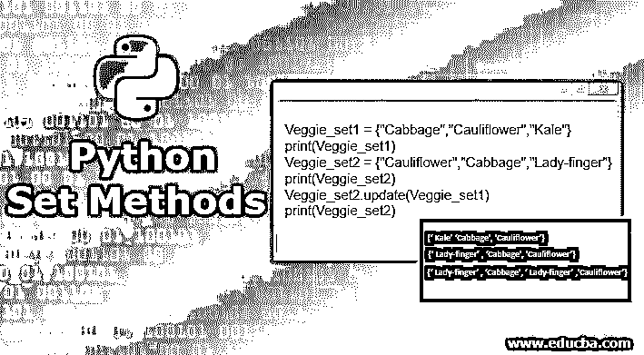

# Python 集合方法

> 原文：<https://www.educba.com/python-set-methods/>




## Python 集合方法简介

集合是 Python 中的重要概念之一。Set 是 Python 中一个无序的、无索引的集合，通常用花括号表示。Python 是在机器学习和数据科学领域占据重要地位的编码语言之一。Python 如此庞大，以至于很难掌握它的每一个方面。

**举例:**

<small>网页开发、编程语言、软件测试&其他</small>

```
Fruits_set = {Apple,Banana,Litchi}
```

### Python 中的 set 方法

现在让我们看看与 set 相关的方法:

#### 1.复制()

此方法将一个集合复制到其他集合。这个方法不需要任何参数。

**代码:**

```
Veggie_set = {"Drumstick","Cabbage","Cauliflower"}
type(Veggie_set)
new_set = Veggie_set.copy()
print(new_set)
type(new_set)
```

**输出:**


#### 2.添加()

此方法向列表中添加新元素。新元素需要在 add()中指定为参数。

**代码:**

```
Veggie_set = {"Drumstick","Cabbage","Cauliflower"}
type(Veggie_set)
Veggie_set.add("Lady-finger")
print(Veggie_set)
```

**输出:**


正如我们看到的“Veggie_set . add(“Lady-finger”)”，这有助于在列表名“Veggie _ Set”中添加元素“Lady-finger”。

#### 3.清除()

这种方法有助于清除集合。应用此方法后，集合中不会保留任何元素。

**代码:**

```
Veggie_set = {"Drumstick","Cabbage","Cauliflower"}
print(Veggie_set)
Veggie_set.clear()
print(Veggie_set)
```

**输出:**


#### 4.差异()

**代码:**

```
Veggie_set1 = {"Drumstick","Cabbage","Cauliflower"}
Veggie_set2 = {"Brocoli","Corn","Cabbage"}
New_set = Veggie_set1.difference(Veggie_set2)
print(New_set)
```

**输出:**


可以注意到，当“Veggie _ set 1 . difference(Veggie _ set 2)”时，“卷心菜”已被删除。同样的事情也可以用另一种方式来做:

**代码:**

```
Veggie_set1 = {"Drumstick","Cabbage","Cauliflower"}
Veggie_set2 = {"Brocoli","Corn","Cabbage"}
New_set = Veggie_set2.difference(Veggie_set1)
print(New_set)
```

**输出:**


两者中存在的相同元素，即“卷心菜”，已被去除。

#### 5.迪卡尔()

此方法有助于从集合中移除元素。

**代码:**

```
Veggie_set1 = {"Drumstick","Cabbage","Cauliflower"}
print(Veggie_set1)
Veggie_set1.discard("Cauliflower")
print(Veggie_set1)
```

**输出:**


假设需要从集合中丢弃多个元素。可以用所有要删除的元素组成一个新的集合，然后可以使用 difference()方法。

**代码:**

```
Veggie_set1 = {"Drumstick","Cabbage","Cauliflower"}
print(Veggie_set1)
set_to_remove = {"Cauliflower","Cabbage"}
New_set = Veggie_set1.difference(set_to_remove)
print(New_set)
```

**输出:**


#### 6.交集()

这种方法有助于在两个以上的集合中找到公共元素。

**代码:**

```
Veggie_set1 = {"Drumstick","Cabbage","Cauliflower"}
print(Veggie_set1)
Veggie_set2 = {"Cauliflower","Cabbage","Lady-finger"}
print(Veggie_set2)
New_set = Veggie_set1.intersection(Veggie_set2)
print(New_set)
```

**输出:**


可以注意到，函数 intersection()是如何取出公共元素的。打印的常见元素是“卷心菜”和“花椰菜”，它们以集合的形式返回。如果必须在多个集合之间求交集，可以这样做:

**代码:**

```
Veggie_set1 = {"Drumstick","Cabbage","Cauliflower"}
print(Veggie_set1)
Veggie_set2 = {"Cauliflower","Cabbage","Lady-finger"}
print(Veggie_set2)
Veggie_set3 = {"Cauliflower","Spinach","Kale"}
print(Veggie_set3)
New_set = Veggie_set1.intersection(Veggie_set2,Veggie_set3)
print(New_set)
```

**输出:**


**语法:**

```
set1.intersection(*s*et2, set3 ...etc.)
```

可以将多组参数放入交叉点。

#### 7\. Issubset()

这种方法可以帮助您识别该集合是否是其他集合的子集。方法 issubset()总是返回布尔输出。如果一个集合的所有元素都存在于一个指定的集合中，它将返回“真”；否则，它将返回“False”

**代码:**

```
Veggie_set1 = {"Cabbage","Cauliflower"}
print(Veggie_set1)
Veggie_set2 = {"Cauliflower","Cabbage","Lady-finger"}
print(Veggie_set2)
Eval = Veggie_set1.issubset(Veggie_set2)
print(Eval)
```

**输出:**


可以注意到，“素食 _ 集 1”实际上是“素食 _ 集 2”的一部分。因此 issubset()方法返回 True。

#### 8.issuperset()

此方法帮助您识别一个集合中的元素是否是其他指定集合的一部分。这以真或假的形式给出输出。

**代码:**

```
Veggie_set1 = {"Cabbage","Cauliflower"}
print(Veggie_set1)
Veggie_set2 = {"Cauliflower","Cabbage","Lady-finger"}
print(Veggie_set2)
check1 = Veggie_set1.issuperset(Veggie_set2)
print(check1)
check2 = Veggie_set2.issuperset(Veggie_set1)
print(check2)
```

**输出:**


可以注意到,“蔬菜 _ 集 1”的所有元素都是“蔬菜 _ 集 2”的一部分。这意味着“蔬菜 _ 集 2”是“蔬菜 _ 集 1”的超集，因此:

```
Statement “Veggie_set1.issuperset(Veggie_set2)” returns False.
Statement “Veggie_set2.issuperset(Veggie_set1)” returns True.
```

#### 9.对称 _ 差异()

这种方法可以帮助您找到属于集合的一部分但不为两个集合所共有的元素。

**代码:**

```
Veggie_set1 = {"Cabbage","Cauliflower","Kale"}
print(Veggie_set1)
Veggie_set2 = {"Cauliflower","Cabbage","Lady-finger"}
print(Veggie_set2)
check = Veggie_set2.symmetric_difference(Veggie_set1)
print(check)
```

**输出:**


如果你仔细注意，元素“卷心菜”和“花椰菜”都是这两组的一部分。因此。当我们在两个集合之间执行 symmentric _ difference()时，将产生“Kale”和“Lady-finger”，其中“Kale”仅是“Veggie_set1”的一部分，“Lady-finger”仅是“Veggie_part2”的一部分。

#### 10.联合()

这个方法可以帮助你合并两个集合中的元素。两个集合中的公共元素和非公共元素形成一个新集合。

**代码:**

```
Veggie_set1 = {"Cabbage","Cauliflower","Kale"}
print(Veggie_set1)
Veggie_set2 = {"Cauliflower","Cabbage","Lady-finger"}
print(Veggie_set2)
check = Veggie_set2.union(Veggie_set1)
print(check)
```

**输出:**


可以注意到，“check”是两个集合“Veggie_set1”和“Veggie_set2”合并后形成的新集合。常见元素有:“白菜”、“菜花”。不常见的元素有:“羽衣甘蓝”，“手指女士。”

所有这些常见和不常见的元素都是这个新集合“check”的一部分，它是两个集合的并集。对于多个集合，可能是这样的:

集合 1.union(集合 2，集合 3..等等。)

#### 11.更新()

此方法有助于使用属于其他指定集合但不属于此集合的元素更新集合。

**代码:**

```
Veggie_set1 = {"Cabbage","Cauliflower","Kale"}
print(Veggie_set1)
Veggie_set2 = {"Cauliflower","Cabbage","Lady-finger"}
print(Veggie_set2)
Veggie_set2.update(Veggie_set1)
print(Veggie_set2)
```

**输出:**


你可以看到，“羽衣甘蓝”是“蔬菜系列 1”的一部分。但在用“Veggie_set1”对“Veggie_set2”执行 update()后，“Kale”变成了“Veggie_set2”的一个元素。

### 结论

正如我们上面看到的，集合的概念有多重要，因此知道它的方法有助于你很好地理解和掌握集合？上面讨论的方法是 Python 中的内置方法。

### 推荐文章

这是 Python 集合方法的指南。这里我们用代码和输出来讨论 Python 中 set 的基本概念和方法。您也可以看看以下文章，了解更多信息–

1.  [Python Rest 服务器](https://www.educba.com/python-rest-server/)
2.  [用 Python 发送邮件](https://www.educba.com/send-mail-in-python/)
3.  [Python 列表删除()](https://www.educba.com/python-list-remove/)
4.  [Python 正则表达式测试器](https://www.educba.com/python-regex-tester/)


