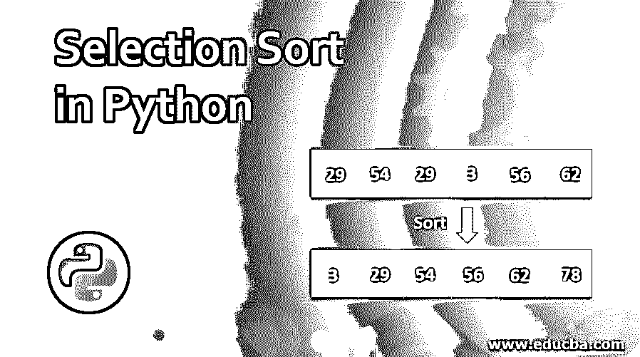

# Python 中的选择排序

> 原文：<https://www.educba.com/selection-sort-in-python/>




## Python 中的选择排序简介

选择排序技术已经被用来以某种特定的顺序完成给定元素的适当排序。然而，排序技术的必要性在于，生成的数据是非常无序的，因此我们需要设置特定的选择排序技术。在现有的排序技术中，选择排序是最基本的一种。选择排序技术包括确定最小元素并对其进行操作，以对整个输入集进行排序。在这个主题中，我们将学习 Python 中的选择排序。

### 选择排序逻辑

这里，首先确定未排序集合中最少的元素；然后，给定的未排序集合中的最小元素被放置在未排序集合的开始处。那么这个元素将被定位在已被操作的未排序集合的开始或第一个位置。接下来，将对未排序集合中的每个元素执行该操作。因此，这意味着确定未排序集合中的每个最小元素，并一个接一个地排队返回到公式化集合。

<small>网页开发、编程语言、软件测试&其他</small>

下面的例子解释了选择排序执行技术，

**Ex 数组:** [ 29，54，3，56，78，62]

#### 迭代#1

整个列表按顺序进行验证，值 3 被确定为给定列表中的最小值。所以值 3 会和 29 的位置交换。结果集看起来会像下面这样，

迭代 1 结果:[3，54，29，56，78，62]

#### 迭代#2

再次，整个列表被顺序验证，并且值 29 将被确定为来自所提到的列表的主要的第二小可能值。因此，值 29 将与第二个位置 54 交换。因此，结果集将如下所示，

迭代 2 结果:[3，29，54，56，78，62]

#### 迭代#3

在执行第三次迭代时，可以确定值 54 是第三小的值，并且它已经与给定列表中的位置 3 相关联。这意味着当前列表没有变化，因为它已经是给定的必要格式。

迭代 3 结果:[3，29，54，56，78，62]

#### 迭代#4

再次在评估时，将确定值 56 是第四小的值，并且这将在数组或列表的第 4 个位置被关联。因此，由于现有的列表是这种格式，在第四次迭代中不会对列表进行任何进一步的更改。

迭代 4 结果:[3，29，54，56，78，62]

#### 迭代#5

根据第五次迭代，可以确定值 62 是列表中第五小的值。因此，由于它当前被放在列表中的最后一个元素，所以它需要与之前一个位置的元素进行交换。这意味着值 62 将与值 78 一起交换。所以 78 将作为数组中的最后一个元素。所以现在，数组变成了有序序列。

迭代 6 结果:[3，29，54，56，78，62]

### Python 中选择排序的示例

下面提到了不同的例子:

#### 示例–用于循环

**代码:**

```
Selection_Array = [29,54,3,56,78,62]
# Print the keyed in input array
print("Unsorted Array:",Selection_Array)
print("\n")
# Ever element in the array is selected for processing
for element1 in range(len(Selection_Array)):
# The most least index value form the giben list is initially associated to element1
    Least_Index = element1
# From the holded item the next item is identified and looped across for finding the smallest value
    for element2 in range(element1+1, len(Selection_Array)):
        if Selection_Array[Least_Index] > Selection_Array[element2]:
            Least_Index = element2
# The previous element in the list and the currently holded least element is been swapped
    Selection_Array[element1], Selection_Array[Least_Index] = Selection_Array[Least_Index], Selection_Array[element1]
# main code
print ("Array after getting sorted by selection sort")
print("Sorted Array:",Selection_Array)
```

**输出:**


**解释**

上述技术是选择排序最常用的技术。它包括接受列表中键入的内容。该列表最初在控制台中打印。接下来，选择列表中键的每个元素进行处理。最后，将每个选中的项目与列表中的每个其他项目进行比较。如果当前项目是最小的项目，那么它将保持原样。但是如果当前项大于给定列表中的其他元素，那么它将与当前位置的元素进行比较和交换。列表中的所有其他元素都将遵循这一过程。将对列表中的所有元素执行比较和交换过程。因此，最终，检索到的列表将是一个有序的列表。新生成的有序列表打印在控制台上。

**代码:**

```
Selection_array = [29,54,3,56,78,62]
print("Unsoted Array",Selection_array)
iterator = 0
while iterator < len(Selection_array):
#smallest element in the sublist
    smallest = min(Selection_array[iterator:])
#Smallest element index
    index_of_smallest = Selection_array.index(smallest)
#Swap the contents of the array
    Selection_array[iterator],Selection_array[index_of_smallest] = Selection_array[index_of_smallest],Selection_array[iterator]
    iterator = iterator + 1
print("Soted Array",Selection_array)
```

**输出:**


**解释:**这里，选择排序技术也是通过 while 循环实现的。这里对于给定的数组或列表的长度，验证数组中的每个元素的最小值；每当找到最小值时，它就与列表中的第一个相关项进行交换。对于列表中存在的所有元素，再次重复这个交换过程。分离每一个最小元素使得列表非常清晰地按照升序排列。因此，在这个过程的最后，一个有序的列表就准备好了。同样，这个列表是按升序排列的。最后，将制定的列表打印到控制台。

### 结论

排序被认为是编程感知中的关键范例之一。这里涉及到许多排序技术，这些技术的目的是以升序或降序实现处理，更一般地说是以某种有序的方式。上面的文章很好地阐述了以非常精确的方式实现给定数据实体的选择排序的合适方法。

### 推荐文章

这是 Python 中选择排序的指南。这里我们讨论 Python 中选择排序的例子和迭代选择排序逻辑。您也可以看看以下文章，了解更多信息–

1.  [Python 比较字符串](https://www.educba.com/python-compare-strings/)
2.  [Python SQLite 创建数据库](https://www.educba.com/python-sqlite-create-database/)
3.  [Python 变量作用域](https://www.educba.com/python-variable-scope/)
4.  [Python 中的缩进](https://www.educba.com/indentation-in-python/)


