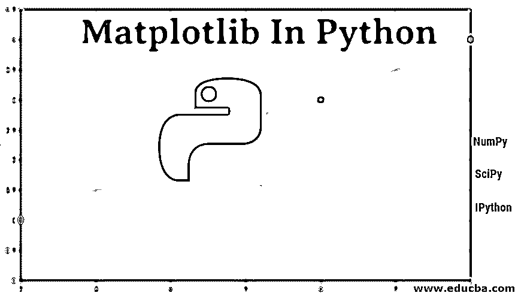
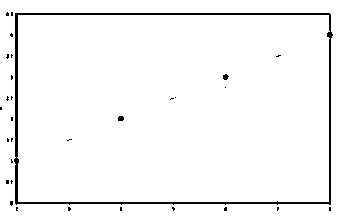
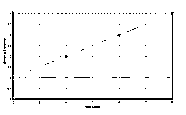

# Python 中的 Matplotlib

> 原文：<https://www.educba.com/matplotlib-in-python/>

我

## Python 中 Matplotlib 的介绍

Matplotlib 是一个帮助绘制图形的开源库。它最初是由约翰·d·亨特写的，他碰巧是一位神经生物学家。他在神经生物学博士后研究期间撰写了 Matplotlib。该库的目的是通过在图表中绘制这些活动来研究癫痫患者大脑皮层中发生的活动。绘制图表的唯一目的是为了更好地可视化和研究其中的共同模式。Matplotlib 的第一次发布是在 2003 年。随着时间的推移，Matplotlib 成为与 Python 编程语言一起用于数据和计算图形绘制的最广泛使用的绘图库之一。它是独立于平台的，可以在 Windows、Mac OS 和 Linux 上运行。

### 谅解

作为一个 Python 库，Matplotlib 提供了可视化的 2D 绘图功能。Matplotlib 与其他开源库一起使用，例如

<small>网页开发、编程语言、软件测试&其他</small>

#### 1.NumPy

术语“NumPy”代表数字 Python 扩展。这个库提供了几个数学函数来处理更大的[和多维数组](https://www.educba.com/multi-dimensional-array-in-javascript/)和矩阵。它还可以保存任意数据类型的[数据，并且很容易与许多数据库集成。要在您的项目中使用 numpy](https://www.educba.com/c-plus-plus-data-types/)[，请确保导入。例如，将 numpy 导入为 npy。](https://www.educba.com/numpy-histogram/)

#### 2.我的天啊

它建立在 [NumPy 数组](https://www.educba.com/numpy-array-functions/)之上；底层数据结构是由 NumPy 模块提供的对象数组。它提供的功能包括图像和信号处理、线性代数中的专用[函数](https://www.educba.com/linear-algebra-in-machine-learning/)和插值。可以使用语句将 SciPy 模块添加到他们的项目中:import sciPy as sp。

#### 3.IPython

术语交互式 Python 的缩写。这是一个增强的交互式 Python shell，支持数学表达式、内联绘图等。它还有助于与 SciPy 堆栈库集成。此外，它带有一个完整的设置，使交互式绘图更容易。

### 如何让 Python 开发者轻松使用 Matplotlib？

作为 python 开发人员，应该利用 matplotlib 库中的 Pyplot 模块。Pyplot 是一个应用程序编程接口，由帮助处理可视化数据的函数/方法组成。在生成可视化图形时，绘图速度很快。此外，它与 Matlab 的相似性使得以前有过使用 [MATLAB](https://www.educba.com/what-is-matlab/) 经验的人工作起来很容易，反之亦然。

### 如何在 Matplotlib 中使用 Pyplot？

为了能够访问 pyplot 方法，需要将其导入到 python 文件中。这可以通过在 python 文件的顶部包含下面一行来实现:

`import matplotlib.pyplot as myplt`

**例#1**

`import matplotlib.pyplot as myplt
myplt. plot([2,4,6,8] , [1,2,3,4])
myplt. show()`

在上面的例子中，plot()方法分别接受 X 和 Y 轴坐标，并相应地绘制一个图形。plot()方法还可以接受一个可选的第三个参数，该参数决定了线形图的颜色字符串和类型。默认情况下，它是“-b”，显示一条蓝线。其他方法如 xlabel()和 ylabel()允许我们命名轴。

**例 2**

`import matplotlib.pyplot as myplt
myplt. plot([2,4,6,8] , [1,2,3,4])
myplt. xlabel(‘time in mins’)
myplt. ylabel(‘distance in Kilo meters’)
myplt. show()`

### Python 中 Matplotlib 的绘图类型

Matplotlib 提供了多种方法和函数来生成不同类型的图形。

让我们看看其中的几个:—

*   **线** **图**:这是所有图形中最简单的一个。plot()方法用于绘制折线图。
*   **支线剧情**:支线剧情()函数用于创建这些。比较这两个图是很有用的。
*   **Images** : Matplotlib 也可以借助 imshow()函数创建图像。
*   **直方图**:要生成直方图，可以使用 hist()方法。
*   **路径:**在 matplotlib.path 模块的帮助下，可以将任意路径添加到 Matplotlib 中。
*   **条形图**:绘制条形图时使用 Bar()函数。使用这种方法，用户可以根据自己的需要将[条形图](https://www.educba.com/javafx-bar-chart/)进一步定制为水平或垂直。
*   **饼状图**:应该使用 Pie()方法生成饼状图。额外的功能允许在饼图上使用阴影效果，标记区域，确定它所代表的百分比等。
*   **表格:**table()函数允许添加一个表格，用于系统的数据分类。
*   **散点图**:为了生成散点图，使用函数 Scatter()。我们还可以利用这个函数必须提供的可选的大小和颜色参数。
*   **填充曲线**:[fill()函数允许](https://www.educba.com/matlab-fill/)绘制填充曲线和多边形。
*   **Log plots**:semi logx()、semiology()和 loglog()等函数使得绘制包含对数函数的图形更加容易。
*   **极坐标图**:生成[极坐标图](https://www.educba.com/polar-plot-in-matlab/)，使用 Polar()函数。
*   **日期处理** : Matplotlib 可以让你轻松地绘制出任何时间序列数据。
*   **流图**:这些图用于矢量场的绘制。streamplot()函数用于实现这一点。

### 优势

下面是解释的一些优点。

1.  Matplotlib 的一些优点是
2.  简单易掌握，适合初学者。
3.  对于以前使用过 Matlab 或其他图形绘制工具的人来说更容易使用。
4.  它提供各种格式的高质量图像和绘图，如 png、pdf、pgf 等。
5.  提供对图形的各种元素的控制，例如 DPI、图形颜色、图形大小。

### 这项技术将如何帮助你的职业发展？

随着数据分析和数据科学需求的上升，需要使用 matplotlib 等工具来研究数据的行为和模式。截至今天，Python 在数据科学和分析领域占据了行业主导地位。对于熟悉 python 的人来说，拥有像 matplotlib 这样的库的知识将有助于一个人的专业成长。

### 结论

本文展示了 Matplotlib 是如何出现的，以及它通常使用的各种其他库。它还涵盖了一些 Matplotlibs 众所周知的函数，用于绘制各种图形，并根据我们的要求定制它们。

### 推荐文章

这是 Python 中 Matplotlib 的指南。在这里，我们讨论 Python 中 Matplotlib 的介绍、工作原理、类型、优点以及它将如何帮助职业发展。您也可以浏览我们推荐的其他文章，了解更多信息——

1.  [Python 的优势](https://www.educba.com/advantages-of-python/)
2.  [Python 框架](https://www.educba.com/python-frameworks/)
3.  [Python 职业生涯](https://www.educba.com/careers-in-python/)
4.  [Python 字符串函数](https://www.educba.com/python-string-functions/)

