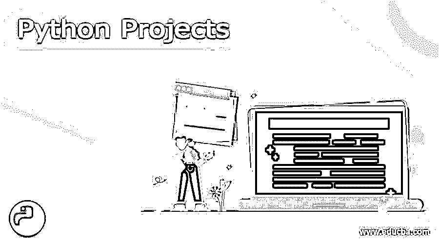
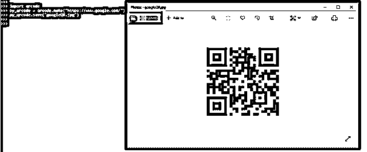
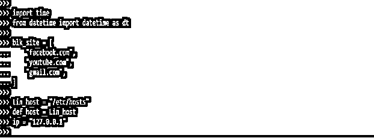
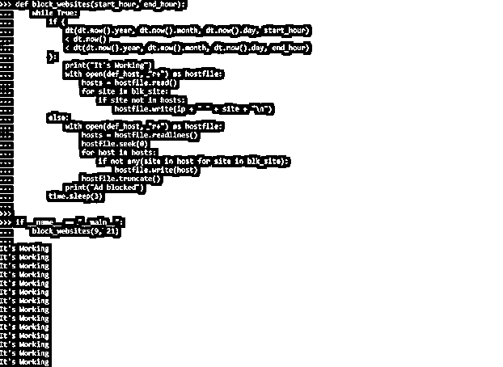

# Python 项目

> 原文：<https://www.educba.com/python-projects/>




## Python 项目的定义

Python 项目在我们开发项目的每个领域都有实施。Python 作为一种广泛使用的编程语言越来越受欢迎。所以获得理论上的知识是没有用的，除非我们从事现实世界的项目。从事这样的项目将考验我们的 Python 技能，同时也为我们提供了实践经验。而致力于实现 python 项目将实现我们的知识。

### Python 项目简介

*   在当今世界，在人工智能和人工智能技术中，所有的技术都在某种程度上依赖于 Python。
*   Python 是免费和开源的。有一个蓬勃发展的开发者社区为技术的进步做出了贡献。
*   Python 是一种通用的解释型编程语言，广泛用于现代软件开发。
*   Python 编程是纯 Python 项目的主要焦点。一个项目允许我们将图书馆和个人设置组合成一个单元。
*   Python 使得编写可以在各种操作系统上运行的可移植的通用程序变得更加容易。

### 顶级 python 项目

*   Python 是一种非常著名的编程语言。Python 现在被全球近 820 万开发者使用。因此，建议我们开始精通 Python 语言。
*   下面是排名靠前的 python 项目如下。

#### 1.使用 python 的电子邮件切片器

*   电子邮件切片器是一个简单的工具，它将电子邮件地址作为输入，并将其切片以生成用户名和域。
*   在下面的项目中，我们以 abc@example.com 为例。在本例中，abc 是用户名，example.com 是域名。

**代码:**

<small>网页开发、编程语言、软件测试&其他</small>

```
py_email = input("Email is: ").strip()
Email is: abc@example.com
uname = py_email[:py_email.index('@')]
py_domain = py_email [py_email.index('@') + 1:]
print (f"Username is {uname} and domain name is {py_domain}")
```


#### 2.利用 python 生成二维码

*   二维码看似简单，却能存储大量数据。下面的项目显示实现二维码如下。在下面的项目中，我们通过使用 google.com 网站实现了一个二维码。

**代码:**

```
import qrcode
py_qrcode = qrcode.make ("https://www.google.com/")
py_qrcode.save ("googleQR.jpg")
```




*   在上面的项目中，我们已经使用 pip 命令首先安装了 qrcode。安装二维码后，我们使用 import 关键字将它导入到我们的项目中。然后我们使用 qrcode.make 方法制作 qrcode，我们使用 google.com 网站制作 qrcode 生成器。然后我们用同样的方法保存生成的二维码。

#### 3.网站拦截器的 Python 项目

*   浏览网页时看到随机弹出的窗口，我们不都很烦吗？因此，通过创建这个 Python 项目，我们阻止了广告。
*   因此，网站拦截器 Python 项目的目标是阻止从任何设备访问网站。
*   每个操作系统都包含一个主机文件。根据操作系统的不同，主机文件可能存储在不同的位置。它将主机名转换成 IP 地址。

**代码:**

```
import time
from datetime import datetime as dt
blk_site = [
    		"facebook.com",
    		"gmail.com",
]
Lin_host = "/etc/hosts"
def_host = Lin_host
ip = "127.0.0.1"
def block_websites (start_hour, end_hour):
    while True:
        if (
            dt(dt.now().year, dt.now().month, dt.now().day, start_hour)
            < dt.now()
            < dt(dt.now().year, dt.now().month, dt.now().day, end_hour)
        ):
            print("It's Working")
            with open(def_host, "r+") as hostfile:
                hosts = hostfile.read()
                for site in blk_site:
                    if site not in hosts:
                        hostfile.write (ip + " " + site + "\n")
        else:
            with open(def_host, "r+") as hostfile:
                hosts = hostfile.readlines ()
                hostfile.seek (0)
                for host in hosts:
                    if not any(site in host for site in blk_site):
                        hostfile.write (host)
                hostfile.truncate ()
            print ("Ad blocked")
        time.sleep (3)
if __name__ == "__main__":
    block_websites(9, 21)
```







#### 4.创建 GIF 创建器的 Python 项目

*   GIF 是一系列图像，产生运动的错觉。尽管近年来 gif 已经广为人知，但对高质量 gif 的需求仍在增加。在这里，我们将创建一个 GIF 创建器，它将从图像生成 GIF。
*   出于开发目的，我们将利用 MoviePy python 模块。要创建 GIF 创建器，首先我们需要将 MoviePy 模块导入到我们的代码中。这个模块用于编辑视频，我们也可以创建一个复合视频(也称为非线性编辑)，或处理视频。该模块还用于读取和写入视频格式。
*   在下面的项目中，我们可以看到我们首先导入了 imageio 模块，在导入模块后，我们提供了两个图像来创建 GIF。
*   在提供图像后，我们使用 for 循环将图像逐个添加到 GIF 中。在 for 循环结束后，我们使用 imageio.mimsave 方法将 gif 文件名保存为 python.gif。该方法用于将 gif 文件保存到代码中指定的位置。

**代码:**

```
import imageio
img_name = ["python.jpg", "googleQR.jpg"]
img = []
for imgname in img_name:
    	img.append (imageio.imread (imgname))
imageio.mimsave ('python.gif', img, 'GIF', duration=1)
```


#### 5.Python 项目将图像转换为铅笔草图

*   对于这个项目，我们将利用 OpenCV 库。用 pip install opencv-python 安装。下面的步骤显示了从图像创建铅笔素描项目。
*   步骤 1:定位要转换为铅笔草图的图像。我们将利用 python 图像。
*   第二步:读取图像并将其转换为灰度。这张照片现在已经被转换成了传统的黑白照片。
*   第三步:将图像反转成灰度，也就是通常所说的负像；这是我们的反转灰度图像。倒装主要用于突出细节。
*   第四步:最后，混合图像，制作铅笔素描。灰度图像被分割以实现这一点。

**代码:**

```
import cv2
py_img = cv2.imread ("python.jpg")
gray_img = cv2.cvtColor (py_img, cv2.COLOR_BGR2GRAY)
invt_img = 255 - gray_img
blur = cv2.GaussianBlur(invt_img, (21, 21), 0)
invt_blur = 255 - blur
pencil_skth = cv2.divide (gray_img, invt_blur, scale=256.0)
cv2.imshow ("Original Image", py_img)
cv2.imshow ("Pencil Sketch of Dog", pencil_skth)
cv2.waitKey (0)
```


### 结论

Python 编程是纯 Python 项目的主要焦点。一个项目允许我们将图书馆和个人设置组合成一个单元。Python 项目在我们开发项目的每个领域都有实施。Python 作为一种广泛使用的编程语言越来越受欢迎。

### 推荐文章

这是 Python 项目的指南。在这里，我们讨论定义、简介、顶级 python 项目示例以及代码实现和输出。您也可以看看以下文章，了解更多信息–

1.  [吉拉积压](https://www.educba.com/backlog-in-jira/)
2.  [吉拉史诗](https://www.educba.com/jira-epic/)
3.  [冲刺吉拉](https://www.educba.com/sprint-in-jira/)
4.  [吉拉版本](https://www.educba.com/jira-versions/)


