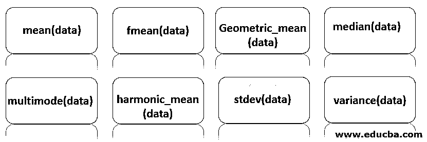
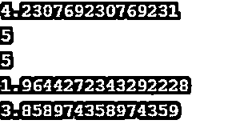

# Python 统计模块

> 原文：<https://www.educba.com/python-statistics-module/>


## Python 统计模块简介

Python 中的统计模块提供了数字数据的统计数学功能。可以看到在这个模块中定义的统计中的一些受欢迎的函数。这些模块使用起来非常简单。
这些与导入统计文件一起使用，计算各种统计操作的结果。统计模块为您提供了一种解决一些简单数学问题的方法，如均值、中值、众数、方差、标准差。该模块为实值数据中的函数提供数理统计数值计算。除非明确指出，否则这些函数支持浮点、整数、分数、小数。

### Python 中为什么要用统计？

R 中的编程非常丰富，专门用于统计，而 Python 是一种保持统计模块一般用途的语言。相比之下，Python 在统计分析方面比 R 语言更少。尽管如此，Python 混合了统计数据和构建复杂的分析管道，在这方面它很丰富，是无价的资产。遗憾的是，统计模块在 Python 2.7 中不可用，但是如果您必须使用这些模块，那么您可以使用 Python 3。有一些第三方库，如 Scipy、Numpy 和一些专业统计学家的 Matlab、SAS、Minitab。这些都是高端水平的图形和科学计算。

<small>网页开发、编程语言、软件测试&其他</small>

### Python 统计模块

让我们来逐一解释 Python 中统计数学方法的几个模块。




#### 1.平均值(数据)

返回样本或总体的算术平均值，其中数据是序列或可迭代的。如果发现空数据，将引发 StatisticsError。

#### 2.fmean(数据)

数据转换为平均值和算术平均值计算。函数总是返回一个数据是序列或可迭代的浮点数。如果发现空数据，将引发 StatisticsError。

#### 3.几何平均值(数据)

通过将数据转换为浮点数来计算几何平均值。通过此功能显示数据的集中趋势或典型值。如果发现空数据，将引发 StatisticsError。

**举例:** round(geometric_mean([36，24，54])，1)

#### 4.中位数(数据)

数据返回中值或中间值。当数据点数为偶数时，中位数通过取两个中间值的平均值进行插值和打印。如果发现空数据，将引发 StatisticsError。

#### 5.多模式(数据)

该函数返回定期出现的值的列表。当数据为空时，返回一个空列表，如果有多个模式，则返回多个结果。如果发现空数据，将引发 StatisticsError。

以下是 3.8 版本中的新增功能

#### 6.调和平均值(数据)

返回数据调和平均值。分项平均数或调和平均数是算术平均数的倒数。如果发现空数据，将引发 StatisticsError。

**举例:** harmonic_mean ([40，60])

#### 7.stdev(数据)

返回样本的[标准差(样本方差平方根)。](https://www.educba.com/standard-deviation-in-r/)

#### 8.差异(数据)

数据的样本方差返回，至少可迭代两个实数值。较大的差异或差异表明数据分散。

### 中心位置的平均值和度量值

平均值和度量值中的函数计算样本总体的平均值。而扩散函数的度量计算样本或总体与平均值或典型值的偏差度量。

*   **均值函数:**数据的平均值或均值。
*   **fmean 函数:**浮点运算的均值。
*   **geometric_mean 函数:**几何数据的平均值。
*   **调和 _ 均值函数:**数据的调和均值。
*   **中位数函数:**数据的中间值或中位数。
*   **median_low 函数:**数据的最小中值。
*   **median_high 函数:**数据的高端中值。
*   **中位数 _ 分组函数:**分组数据的第 50 个<sup>第</sup>百分位。
*   **模式函数:**名义或离散数据最常见的值。(单一模式)
*   **多模态函数:**名义或离散数据的最常见值。(模式列表)
*   **质量函数:**以相等的概率将数据分成区间

### 传播措施

*   **stdev 函数:**总体数据的标准差。
*   **pstdev 函数:**人口数据的方差。
*   **p 方差函数:**样本数据的标准差。
*   **方差函数:**样本数据的方差。

### Python 统计模块示例

下面是一些例子:

**代码:**

```
import statistics
list_example = [6,7,2,6,3,5,5,5,2,5,6,1,2]
a = statistics.mean(list_example)
print(a)
b = statistics.median(list_example)
print(b)
c = statistics.mode(list_example)
print(c)
d = statistics.stdev(list_example)
print(d)
e = statistics.variance(list_example)
print(e)
```

**输出:**




*   输出的第一行显示平均值。这是给定列表的平均值。
*   输出的第二行显示了给定列表的中间值。
*   第三行输出显示了给定列表的模式。这是在给定列表中经常出现的值。
*   列表的第四行[显示给定列表的标准偏差](https://www.educba.com/standard-deviation-in-r/)。这是给定列表中的一组值之间的变化量或分散度。
*   第五行输出显示了差异。也就是说，该组值离平均值有多远。

### Python 统计模块中的异常和错误

python 统计模块中的异常和错误如下所示:

对于与统计相关的异常，是 ValueError 的子类。如果 sigma 为–ve，则会产生统计误差。当您的输入由混合集合类型组成时，您需要确保您的[使用映射函数](https://www.educba.com/javascript-map-function/)来确保一致的结果。

例如，map(float，data_input)。

#### 示例#1

**代码:**

```
#For mean:
import statistics
data = [1, 5, 6, 7, 4, 5, 6]
a = statistics.mean(data)
print("Mean of the given list : ", a)
```

**输出:**


#### 实施例 2

**代码:**

```
#For median:
import statistics
data = [-8, -5, -4, -9, 0, 2, 5, 6, 1]
a = statistics.median(data)
print("Median of the given list is : " ,a)
```

**输出:**


### 推荐文章

这是一个 Python 统计模块指南。在这里，我们将讨论中心位置的基本概念、平均值和测量值，以及 python 统计的模块。您也可以阅读以下文章，了解更多信息——

1.  [Python Tkinter Canvas](https://www.educba.com/python-tkinter-canvas/)
2.  [t 帧间帧](https://www.educba.com/tkinter-frame/)
3.  [标签帧间](https://www.educba.com/tkinter-labelframe/)
4.  [Python Tkinter](https://www.educba.com/python-tkinter/)


