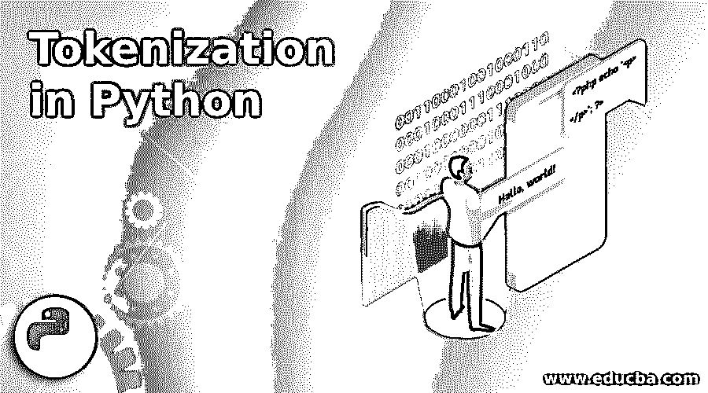
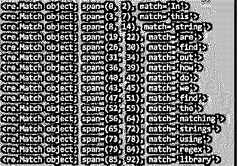

# Python 中的标记化

> 原文：<https://www.educba.com/tokenization-in-python/>

## Python 中的标记化简介

Python 中的标记化是任何自然语言处理程序中最主要的步骤。这可以在统计分析、解析、拼写检查、计数和语料库生成等方面找到它的效用。记号赋予器是一个 Python (2 和 3)模块。

### 为什么要在 Python 中进行标记化？

自然语言处理是一个计算机科学领域，其学习涉及计算机语言学和人工智能，主要是人类自然语言和计算机之间的交互。通过使用自然语言处理，计算机被编程来处理自然语言。标记数据仅仅意味着分割文本主体。这里涉及的过程是将 Python 文本字符串转换成令牌对象流。要注意的是，每个令牌是单独的单词、数字、电子邮件、标点符号、URL/URI 等。还有将标记分割成句子流，在句子中间有日期和缩写。tokenizer 在 MIT 许可证下获得许可。

<small>网页开发、编程语言、软件测试&其他</small>

**对象:令牌**

如上所述，每个令牌由一个<namedtuple>表示，它有三个字段:(kind，txt，val)</namedtuple>

**种类字段:**包含以下整数常量之一，在 TOK 类下定义。

**txt 字段:**它包含原始文本，在某些情况下，注意到分词器会自动更正源文本。可以看到它将单引号和双引号转换为冰岛语。

**val 字段:**该字段包含对应令牌的辅助信息。

**安装:**你可以从 https://github.com/mideind/Tokenizer[克隆仓库](https://github.com/mideind/Tokenizer)

如果想运行内置测试，可以安装 pytest。然后 cd 到 Tokenizer，你还需要激活你的 virtualenv，然后运行。

Python -m pytest

### 在 Python 中执行标记化的方法

下面列出了执行标记化的方法数量:

*   Python 的 split 函数
*   在 NLTK 中使用正则表达式
*   空间图书馆
*   使用 Keras 的标记化
*   用 Gensim 进行标记化

### 用 Python 实现标记化的示例

以下是 Python 中标记化的例子

#### 示例#1

**Python 的 split 函数:**这是最基本的一个，它根据特定的分隔符将字符串拆分后返回一个字符串列表。可以根据需要更换分离器。句子标记化:这里分析句子的结构。我们知道，一个句子以句号(。);因此，它可以用作分离器。

**代码:**

`text = """ This tool is an a beta stage. Alexa developers can use Get Metrics API to seamlessly analyse metric. It also supports custom skill model, prebuilt Flash Briefing model, and the Smart Home Skill API. You can use this tool for creation of monitors, alarms, and dashboards that spotlight changes. The release of these three tools will enable developers to create visual rich skills for Alexa devices with screens. Amazon describes these tools as the collection of tech and tools for creating visually rich and interactive voice experiences.  """
data = text.split('.')
for i in data:
print (i)`

**输出:**

*   单词分词器:它的工作原理类似于句子分词器。此处，文本根据作为分隔符的(“”)拆分为标记。默认情况下，我们不给出任何参数，它按空格分割。

**代码:**

`text = """ Tesla, Inc. is an American automotive and energy company based in PAlo Alto, California. The company specializes in electric car manufacturing and, through its SolarCity subsidiary, solar panel manufacturing. """
data = text.split()
for i in data:
print (i)`

**输出:**

#### 实施例 2

**使用 NLTK 的正则表达式:**正则表达式基本上是一个字符序列，它帮助我们在我们拥有的文本中搜索匹配的模式。Python 中用于正则表达式的库是 **re，**，它预装了 Python 包**。**示例:我们导入了 re 库 use \w+,用于从表达式中提取特定的单词。

**代码:**

`import re
text_to_search = """ In this string you are to find out, how do we find the matching strings using regex library """
pattern = re.compile('\w+')
matches = pattern.finditer(text_to_search)
for match in matches:
print(match)`

**输出:**

需要注意的是，在我们使用正则表达式之前，nltk 需要被导入。

NLTK 的标记化:这个库主要是为统计自然语言处理而编写的。我们使用 tokenize()将其进一步分为两种类型:

*   Word tokenize: word_tokenize()用于根据需要将一个句子拆分成多个标记。
*   sent_tokenize()用于将一个段落或一个文档拆分成句子。

我们在下面的终端中看到了输出:

`from nltk.tokenize import regexp_tokenize
from nltk.tokenize import sent_tokenize
from nltk.tokenize import word_tokenize
s = "I can't do this. I won't do it!"
sent_tokenize(s)
word_tokenize(s)`

(上面的输出是在 cmd 中运行的，因为我的 Visual Studio 代码出现了一些问题。)

在上面的例子中，我们看到“不可以”和“不愿意”也被分离出来。如果那必须被认为是一个单词，那么我们遵循下面的方法。

我们通过添加另一行代码来处理它。通过指定[\w']+，我们确保告诉 python 撇号(')后面有一个单词，也需要进行处理。

`regexp_tokenize(s,”[\w’]+”)`

**NLTK 的方法**

tokenize()函数:当我们需要对一个字符串进行标记时，我们使用这个函数并得到一个标记对象的 Python 生成器。每个令牌对象都是一个包含字段的简单元组。在 Python 2.7 中，可以将 Unicode 字符串或字节字符串传递给函数 **tokenizer.tokenize()。**而在后来的版本中，可以看到字节串是用 UTF-8 编码的。

#### 实施例 3

**spaCy library:** 是 NLP 的开源库。这里我们使用 spacy.lang.en，它支持英语。spacy 是一个比 nltk 更快的库。

在使用 spaCy 之前，需要在系统中安装 Anaconda。Anaconda 是一些流行的 python 包和一个名为 conda(类似于 pip)的包管理器的捆绑包。这些软件包在数据科学研究中非常流行。一些流行的 anaconda 包有 numpy、scipy、nltk(上面使用的那个)、jupyter、scikit-learn 等。使用 conda 而不是 pip 的原因是它也有助于使用非 python 依赖，而 pip 不允许这样做。

记号赋予器的输入是一个 Unicode 文本，Doc 对象是输出。构造 Doc 对象需要 Vocab。SpaCy 的标记化总是可以被重构为原始的标记化，并且需要注意的是，它保留了空白信息。

**代码:**

`import spacy
from spacy.tokens import Doc
from spacy.lang.en import English
nlp = English()
doc = Doc(nlp.vocab, words = ["Hello", " , ", "World", " ! "], spaces = [False, True, False, False])
print([(t.text, t.text_with_ws, t.whitespace_) for t in doc])`

**输出:**

#### 实施例 4

**使用 Keras 进行标记化:**是最可靠的深度学习框架之一。这是一个用于神经网络的 python 开源库。我们可以使用以下命令安装它:pip install Keras。为了执行标记化，我们使用来自 Classkeras.preprocessing.text class 类的 text_to_word_sequence 方法。Keras 的一个优点是它在标记字母表之前先转换成小写字母，这样有助于节省时间。

**代码:**

`from keras.preprocessing.text import text_to_word_sequence
# define the text
text = 'Text to Word Sequence Function works really well'
# tokenizing the text
tokens = text_to_word_sequence(text)
print(tokens)`

**输出:**

#### 实施例 5

**Gensim 的标记化:**这个开源库旨在自动提取语义主题，并在无监督主题建模和自然语言处理中有很大的用处。需要注意的是，与其他库不同，Gensim 对字符串中的标点符号非常挑剔。

**代码:**

`from gensim.summerization.textcleaner import tokenize_by_word
g = tokenize_by_word('Veni. Vedi. Vici. ')
print(next(g))
print(next(g))
print(next(g))`

**输出:**

### 结论

符号化是解决 NLP 程序的一个有用的关键步骤。因为我们需要在开始建模过程之前先处理非结构化数据。作为第一步也是最重要的一步，标记化非常方便。

### 推荐文章

这是一个关于 Python 中标记化的指南。在这里，我们讨论 Python 中标记化的介绍、方法、输出示例和代码。您也可以浏览我们的其他相关文章，了解更多信息——

1.  [Python 中的 NLP](https://www.educba.com/nlp-in-python/)
2.  [Python PEP8](https://www.educba.com/python-pep8/)
3.  [名为 tuple Python](https://www.educba.com/namedtuple-python/)
4.  [Python 逆向列表](https://www.educba.com/python-reverse-list/)

