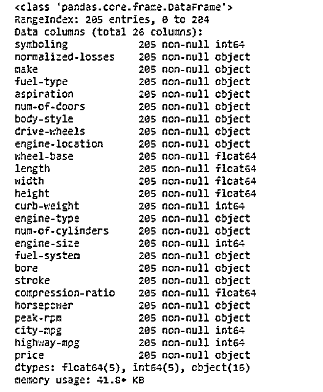

# Python 文档字符串

> 原文：<https://www.educba.com/python-docstring/>


## Python Docstring 简介

Python Doctstring 是出现在类、方法、模块或函数级别的文档字符串。docstring 只是一个没有赋值的多行字符串。它在用于记录特定代码段的源代码中指定。它通常是各个区域中的第一条语句，后面是代码。任何特定 python 对象的 docstring 都可以通过使用该对象的 doc 属性来访问。

### Python 文档字符串的类型

下面给出了各种类型的文档字符串:

<small>网页开发、编程语言、软件测试&其他</small>

#### 1.基于线的数量

以下是基于行数的不同类型的文档字符串:

##### a.单行文档字符串

**语法:**

```
"""This is an example of single line docstring."""
```

单行文档字符串应该用三重引号括起来。

##### b.多行文档字符串

当我们必须写一个详细的代码解释时，我们就使用多行 docstring。

以下是其组成部分:

*   单行汇总行
*   摘要前的空行
*   代码解释摘要
*   摘要后的空行

**语法:**

```
""" This is the first line of single line docstring.
      It is the summary of the docstring. Here we elaborately discuss about the docstring. It is generally multiline comment."""
      # Code commences from this line
```

#### 2.基于功能

以下是基于功能的不同类型的文档字符串:

##### a.类文档字符串

类文档字符串是该类及其相关方法的文档。docstring 类的目的是为使用该类的用户提供对该类及其方法的清晰理解。这些文档字符串分别放在类和方法声明的下面，缩进一个单位。

**语法:**

```
class ClassName:
  """Class Docstring goes here."""
  // class attribures
  def class_method():
    """Class method docstring goes here."""
    // class method declaration
```

类 docstring 中应包含以下信息:

*   对课程的总体概述。
*   所有方法的详细描述。
*   [类属性](https://www.educba.com/python-class-attributes/)的描述。
*   强制参数和可选参数的描述。
*   强加于该类的任何例外和限制。

让我们看一个 docstring 类的例子:

**代码:**

```
class Vehicle:
  """The following class is about a vehicle
  Attributes
  -------------
  name : str
      the name of the vehicle
  manufacturer : str
      the name of the manufacturer of the vehicle
  price : float64
      the showroom price of the vehicle
  manufacturing_year : int64
      the year of manufacturing of the vehicle
  Methods
  ---------------
  """
  def __init__(self,name,manufacturer,price,manufacturing_year):
    self.name = name,
    self.manufacturer = manufacturer,
    self.price = price,
    self.manufacturing_year = manufacturing_year
    """
    Parameters
    ------------
     name : str
      the name of the vehicle
    manufacturer : str
      the name of the manufacturer of the vehicle
    price : float64
      the showroom price of the vehicle
    manufacturing_year : int64
      the year of manufacturing of the vehicle
   """
vehicle = Vehicle("SX4","Suzuki",450000,2010)
print("Name of the vehicle :",vehicle.name)
print("Manufacturer Name :",vehicle.manufacturer)
print("Price of vehicle :",vehicle.price)
print("Manufacturing year :",vehicle.manufacturing_year)
```

**输出:**


##### b.包文档字符串

包文档字符串用于突出显示包中使用的子包和模块。在任何导入完成之前，这些都被放在最上面。

包 docstring 中应包含以下信息:

*   包装及其用途的描述。
*   由包导出的类、异常和对象的列表。
*   关于传递的参数的描述。
*   对函数方法的任何例外或限制。

任何 python 模块的 docstring 都可以看作是包 docstring 的一个例子。这个可以参考熊猫的包装的文档。

##### c.编写文档字符串脚本

脚本是可以从控制台执行的单文件可执行文件。脚本文档字符串用于让用户完全理解脚本的功能和用法。脚本中使用的任何自定义导入都需要作为脚本 docstring 的一部分提及。

让我们看一个 Python 脚本 Docstring 的例子，其中我们定义了一个函数来显示 CSV 文件中存在的列的信息，前提是我们给出了 CSV 文件的路径。

**代码:**

```
"""CSV file info
The following script allows the user to print to the console all the information of the columns in the
spreadsheet. 
This script accepts comma separated value files (.csv) 
Pre-requisite :
pandas package to be installed within the Python runtime environment

"""
import pandas as pd
def get_csv_info(file_location):
    """Gets and prints the information about the columns of the csv file
    Parameters
    ----------
    file_location : str
        The file location of the csv file
    Returns
    -------
    list
        The information about all the columns of the csv file
    """
    file_data = pd.read_excel(file_location)    
    return(file_data.info())
```

**输出:**




### 推荐文章

这是 Python Docstring 的指南。这里我们讨论 Python 中文档字符串的基础知识，以及不同文档字符串的语法和例子。您也可以阅读以下文章，了解更多信息——

1.  [Python len 函数](https://www.educba.com/python-len-function/)
2.  [Python 切片字符串](https://www.educba.com/python-slice-string/)
3.  [Python 打印表格](https://www.educba.com/python-print-table/)
4.  [Python 输入字符串](https://www.educba.com/python-input-string/)


