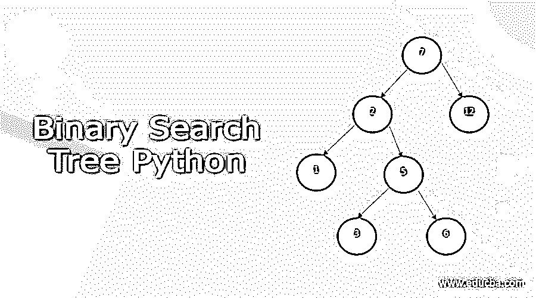
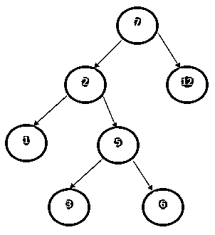

# 二叉查找树蟒蛇

> 原文：<https://www.educba.com/binary-search-tree-python/>




## 二叉查找树 Python 的定义

Python 中的二叉查找树是一棵有序或排序的树，其内部节点以一种方式相互连接，并可以无缝地相互通信。二叉查找树的概念源于这样一个事实，即节点的排列和组织方式是使用数据项的添加、快速查找和删除进行操作，然后创建查找表和动态集合。键和值对子树位于节点的左边还是右边起着重要的作用。

**语法:**

<small>网页开发、编程语言、软件测试&其他</small>

Python 中二分搜索法树的语法流程如下:

```
Class A_node:
	Def _init_(self, key),
	// Put and initialize the key and value pait
	// Then a utility function as per requirement can be written
		Def insert(root, key)
		// define function 
//Write the driver program & print with a logger to understand the flow. 
```

### 二叉查找树是如何用 Python 工作的？

二叉查找树的工作方式如下让我们举这个例子来说明。让我们假设下面是一棵二叉树，它是一种没有顺序的树，那么一棵有这么多不同数字的树如何比较和排列自己。

基本上，二叉树是基于节点的二叉树数据结构，具有以下特征

*   节点的左子树包含键小于该节点键的节点。
*   然后，一个节点的右子树包含一个比该节点的键大的键。
*   左边和右边的子树必须有一个二叉查找树，其中不允许所有的重复节点。
*   以上三个节点都必须有像插入、删除、搜索最小值和最大值这样的操作的键。




由于二叉树被认为是一种数据结构，它有助于以有组织的方式存储数据或数字。

*   当前的顺序与剩余值的一半成比例，这使得在虔诚地维护时间复杂性时，计算或操作完全更少。
*   这远远好于基本上用于存储数据的线性时间，即以键和值的形式存储的项目，这使得它比散列表上存在的相应操作慢得多。
*   二叉查找树是一棵有根的二叉树，它的内部节点主要是在进行了区分树中存在的许多集合、多重集合和项目的比较之后，为存储关键字进行比较研究。
*   基本上，进行比较，并通过三路比较子程序维护总的前序，该子程序是实际例程的一部分。
*   与每个遍历相关联的时间复杂度在某种意义上具有某种意义，这取决于元素如何从左向右旋转，反之亦然，如最坏情况、最好情况或平均情况。
*   重复也是允许的，但是在某些情况下也有限制，因为有时它们不存在或不被允许。

### 例子

让我们讨论二叉查找树 Python 的例子。

#### 示例#1

这个程序演示了 BST 的一个实用函数，在这个函数中进行搜索，使键值对返回一些具有特定需求和约束的值。

```
def search_keyval (root_0, keyval):
  if root_0 is None or root_0.keyval == key:
      return root_0
 if root_0.keyval < key:
    return search (root_0.right,key)
  return search_keyval (root_0.left,key)
```

**说明:**

这是一个用 python 编写的自定义搜索函数，用于确保整个 BST 中所需的项目都存在，以便按照要求工作。这将有助于使子树在整个树中排列适当的项目。

#### 实施例 2

这个程序演示了在整个 BST 中插入带有值的键来执行操作，如下面的输出所示。

```
class Node_def:
   def __init__(self_0, key_1):
     self_0.left = None
     self_0.right = None
     self_0.val = key_1
  def insert_val(root_0, key_1):
    if root_0 is None:
       return Node_def(key_1)
    else:
      if root_0.val == key_1:
         return root_0
      elif root_0.val < key_1:
         root_0.right = insert_val(root_0.right, key_1)
      else:
        root_0.left = insert_val(root_0.left, key_1)
 return root_0
def inorder_val(root_0):
  if root_0:
     inorder_val(root_0.left)
     print(root_0.val)
     inorder_val(root_0.right)
r_9 = Node_def(50)
r_9 = insert_val(r_9, 12)
r_9 = insert_val(r_9, 20)
r_9 = insert_val(r_9, 2)
r_9 = insert_val(r_9, 15)
r_9 = insert_val(r_9, 60)
r_9 = insert_val(r_9, 76)
inorder_val(r_9)
```

**输出:**


**解释**

在给定的一系列程序中，插入元素以将它们按顺序排列，并根据要求进行一些比较，其中整个比较和计算从根开始直到结束。有一些与此相关联的时间复杂度，其中搜索和插入是通过在高度和水平方向上的比较和搜索来进行的，其中搜索和插入是以 O(h)的最坏时间复杂度来进行的。

#### 实施例 3

这个程序演示了二叉查找树，它代表了存在于整个树中的项目，即使子树中包含的元素是有序的，如下面的输出所示。

```
class Node_0:
  def __init__(self_3, data_0):
    self_3.left = None
    self_3.right = None
    self_3.node = data_0
  def insert(self_3, data_0):
   if self_3.node:
      if data_0 < self_3.node:
         if self_3.left is None:
            self_3.left = Node_0(data_0)
  else:
    self_3.left.insert(data_0)
elif data_0 > self_3.node:
if self_3.right is None:
   self_3.right = Node_0(data_0)
else:
   self_3.right.insert(data_0)
else:
   self_3.node = data_0
def Print_Tree(self_3):
  if self_3.left:
     self_3.left.Print_Tree()
  print(self_3.node, end=' ')
  if self_3.right:
     self_3.right.Print_Tree()
root_0 = Node_0(18)
root_0.insert(5)
root_0.insert(24)
root_0.insert(2)
root_0.insert(22)
root_0.insert(18)
root_0.insert(11)
root_0.Print_Tree()
```

**输出:**


说明:这个程序在二叉树中试图安排所有的元素在一个层次结构中，使元素按顺序排列，以表示每个元素中有一些值。Node_0 然后执行并计算整个二叉查找树的时间复杂度。

### 结论

使用 python 中的 Binary_Search_Tree 有很多原因，选择 Python 的意义在于它的易用性和它提供的无缝行为。它甚至有助于根据需要从左到右或从右到左进行大量操作。在以有序的方式进行迭代搜索方面，二叉查找树有很多优势。

### 推荐文章

这是一个二叉查找树蟒蛇指南。这里我们讨论定义，语法，二叉查找树如何在 Python 中工作？示例分别用代码实现。您也可以看看以下文章，了解更多信息–

1.  [Python 中的 CGI](https://www.educba.com/cgi-in-python/)
2.  [Python 中的回溯](https://www.educba.com/traceback-in-python/)
3.  [BFS 算法 Python](https://www.educba.com/bfs-algorithm-python/)
4.  [Python 中的多态性](https://www.educba.com/polymorphism-in-python/)


