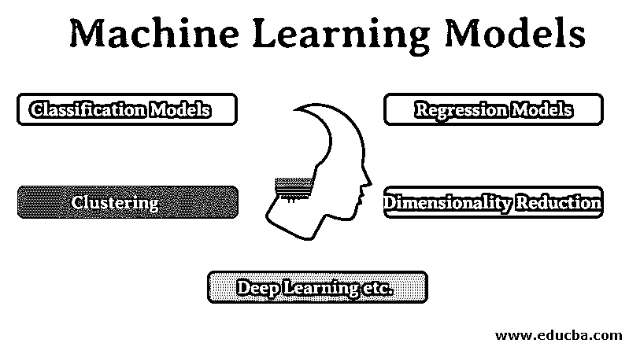

# 机器学习模型

> 原文：<https://www.educba.com/machine-learning-models/>

## 机器学习模型简介

机器学习模型是训练过程的输出，并且被定义为现实世界过程的数学表示。[机器学习算法](https://www.educba.com/machine-learning-algorithms/)在训练数据集中寻找模式，用于逼近目标函数，并负责将输入映射到可用数据集中的输出。这些机器学习方法取决于任务的类型，并被分类为分类模型、回归模型、聚类、维度缩减、主成分分析等。

### 机器学习模型的类型

基于任务的类型，我们可以将机器学习模型分为以下类型:

<small>Hadoop、数据科学、统计学&其他</small>

*   分类模型
*   回归模型
*   使聚集
*   降维
*   深度学习等。

#### 1)分类

关于机器学习，分类是在有限数量的选项内预测对象的类型或类别的任务。分类的输出变量始终是分类变量。例如，预测一封电子邮件是否是垃圾邮件是一个标准的二进制分类任务。现在让我们记下分类问题的一些重要模型。

1.  k-最近邻算法-简单但计算详尽。
2.  朴素贝叶斯——基于[贝叶斯定理](https://www.educba.com/bayes-theorem/)。
3.  逻辑回归–二元分类的线性模型。
4.  SVM–可用于二元/多元分类。
5.  决策树-*'*If Else*'*基于分类器，对离群值更鲁棒。
6.  集成——将多个机器学习模型组合在一起以获得更好的结果。

#### 2)回归

在机器中，学习回归是一组输出变量可以取连续值的问题。例如，预测机票价格可以被视为一个标准的回归任务。让我们记下一些在实践中使用的重要回归模型。

1.  线性回归——回归任务最简单的基线模型，只有当数据是线性可分的，并且很少或没有多重共线性时才适用。
2.  套索回归-L2 正则化的线性回归。
3.  岭回归-L1 正则化的线性回归。
4.  SVM 回归
5.  决策树回归等。

#### 3)聚类

简而言之，聚类是将相似的对象分组在一起的任务。它有助于自动识别相似的对象，无需人工干预。没有同质数据，我们无法建立有效的监督机器学习模型(需要用人工筛选或标记的数据训练的模型)。集群帮助我们以更智能的方式实现这一目标。以下是一些广泛使用的聚类模型:

1.  k 表示–简单，但方差较大。
2.  K 表示++ K 表示的修改版本。
3.  K medoids。
4.  凝聚聚类–一种层次聚类模型。
5.  基于密度的聚类算法等。

#### 4)降维

维数是用于预测独立变量或目标的预测变量的数量。通常，在现实世界的数据集中，变量的数量太多。太多的变量也会给模型带来过度拟合的诅咒。在实践中，在这些大量的变量中，并不是所有的变量对目标的贡献都是相等的，在许多情况下，我们实际上可以用较少的变量来保持方差。下面列举一些常用的降维模型。

1.  主成分分析——它从大量的预测中创造出较少的新变量。新的变量相互独立，但更难解释。
2.  TSNE–提供高维数据点的低维嵌入。
3.  奇异值分解用于将矩阵分解成更小的部分，以提高计算效率。

#### 5)深度学习

深度学习是处理神经网络的机器学习的子集。基于神经网络的架构，让我们列出重要的深度学习模型:

1.  多层感知器
2.  卷积神经网络
3.  递归神经网络
4.  玻尔兹曼机器
5.  自动编码器等。

### 哪个型号最好？

上面我们采用了许多机器学习模型的想法。现在，一个显而易见的问题浮现在我们的脑海中，那就是它们中最好的模型？它取决于手头的问题和其他相关属性，如离群值、可用数据量、数据质量、特征工程等。在实践中，最好从适用于问题的最简单模型开始，通过适当的参数调整和交叉验证逐渐增加复杂性。数据科学领域有一句谚语——“交叉验证比领域知识更值得信赖。

### 如何建立模型？

让我们看看如何使用 python 的 Scikit 学习库构建一个简单的逻辑回归模型。为了简单起见，我们假设问题是一个标准的分类模型，并且‘train . CSV’是训练，而‘test . CSV’分别是训练和测试数据。

### 结论

本文讨论了用于实际目的的重要机器学习模型，以及如何用 python 构建一个简单的模型。为特定用例选择适当的模型对于获得机器学习任务的适当结果非常重要。为了比较各种模型之间的性能，针对特定的业务问题定义了评估指标或 KPI，并在应用统计性能检查后选择最佳模型用于生产。

### 推荐文章

这是机器学习模型的指南。在这里，我们讨论了机器学习模型的前 5 种类型的基本概念以及如何详细构建它。您也可以浏览我们推荐的其他文章，了解更多信息——

1.  [机器学习方法](https://www.educba.com/machine-learning-methods/)
2.  [机器学习的类型](https://www.educba.com/types-of-machine-learning/)
3.  [机器学习算法](https://www.educba.com/machine-learning-algorithms/)
4.  [什么是机器学习？](https://www.educba.com/what-is-machine-learning/)

