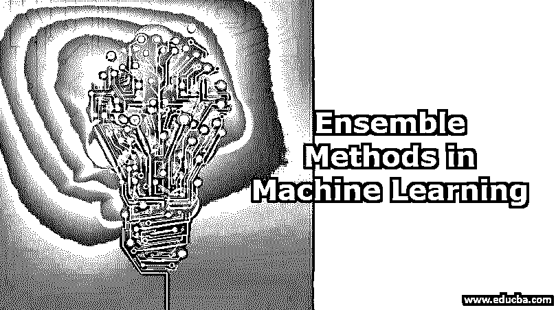
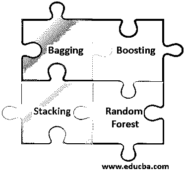

# 机器学习中的集成方法

> 原文：<https://www.educba.com/ensemble-methods-in-machine-learning/>

## 机器学习中的集成方法介绍

机器学习中的集成方法被定义为多模态系统，其中不同的分类器和技术被战略性地组合成一个预测模型(分为顺序模型、并行模型、同质和异质方法等。)集成方法也有助于减少预测数据中的方差，最小化预测模型中的偏差，并且以更好的准确性对来自复杂问题的统计数据进行分类和预测。

### 机器学习中集成方法的类型

集成方法有助于创建多个模型，然后将它们组合起来以产生改进的结果，一些集成方法分为以下几组:

<small>Hadoop、数据科学、统计学&其他</small>

#### 1.顺序方法

在这种集成方法中，存在顺序生成的基础学习器，其中存在数据依赖性。基础学习者中的所有其他数据都依赖于以前的数据。因此，之前的错误标记数据基于其权重进行调整，以提高整个系统的性能。

**示例**:升压

#### 2.并行方法

在这种集成方法中，基本学习器以并行顺序生成，其中不存在数据依赖性。基础学习器中的每个数据都是独立生成的。

**示例**:堆叠

#### 3.均匀系综

这种集成方法是相同类型分类器的组合。但是每个分类器的数据集是不同的。这将使组合模型在汇总每个模型的结果后更精确地工作。这种集成方法适用于大量数据集。在同质方法中，对于不同的训练数据，特征选择方法是相同的。这在计算上是昂贵的。

**例:【bagging、boosting 等流行方法进入同质系综。**

#### 4.异质系综

这种集成方法是不同类型的分类器或[机器学习模型](https://www.educba.com/machine-learning-models/)的组合，其中每个分类器建立在相同的数据上。这种方法适用于小数据集。在异构中，对于相同的训练数据，特征选择方法是不同的。这种集合方法的总体结果是通过平均每个组合模型的所有结果来实现的。

**示例**:堆叠

### 集合方法的技术分类

以下是集合方法的技术分类:

#### 1.制袋材料

这种集成方法将两种机器学习模型(即自举和聚合)组合成单个集成模型。bagging 方法的目的是减少模型的高方差。决策树具有方差和低偏差。大型数据集(比如 1000 个样本)是子采样的(比如 10 个子样本，每个子样本携带 100 个数据样本)。[多个决策树](https://www.educba.com/decision-tree-in-machine-learning/)建立在每个子样本训练数据上。当在不同的决策树上敲打子采样数据时，减少了对每个决策树上的训练数据的过度拟合的关注。为了模型的效率，每一个单独的决策树生长得更深，包含子采样的训练数据。汇总每个决策树的结果，以了解最终的预测。汇总数据的方差开始减小。bagging 方法中模型的预测精度取决于所用决策树的数量。样本数据各种子样本是通过替换随机选择的。每棵树的输出都有很高的相关性。

#### 2.助推

提升集成也组合不同的相同类型的分类器。Boosting 是一种顺序集成方法，其中每个模型或分类器基于下一个模型将利用的特征运行。以这种方式，增强方法通过平均它们的权重从弱学习者模型中找出更强的学习者模型。换句话说，一个较强的训练模型依赖于多个较弱的训练模型。弱学习者或穿着训练模型是与真实分类非常不相关的模型。但是下一个弱学习者与真实分类稍微更相关。这些不同的弱学习器的组合给出了与真实分类非常相关的强学习器。

#### 3.堆垛

这种方法还使用元分类器或元模型结合了多种分类或回归技术。用完整的训练数据集训练较低级别的模型，然后用较低级别的模型的结果训练组合模型。与 boosting 不同，每个较低级别的模型都经历并行训练。来自较低层模型的预测被用作作为训练数据集的下一个模型的输入，并形成一个堆栈，其中模型的顶层比模型的底层受到更多的训练。顶层模型具有很好的预测精度，它们建立在低层模型的基础上。堆栈继续增加，直到以最小误差进行最佳预测。组合模型或元模型的预测基于不同弱模型或较低层模型的预测。它侧重于产生较少偏差的模型。

#### 4.随机森林

随机森林与 bagging 略有不同，因为它使用了适合 bootstrap 样本的深树。每个树的输出被组合以减少方差。在生长每棵树时，我们不是基于数据集中的观察来生成引导样本，而是基于特征对数据集进行采样，并且仅使用这种样本的随机子集来构建树。换句话说，数据集的采样是基于降低不同输出相关性的特征进行的。随机森林有助于确定丢失的数据。随机森林意味着随机选择样本的子集，这减少了获得相关预测值的机会。每棵树都有不同的结构。随机森林导致森林的偏差略微增加，但是由于对来自不同树的所有不太相关的预测进行平均，结果方差减小，并且总体上给出更好的性能。

### 结论

集成的多模型方法是通过深度学习模型来实现的，在深度学习模型中，通过分类器的这种不同组合来研究和处理复杂数据，以获得更好的预测或分类。集成学习中每个模型的预测必须更加不相关。这将使模型的偏差和方差尽可能低。该模型将更有效，并在最小误差下预测产量。集成是一种受监督的学习算法，因为模型是用数据集预先训练的，以进行预测。在集成学习中，分量分类器的数量应该与类别标签的数量相同，以达到较高的准确率。

### 推荐文章

这是机器学习中集成方法的指南。在这里，我们讨论了机器学习中集成方法的重要类型以及技术分类。您也可以浏览我们推荐的其他文章，了解更多信息——

1.  [集成技术介绍](https://www.educba.com/ensemble-techniques/)
2.  [具有优势的机器学习生命周期](https://www.educba.com/machine-learning-life-cycle/)
3.  [机器学习算法](https://www.educba.com/machine-learning-algorithms/)

