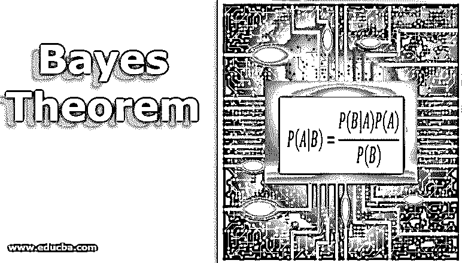
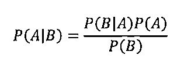
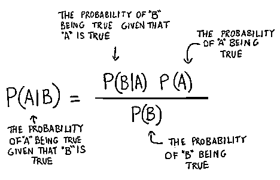

# 贝叶斯定理

> 原文：<https://www.educba.com/bayes-theorem/>

## 什么是贝叶斯定理？

贝叶斯定理是一个配方，描述了当给出证据时，如何更新理论的概率。它基本上是从条件概率的准则出发的；然而，它可以用于推理广泛的问题，包括定罪刷新。

给定理论 h 和证明 e，贝叶斯定理表示在得到证明 P(H)之前的推测的概率和在得到证明 P(H∣E 之后的理论的概率之间的关系是:

<small>Hadoop、数据科学、统计学&其他</small>

这是一个美丽的概率概念，当我们知道其他概率时，我们就找到了这个概率:

*   这告诉我们，在给定 B 发生的情况下，A 发生的有多规律，由 P(A|B)组成
*   当我们知道，给定一个发生，B 如何有规律地发生，合成 P(B|A)
*   此外，在没有其他人的情况下，组合 P(A)的可能性有多大
*   更何况，没有其他人的 B 有多大可能，组成 P(B)

### 贝叶斯定理的例子

你今天要安排一次郊游；然而，早晨阴云密布；上帝帮助我们！每一个暴风雨天的一半都是从阴暗开始的！无论如何，阴暗的早晨是正常的(大约 40%的日子开始变阴)。此外，这通常是一个干旱的月份(一般来说，30 天中只有 3 天会有暴风雨，或 10%)。白天下暴雨的概率有多大？我们将用雨来表示白天的倾盆大雨，用云来表示多云的早晨。给定云下雨的可能性由 P(雨|云)组成

所以我们应该把它放在等式里:

*   下雨的概率= 10%(给定)
*   P(Cloud|Rain)有云和下雨的概率= 50%
*   p(云)是那里有云的概率= 40%

所以我们可以说在 c 语言中:

这就是贝叶斯定理:你可以利用一件事的概率来预见另一件事的概率。然而，贝叶斯定理绝不是静态的。这是一台机器，你扳手，以改善和更好的预测，作为新的证明表面。一个有趣的活动是通过将独特的理论品质归入 P(B)或 P(A)来扰乱这些因素，并考虑它们对 P(A|B)的连贯影响。例如，如果你增加右边的分母 P(B ),那么 P(A|B)会下降。实体模型:流鼻涕表示麻疹，但不可否认，流鼻涕比带有小白点的皮疹更典型。

也就是说，如果你选择 P(B)，其中 B 是流鼻涕，在这一点上，整个公众中流鼻涕的复发减少了流鼻涕是麻疹指征的机会。随着副作用逐渐变得正常，发现麻疹的概率下降；这些表现并不是可靠的指针。类似地，随着麻疹变得越来越正常，P(A)在右边的分子中上升，P(A|B)本质上上升，因为麻疹的可能性更大，很少考虑你所考虑的副作用。

### 贝叶斯定理在机器学习中的应用

下面给出的是贝叶斯定理在机器学习中的应用:

**朴素贝叶斯分类器:**

朴素贝叶斯是双(两类)和多类分组问题的表征计算。当使用双重或直接的信息质量描述时，系统是最不需要理解的。它被称为朴素贝叶斯或低能贝叶斯，因为计算每一个理论的概率是精简的，使他们的计数易于处理。与努力确定每个特质自尊 P(d1，d2，d3|h)的估计相反，它们被认为是给定目标价值的限制性自由的，并被确定为 P(d1|h) * P(d2|H，等等。

这是一个坚实的假设，是最牵强的真实信息；例如，属性不通信。渐渐地，这种方法在这种假设不成立的信息上表现得非常好。

**朴素贝叶斯模型使用的刻画:**

朴素贝叶斯算法的描述是概率。带有概率的集合被放在一边，以请求一个学术性的朴素贝叶斯模型。

这包括:

*   **类概率:**准备数据集中一切的概率。
*   **条件概率:**给定每个类的权重，每个实例信息值的条件概率。

从数据中获取朴素贝叶斯模型。从准备信息中获取朴素贝叶斯模型很快。准备是快速的，因为应该确定该类的每个实例的概率值和给定区别信息(x)值的该类的每个实例的概率值。增强系统不应该适合任何系数。

##### 计算类别概率

类别概率基本上是案例的重复出现，每个类别由完整的案例数隔离。

例如，在并行类中，案例在类 1 中具有位置的概率被确定为:

Probability (class=1) = total(class=1)/(total(class=0) + total(class=1))

在最简单的情况下，每个类都有 0.5 或一半的概率出现双重分类问题，并且在该类的每个实例中出现的次数相似。

##### 计算条件概率

条件概率是给定类别价值的每个特征尊重的重现，由具有该类别尊重的实例的重现来划分。

### 贝叶斯定理的所有应用

贝叶斯定理在现实中有很多应用。尽量不要强调万一你没有立即看到所有的算法。简单地了解一下它是如何工作的就足够了。

贝叶斯决策理论是处理范例分类问题的一种可度量的方法。在这种假设下，期望类别的基本概率传递是已知的。这样，我们获得了一个完美的贝叶斯分类器，每个其他的分类器都是根据它来决定执行的。

我们将讨论贝叶斯定理的三个基本用途:

*   朴素贝叶斯分类器
*   判别函数和决策面
*   贝叶斯参数估计

### 结论

贝叶斯定理的伟大和深刻从未停止让我震惊。一位 250 多年前去世的牧师给出了一个基本的想法，这个想法在今天绝对无误的人工智能程序中得到了应用。

### 推荐文章

这是贝叶斯定理的指南。在这里，我们讨论贝叶斯定理在机器学习中的使用，以及朴素贝叶斯模型使用的描述，并附有示例。您也可以看看以下文章，了解更多信息–

1.  [朴素贝叶斯算法](https://www.educba.com/naive-bayes-algorithm/)
2.  [机器学习算法的类型](https://www.educba.com/types-of-machine-learning-algorithms/)
3.  [机器学习模型](https://www.educba.com/machine-learning-models/)
4.  [机器学习方法](https://www.educba.com/machine-learning-methods/)

