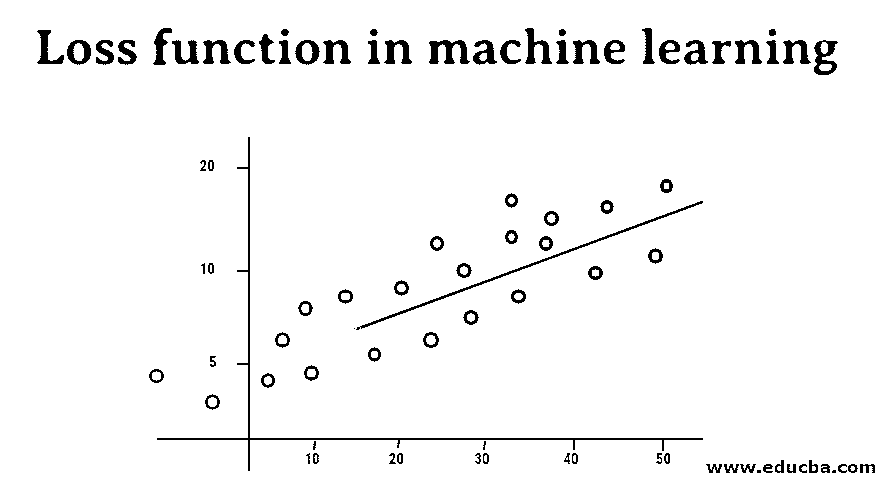

# 机器学习中的损失函数

> 原文：<https://www.educba.com/loss-functions-in-machine-learning/>

## 机器学习中损失函数综述

在机器学习中，损失函数被确定为单个训练示例的实际输出和模型的预测输出之间的差，而所有训练示例的损失函数的平均值被称为成本函数。从损失函数(如回归损失、二元分类和多元分类损失函数)计算出的差值称为误差值；这个误差值与实际值和预测值成正比。

### 损失函数是如何工作的？

“损失”一词表示未能达到预期产出的惩罚。如果我们的模型的预测值与期望值之间的偏差很大，那么损失函数会给出一个较高的数字作为输出，如果偏差很小&非常接近期望值，那么它会输出一个较小的数字。

<small>Hadoop、数据科学、统计学&其他</small>

这里有一个例子，当我们试图预测大都市的房屋销售价格。

| Predicted销售价格(10 万卢比) | Actual销售价格(10 万卢比) | 偏差(损失) |
| 班加罗尔:45 人 |  | 0(所有预测都是正确的) |
| 浦那:35 人 |  |
| 钦奈:40 人 |  |
| 班加罗尔:40 人 | 班加罗尔:45 人 | 班加罗尔 50 万，钦奈 20 万 |
| 浦那:35 人 | 浦那:35 人 |
| 钦奈:38 人 | 钦奈:40 人 |
| 班加罗尔:43 人 |  | 班加罗尔 20 万卢比，钦奈 50 万卢比， |
| 浦那:30 |  |
| 钦奈:45 人 |  |

值得注意的是，偏离量并不重要；这里重要的是我们的模型预测的值是对还是错。损失函数基于你的问题陈述而不同，而[机器学习](https://www.educba.com/what-is-machine-learning/)正被应用于该问题陈述。成本函数是损失函数的另一个可互换的术语，但它的含义略有不同。损失函数用于单个训练示例，而成本函数是整个训练数据集的平均损失。

### 机器学习中损失函数的类型

以下是机器学习中损失函数的不同类型，如下所示:

#### 1.回归损失函数

线性回归是这个函数的一个基本概念。回归损失函数在因变量(Y)和自变量(X)之间建立线性关系；因此，我们试图在这些变量上拟合最佳的空间线。

**Y = X0 + X1 + X2 + X3 + X4….+ Xn**

*   **X =** 自变量
*   **Y** =因变量

##### 均方误差损失

MSE(L2 误差)衡量模型的实际值和预测值之间的均方差。输出是与一组值相关联的单个数字。我们的目标是减少 MSE 以提高模型的准确性。

考虑线性方程， **y = mx + c** ，我们可以得出 MSE 为:

**MSE=1/N ∑i=1 to n (y(i)−(mx(i)+b))2**

这里 N 是数据点的总数， **1/N ∑i=1** 到 N 是平均值，y(i)是实际值，mx(i)+b 是其预测值。

##### 均方对数误差损失(MSLE)

MSLE 衡量实际值和预测值之间的比率。它在误差曲线中引入了不对称性。MSLE 只关心实际值和预测值之间的百分比差异。当我们想要预测房屋销售价格、面包店销售价格，并且数据是连续的时，它可以作为损失函数是一个不错的选择。

这里，损失可以计算为对数变换的实际值和预测值之间的平方差的观察数据的平均值，其可以给出为:

**L=1nn∑i=1(log(y(i)+1)−log(^y(i)+1))2**

##### 平均绝对误差

MAE 计算实际变量和预测变量之间的绝对差值之和。这意味着它测量一组预测值的平均误差幅度。使用均方误差更容易解决，但使用绝对误差对异常值更稳健。异常值是那些与其他观察到的数据点有很大偏差的值。

MAE 可以计算为:

**L=1nn∑i=1∣∣y(i)−^y(i)∣∣**

#### 2.二元分类损失函数

这些损失函数用来衡量分类模型的性能。在这种情况下，数据点被分配一个标签，即 0 或 1。此外，它们可以分为:

##### 二元交叉熵

这是二元分类问题的默认损失函数。交叉熵损失计算分类模型的性能，该模型给出介于 0 和 1 之间的概率值的输出。交叉熵损失随着预测概率值偏离实际标签而增加。

##### 铰链损耗

铰链损失可以用作交叉熵的替代，交叉熵最初被开发用于支持向量机算法。铰链损失最适合分类问题，因为目标值在{-1，1}的集合中。当实际值和预测值之间存在符号差异时，它允许分配更多的误差。因此导致比交叉熵更好的性能。

##### 平方铰链损耗

铰链损失的扩展，它简单地计算铰链损失分数的平方。它减少了误差函数，使其在数值上更容易处理。它查找指定各种类的数据点之间的最大边距的分类边界。平方铰链损失非常适合是或否类型的决策问题，其中概率偏差不是关注点。

#### 3.多类分类损失函数

多类分类是将数据点分配到两个以上类别的预测模型。每个类被分配一个从 0 到(类数–1)的唯一值。强烈推荐用于图像或文本分类问题，其中一篇论文可以有多个主题。

##### 多类交叉熵

在这种情况下，目标值在 0 到 n 的集合中，即{0，1，2，3…n}。它计算实际概率值和预测概率值之间的平均差值，并最小化该分数以达到最佳可能的准确性。多类交叉熵是文本分类问题的默认损失函数。

##### 稀疏多类交叉熵

一个热编码过程使得多类交叉熵难以处理大量数据点。稀疏交叉熵通过执行误差计算而不使用一键编码来解决这个问题。

##### Kullback Leibler 发散损失

KL 散度损失计算概率分布和基线分布之间的散度，并找出以比特为单位损失了多少信息。输出是一个非负值，指定两个概率分布有多接近。为了从概率的角度描述 KL 散度，使用了似然比。

在本文中，首先，我们理解了损失函数是如何工作的，然后我们继续探索一个包含用例的损失函数的综合列表。但是，实际理解更有益，所以尽量多读，多执行。它会彻底澄清你的疑惑。

### 推荐文章

这是机器学习中损失函数的指南。这里我们详细讨论损失函数是如何工作的，以及机器学习中损失函数的类型。您也可以看看以下文章，了解更多信息–

1.  [机器学习方法](https://www.educba.com/machine-learning-methods/)
2.  [机器学习简介](https://www.educba.com/introduction-to-machine-learning/)
3.  [大数据技术](https://www.educba.com/big-data-technologies/)
4.  [学习超参数的分类](https://www.educba.com/hyperparameter-machine-learning/)
5.  [机器学习生命周期|前 8 个阶段](https://www.educba.com/machine-learning-life-cycle/)

