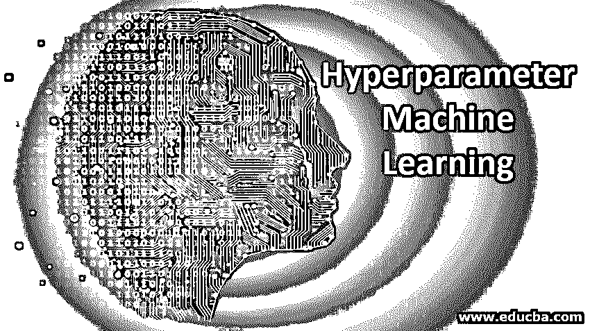

# 超参数机器学习

> 原文：<https://www.educba.com/hyperparameter-machine-learning/>

## 超参数机器学习简介

在机器学习中，所有这些参数都被称为超参数，由用户明确定义，以改善模型的学习。与那些从数据中获得而没有明确编程的参数不同，这些超参数分为两种形式，第一种是超参数优化，涉及(学习速率、批量大小和时期数)，第二种是特定模型的超参数，即(隐藏单元数、层数等)。)

### 什么是超参数机器学习？

对于机器学习中的大多数框架来说，超参数并没有一个严格的定义。这些超参数管理模型的基础系统，该系统指导模型的主要(模型)参数。

<small>Hadoop、数据科学、统计学&其他</small>

让我们用下面的例子来看看超参数。

*   当一个人处于学习阶段时，调整你的小提琴是非常重要的，因为在那个时候，一个人会在不同的感官之间建立联系。耳朵、手指和眼睛都在同时学习小提琴。现在开始习惯小提琴走调的声音会产生一种不好的声音味道，这将破坏一个人爱上小提琴学习过程的整个体验。
*   这就是为什么调小提琴真的可以帮助一个人学习小提琴的过程。同理，超参数也是对[机器学习模型](https://www.educba.com/machine-learning-models/)的一种调优，从而给出正确的方向。
*   通常在将机器学习算法应用于数据集之前定义超参数。
*   现在下一个任务是什么应该是超参数，它的值应该是什么。因为一个人在调音之前必须知道小提琴需要调什么弦，怎么调。这同样适用于超参数，我们需要定义什么超参数以及它们的值应该是什么，基本上这取决于每个任务和每个数据集。
*   为了理解这一点，让我们从模型优化的角度来看。
*   在机器学习模型的实现中，模型优化起着至关重要的作用。有许多机器学习的分支专门致力于机器学习模型的优化。人们普遍认为，为了优化模型，我们需要修改代码，以使错误最小化。
*   然而，存在影响机器学习优化的隐藏元素，其在模型之外，并且对模型行为有很大影响。这些隐藏元素被称为超参数，它们是优化任何机器学习模型的关键组件。
*   超参数是控制模型行为的微调器/设置。这些超参数是在模型之外定义的，但与模型性能有直接关系。超参数可视为与模型正交。
*   定义超参数的标准非常灵活和抽象。当然，有一些超参数，如隐藏层的数量，已建立的模型的学习率，也有一些设置可以被视为特定模型的超参数，如控制模型的容量。
*   如果算法直接通过设置学习，则算法有可能过度拟合模型。很明显，超参数不是通过训练集学习/调整的，因此使用测试或验证集来选择超参数。在 broadway 中，我们设置不同的超参数值，最适合测试或验证集的值被视为我们的最佳超参数。

### 超参数的类别

对于不同类型的数据集，根据模型，我们可以使用不同的超参数来提高模型的性能。

广义而言，超参数可以分为两类:

*   优化的超参数
*   特定模型的超参数

#### 1.优化的超参数

顾名思义，这些超参数用于优化模型。

*   **学习率:**这个超参数决定了新获取的数据将在多大程度上覆盖旧的可用数据。如果这个超参数的值很高，则更高的学习率不会适当地优化模型，因为它有可能跳过最小值。另一方面，如果学习率非常低，那么收敛将非常慢。学习率在模型性能的优化中起着至关重要的作用，因为在某些情况下，模型具有数百个带有误差曲线的参数(模型参数)，学习率将决定与所有参数交叉检查的频率。此外，很难找到误差曲线的局部最小值，因为它们通常具有不规则的曲线。
*   **批次大小:**为了加快学习过程，训练集被分成不同的批次。在训练模型的随机过程的情况下，小批量被训练、评估和反向传播，以便调整所有超参数的值，这同样被重复用于整个训练集。如果批量大于，将增加学习时间，并需要更多内存来处理矩阵乘法。如果批量小于，误差计算中会有更多噪声。
*   **历元数:**历元代表机器学习中待学习数据的一个完整周期。历元在迭代学习过程中起着非常重要的作用。考虑验证误差以确定正确的历元数。只要验证误差减少，就可以增加历元的数量。如果验证误差在连续的时期内没有改善，那么这是停止增加时期数量的信号。它也被称为提前停止。

#### 2.特定模型的超参数

一些超参数涉及模型本身的结构。

*   **隐单元数量:**在[深度学习模型](https://www.educba.com/deep-learning-model/)中，定义神经网络的隐单元数量至关重要。该超参数用于定义模型的学习能力。对于复杂的函数，我们必须定义一些隐藏单元，但是请记住，它不应该过度适应模型。
*   **层数:**[很明显，3 层的神经网络](https://www.educba.com/what-is-neural-networks/)将比 2 层的神经网络给出更好的性能。在神经网络中，增加超过 3 并没有多大帮助。在 CNN 的例子中，层数的增加使得模型更好。

### 结论

在将机器学习算法应用于数据集之前，明确定义超参数。超参数用于定义模型的高级复杂度和学习能力。超参数也可以是模型的设置。定义了一些超参数来优化模型(批量大小、学习速率等)。)还有一些是特定于模型的(隐藏层数等)。).

### 推荐文章

这是一本超参数机器学习指南。在这里，我们讨论介绍和什么是超参数机器学习及其类别。您也可以阅读以下文章，了解更多信息——

1.  [机器学习简介](https://www.educba.com/introduction-to-machine-learning/)
2.  [无监督机器学习](https://www.educba.com/unsupervised-machine-learning/)
3.  [机器学习算法的类型](https://www.educba.com/types-of-machine-learning-algorithms/)
4.  [机器学习的应用](https://www.educba.com/applications-of-machine-learning/)

