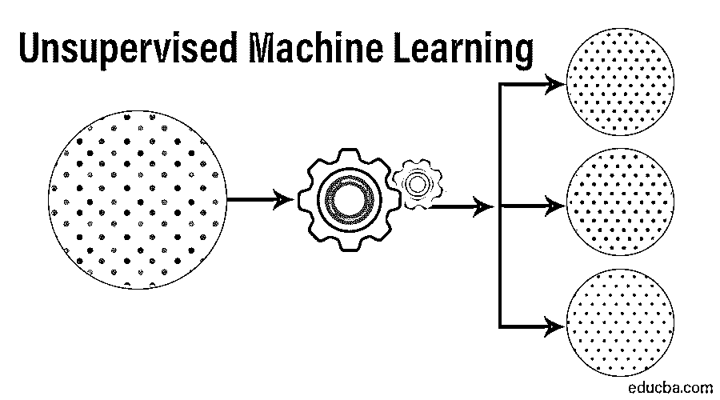

# 无监督机器学习

> 原文：<https://www.educba.com/unsupervised-machine-learning/>

## 无监督机器学习简介

无监督机器学习是机器学习的三种主要技术之一。这是一种自组织的学习算法，其中我们不需要通过提供带标签的数据集来监督数据，因为与监督学习等其他机器学习技术相比，它可以通过执行复杂的任务(如主成分分析和聚类分析)在未标记的数据集中找到以前未知的模式，从而发现有用的信息。所以，让我们看看如何做到这一点！在这个主题中，我们将学习无监督机器学习。

“机器学习”，顾名思义，我们正在教机器做类似人类的任务，以及人类如何学习，要么从某人那里，要么通过观察。和人类一样，机器学习的方式。

<small>Hadoop、数据科学、统计学&其他</small>

机器学习可以分为 3 个部分:

*   监督学习
*   无监督学习
*   [强化学习](https://www.educba.com/what-is-reinforcement-learning/)

### 机器学习的类型

强化学习是基于主体的学习，它包括对主体所采取的行动进行奖励和惩罚。最终目标是在从环境中学习的过程中最大化整体回报。

当你有输入-输出数据，简而言之，有标签的数据，例如，给定身高和体重以确定一个人是男是女，可以被[视为监督学习](https://www.educba.com/what-is-supervised-learning/)任务(在人类的情况下，来自某人)。

但是在许多现实生活场景中，这种带标签或带注释的数据并不总是可用的。因此，很多时候，我们会面临基于没有明确提到的属性来分割对象的问题。那么如何解决这个问题呢？嗯，无监督学习是解决办法。

维基百科表示，无监督学习是一种自组织的 Hebbian 学习，有助于在没有预先存在的标签的情况下发现以前未知的数据集模式。在无监督学习中，我们没有任何标签信息，但我们仍然希望根据数据的不同属性从数据中获得洞察力。

### 无监督机器学习的类型

无监督学习任务可以大致分为 3 类:

*   关联规则挖掘
*   使聚集
*   推荐系统

#### 1.关联规则挖掘

当我们有某样东西的交易数据时，它可以是销售的产品或任何相关的交易数据；我想知道，买家和产品或产品对产品之间是否有任何隐藏的关系，这样我就可以以某种方式利用这些信息来增加我的销售。提取这些关系是关联规则挖掘的核心。我们可以使用人工免疫、SETM、先验、FP 生长算法来提取关系。

#### 2.使聚集

可以对任何没有类别或标签信息的数据进行聚类。我们希望对数据进行分组，使得具有相似属性的观测值属于同一个聚类/组，并且聚类间的距离应该最大。同时，组内距离应该最小。我们可以对投票者的数据进行聚类，以确定对政府的看法，或者根据产品的功能和用途对产品进行聚类。基于收入特征或在销售和营销中使用聚类来划分人群。

我们可以使用 K 均值、K 均值++和模糊 C 均值(FCM)

期望最大化(EM)、凝聚聚类、DBSCAN、分层聚类类型，如单个连锁、完全连锁、中间连锁、Ward's method 聚类算法。​

#### 3.推荐系统

推荐系统在某种意义上基本上是关联规则挖掘的延伸；我们正在 ARM 中提取关系。在推荐系统中，我们使用这些关系来推荐最终用户更有可能接受的东西。在 2009 年网飞宣布了 100 万美元的大奖后，推荐系统开始流行起来。

推荐系统处理交易数据，无论是金融交易、电子商务还是杂货店交易。如今，电子商务行业的巨头正在通过根据每个用户过去的购买历史和来自其他用户的类似行为购买数据为每个用户提供定制推荐来吸引客户。

开发推荐系统的方法可以大致分为协同过滤和基于内容的过滤。在协同过滤中，我们有用户-用户协同过滤和项目-项目协同过滤，它们是基于记忆的方法&基于矩阵分解和奇异值分解(SVD)模型的方法。

### 无监督学习的应用

随着世界上的数据每天都在急剧增加，无监督学习有许多应用。我们总是在通过使用社交媒体平台或 YouTube 上的一些视频内容来创建数据，很多时候我们甚至不是故意这样做的。所有这些数据都是非结构化的，为监督学习任务标记这些数据会很累，而且很昂贵。

以下是无监督机器学习的一些很酷的应用:

*   **杂货店或电子商务商店/市场:**从客户交易数据中提取关联规则，为消费者购买产品提供建议。
*   **社交媒体平台:**提取与不同用户的关系，以推荐产品或服务。为社交网络推荐新人。
*   服务:旅游服务推荐、房屋租赁推荐或婚介服务。
*   **银行业:**根据金融交易对客户进行聚类。对欺诈交易进行聚类，以进行欺诈检测。
*   **政治:**聚集选民对某一政党获胜机会的看法。
*   **数据可视化:**通过聚类和 t 分布随机邻居嵌入(t-SNE)，我们可以可视化高维数据。此外，这还可以用于降维。
*   娱乐:推荐电影、音乐，就像网飞和亚马逊正在做的那样。
*   **图像分割:**根据最近的像素值对图像部分进行聚类。
*   **内容:**个性化报纸、网页推荐、电子学习应用、邮件过滤器。
*   **结构发现:**通过聚类，我们可以发现数据中的任何隐藏结构——聚类 twitter 数据以进行情感分析。

### 结论

无监督机器学习不太可量化，但可以解决监督算法失败的许多问题。在我们拥有非结构化和未标记数据的许多领域中，无监督学习有许多应用。我们可以使用无监督学习技术来教我们的机器做得比我们更好。近年来，在被认为是由人类解决了几个世纪的任务方面，机器的表现超过了人类。我希望通过这篇文章，你能理解什么是无监督的[机器学习技术](https://www.educba.com/machine-learning-techniques/)如何被用来解决现实世界的问题。

### 推荐文章

这是一本无监督机器学习的指南。这里我们讨论机器学习的类型和无监督机器学习的类型及其应用。您也可以看看以下文章，了解更多信息–

1.  [机器学习算法](https://www.educba.com/machine-learning-algorithms/)
2.  [什么是机器学习？](https://www.educba.com/what-is-machine-learning/)
3.  [机器学习简介](https://www.educba.com/introduction-to-machine-learning/)
4.  [机器学习工具](https://www.educba.com/machine-learning-tools/)

