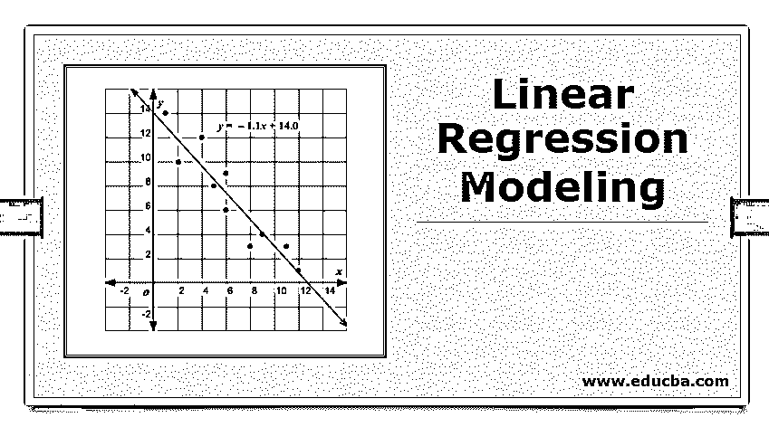
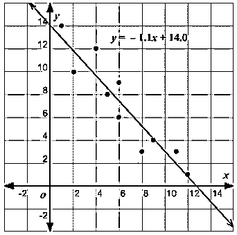
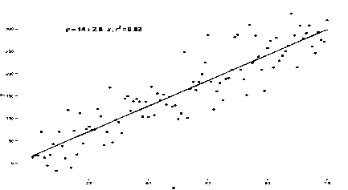
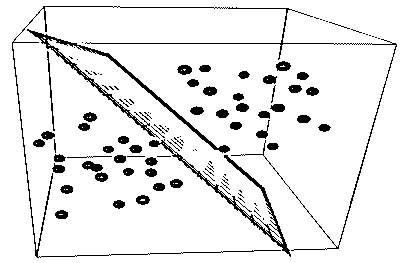

# 线性回归建模

> 原文：<https://www.educba.com/linear-regression-modeling/>

## 线性回归建模概述

线性回归实际上已经存在很长时间了(大约 200 年)。它是一个线性模型，即假设输入变量(x)和单个输出变量(y)之间存在线性关系。这里的 y 由输入变量的线性组合计算得出。

[线性回归](https://www.educba.com/what-is-linear-regression/)是一种机器学习算法，用于对标量相关变量和一个或多个自变量之间的关系进行建模。有一个独立变量的情况称为简单线性回归，而有多个线性回归的情况称为多元线性回归。在这两种线性回归中，模型都是使用线性预测函数构建的。未知数据参数是使用可用数据集估计的，因为该特征具有各种应用，例如金融、经济、流行病学等。

<small>Hadoop、数据科学、统计学&其他</small>

因此，监督学习是这样一种学习，我们训练机器来理解训练数据集中提供的输入和输出值之间的关系，然后使用相同的模型来预测测试数据集的输出值。因此，基本上，如果我们的训练数据集中已经提供了输出或标记，并且我们确信提供的输出与输入相对应是有意义的，那么我们使用监督学习。监督学习算法分为回归和分类。

当您注意到输出是一个连续变量时，就使用回归算法；而当输出被分成通过/失败、良好/一般/不良等部分时，就使用分类算法。我们有各种算法来执行回归或分类操作，线性回归算法是回归中的基本算法。

来到这个回归，在进入算法之前，让我为你设定基数。上学的时候，希望大家记住线方程概念。让我简单介绍一下。给定 XY 平面上的两个点，即(x1，y1)和(x2，y2)，其中 y1 是 x1 的输出，y2 是 x2 的输出，那么通过这些点的直线方程是(y-y1)=m(x-x1)其中 m 是直线的斜率。找到直线方程后，如果给你一个点，比如说(x3，y3)，你可以很容易地预测这个点是否在线上，或者点到直线的距离。这是我上学时做的基本回归，甚至没有意识到这在机器学习中有如此重要的意义。我们通常这样做，以确定可以适当地拟合训练数据集的输入和输出的方程线或曲线，然后使用相同的方程来预测测试数据集的输出值。这将导致连续的期望值。

### 两种类型的线性回归

先说两类线性回归。

#### 1.简单线性回归

当只有一个输入变量时，即直线方程是 c

考虑为 y=mx+c，那么就是简单的线性回归。

#### 2.多元线性回归

当有多个输入变量时，即直线方程被认为是 y = ax1+bx2+…NXn，那么就是[多元线性回归](https://www.educba.com/multiple-linear-regression/)。利用各种技术从数据中准备或训练回归方程，其中最常见的一种称为普通最小二乘法。使用上述方法建立的模型被称为普通最小二乘线性回归或简称最小二乘回归。当要确定的输入值和输出值是数值时，使用模型。当只有一个输入和一个输出时，则形成的方程是一个线性方程，即

`y = B0x+B1`

其中线的系数将使用统计方法来确定。

[简单线性回归](https://www.educba.com/simple-linear-regression/)模型在 ML 中很少见，因为我们通常会有各种输入因素来决定结果。当有多个输入值和一个输出值时，则形成的方程是平面或超平面的方程。

`y = ax1+bx2+…nxn`

 

回归模型的核心思想是获得最符合数据的直线方程。最佳拟合线是当所有数据点的总预测误差被认为尽可能小时。误差是平面上的点到回归线的距离。

### 例子

让我们从简单线性回归的例子开始。

一个人的身高和体重是成正比的关系。对志愿者进行了一项研究，以确定人的身高和理想体重，并记录了这些值。这将被视为我们的训练数据集。使用训练数据，计算回归线方程，这将给出最小误差。然后，这个线性方程用于对新数据进行预测。也就是说，如果我们给定了人的身高，那么对应的体重应该是由我们开发的模型预测出来的，误差最小或者为零。

`Y(pred) = b0 + b1*x`

b0 和 b1 值的选择必须使误差最小。如果将误差平方和作为评估模型的度量，那么目标是获得一条最能减少误差的线。

我们将误差平方，这样正值和负值就不会相互抵消。对于具有一个预测器的模型:

线方程中截距(b0)的计算如下:

输入值 x 的系数计算如下:

了解系数 b 1 :

*   如果 b 1 > 0，那么 x(输入)和 y(输出)成正比。也就是说，x 的增加会增加 y，比如身高增加，体重增加。
*   如果 b 1 < 0，那么 x(预测值)和 y(目标值)成反比。也就是说，x 的增加会使 y 减少，如车速增加，所用时间减少。

了解系数 b 0 :

*   B 0 占用模型的残差值，确保预测没有偏差。如果我们没有 B 0 项，那么线方程(y=B 1 x)被强制通过原点，即输入到模型中的输入和输出值结果为 0。但绝不会是这样的；如果我们在输入中有 0，那么 B 0 将是 x=0 时所有预测值的平均值。在 x=0 的情况下，将所有预测值设置为 0 将导致数据丢失，这通常是不可能的。

除了上面提到的系数之外，该模型也可以使用正规方程来计算。我将在下一篇文章中进一步讨论正规方程的使用和设计一个简单/多线性回归模型。

### 推荐文章

这是线性回归建模指南。这里我们讨论线性回归的基本概念和类型，包括简单和多元线性回归以及一些例子。您也可以阅读以下文章，了解更多信息——

1.  [R 中的线性回归](https://www.educba.com/linear-regression-in-r/)
2.  [预测建模](https://www.educba.com/predictive-modeling/)
3.  [如何在 R 中创造 GLM？](https://www.educba.com/glm-in-r/)
4.  [线性回归 vs 逻辑回归](https://www.educba.com/linear-regression-vs-logistic-regression/)

