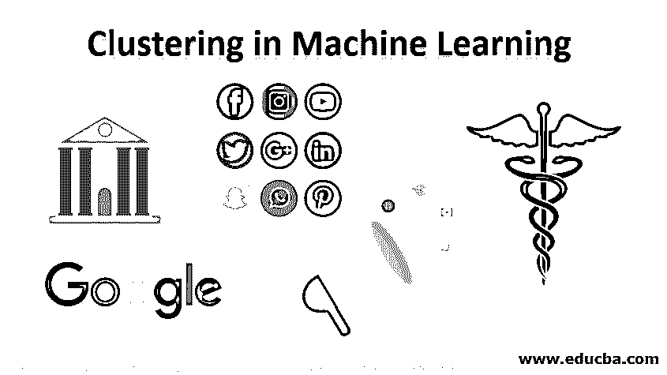
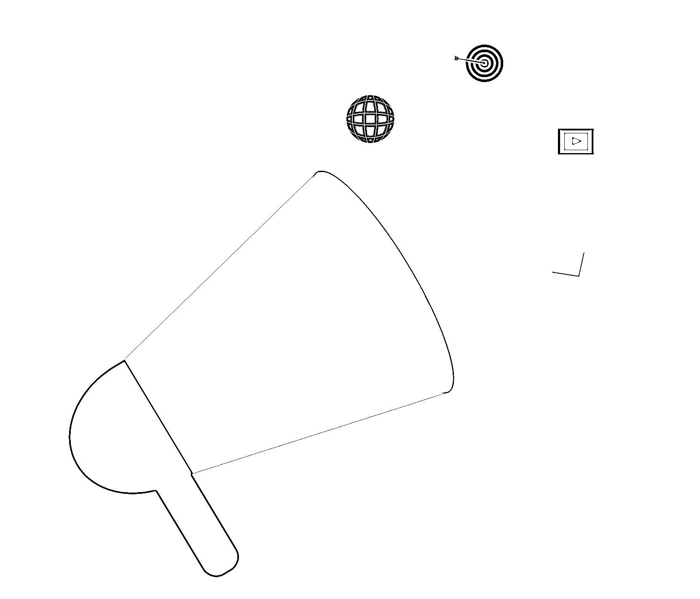

# 机器学习中的聚类

> 原文：<https://www.educba.com/clustering-in-machine-learning/>

## 机器学习中的聚类介绍

机器学习中的聚类是在用于统计数据分析的无监督学习技术中使用的主要方法之一，通过基于相似的特征或属性将给定数据集的群体或数据点分类成几个组，而不同组中的数据点构成高度不相似的属性或特征。机器学习中使用的聚类方法(即，k-均值聚类、密度方法、基于网格的方法、分层基方法等。)根据它们之间的相似性和不相似性来执行数据点的收集。

### 机器学习中的聚类是如何工作的？

在聚类中，我们将一个未标记的数据集分组，这就是所谓的无监督学习。当我们第一次对未标记的数据进行分组时，我们需要找到一个相似的组。当我们创建一个组时，我们需要了解数据集的特征，即相似的东西。如果我们通过一个或两个特征创建一个组，就很容易衡量相似性。

<small>Hadoop、数据科学、统计学&其他</small>

*   **例#1:** 导演的电影。聚类完成后，每个聚类都被分配一个聚类号，称为 ClusterID。[像 YouTube 这样的机器学习系统](https://www.educba.com/machine-learning-system/)用 clusterID 来表示复杂数据最容易。
*   例 2: YouTube 使用我们的搜索历史或观看历史，并推荐我们可能喜欢的视频。脸书的特征数据包括我们关注的人、我们关注的页面、我们输入的评论、我们喜欢的照片或视频、我们标记的图片或照片。由于数据的压缩，聚类脸书视频或照片将用单个 clusterID 替换一组要素。

### 机器学习中聚类的四大方法

以下是机器学习中聚类的[种方法:](https://www.educba.com/clustering-methods/)

#### 1.等级体系的

集群这个名称定义了一种工作方式；这种方法以分层的方式形成一个集群。使用先前形成的结构形成新的簇。我们需要理解分裂法和凝聚法之间的区别。凝聚是一种自下而上的方法；它从一个簇中的单个点开始，并组合一些任意的。分裂始于单个集群，所有的点都在一个集群中，并把它分成多个集群。

#### 2.基于密度

在这种方法中，密集区域被认为是具有相似性的聚类。它不同于物体空间的低密度区域。DBSCAN 被称为带噪声的应用的基于密度的空间聚类。DBSCAN 寻找一些面向数据对象的 epsilon 我们设定一些半径ε和最小点数。如果我们在一个半径内超过一些最小数量的点，那么我们把一个集群列为高密度。这样，我们可以考虑高密度区域的数据。DBSCAN 不同于聚类的质心方法，因为它不是一种严格的方法。噪声点是低密度区域中未标记或标记为异常值的点。这就是我们不需要特定 k 的原因。我们可以为高密度区域指定最小点，并为区域或聚类指定我们想要的半径。

#### 3.分割

当我们有一个 N 个对象的数据集时，这个方法构造“K”作为数据的分区。这个分区是集群，即构造 K，分区(K<=N)。

**需要满足的要求:**

*   每个组或数据集必须包含至少一个对象。
*   每个对象应该只属于一个组。

划分的一个例子是 K 均值聚类。

#### 4.基于网格的

对象空间，有限数量的单元，形成网格结构。这种方法提供了快速的集群处理。这些是独立于对象空间的。

### 聚类在机器学习中的应用

以下是聚类在机器学习中的应用:

#### 1.医学的

医生可以使用聚类算法来发现疾病的检测。让我们以甲状腺疾病为例。当我们对包含甲状腺和非甲状腺数据集的数据集应用无监督学习时，可以使用聚类算法来识别甲状腺疾病数据集。聚类将识别疾病的原因，并将给出成功的结果搜索。

#### 2.社交网络

我们是互联网时代的一代；我们可以通过互联网认识任何人或了解任何个人身份。[社交网络](https://www.educba.com/what-is-social-networking/)网站使用聚类来理解内容、人脸或用户位置。当无监督学习用于社交时，它对于语言的翻译是有用的。**比如** Instagram 和脸书提供了语言的翻译功能。

#### 3.营销

我们可以看到或观察到不同的技术正在我们身边发展，人们正在吸引使用这些技术，如云、数字营销。为了吸引更多的客户，每个公司都在开发易于使用的功能和技术。为了了解客户，我们可以使用聚类。聚类将帮助公司了解用户群，然后对每个客户进行分类。这样，我们可以了解客户，找到客户之间的相似之处，并对他们进行分组。

#### 4.银行业务

我们观察到，诈骗钱财的行为正在我们身边发生，公司正在就此向客户发出警告。在聚类的帮助下，保险公司可以发现欺诈，确认客户的欺诈行为，并了解客户提出的政策。

#### 5.谷歌

谷歌是人们使用的搜索引擎之一。我们来举一个例子，当我们搜索一些像该地区宠物店的信息时；谷歌将为我们提供不同的选择。这是聚类的结果，提供给你的相似结果的聚类。

### 结论

我们已经看到了聚类和机器学习。机器学习中的聚类方法。关于无监督学习的信息。无监督学习的实时使用。聚类方法以及每种方法在机器学习中的工作原理。

### 推荐文章

这是机器学习中的聚类指南。在这里，我们讨论了机器学习中聚类的四大方法及其应用。您也可以浏览我们的其他相关文章，了解更多信息——

1.  [机器学习框架 10 强](https://www.educba.com/machine-learning-frameworks/)
2.  [具有优势的 K- Means 聚类算法](https://www.educba.com/k-means-clustering-algorithm/)
3.  [机器学习技术介绍](https://www.educba.com/machine-learning-techniques/)
4.  [机器学习模型|前 5 种类型](https://www.educba.com/machine-learning-models/)

