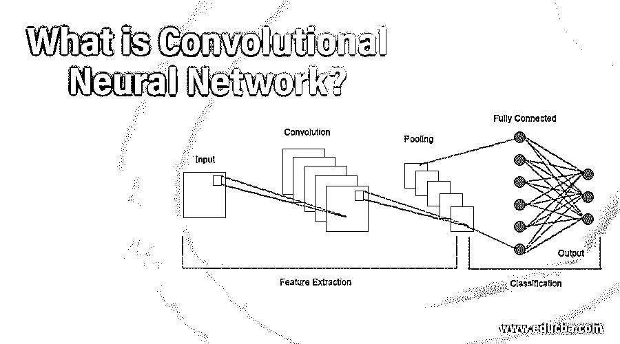

# 什么是卷积神经网络？

> 原文：<https://www.educba.com/what-is-convolutional-neural-network/>

## 卷积神经网络简介

卷积神经网络用于心理想象，而它接受输入并区分输出价格。这被用于像图像分类和医学图像分析这样的应用中。它是多层感知器的正则化版本，是连接到下一层的植物细胞的一层。

卷积神经网络由关联度输入层、关联度输出层和多个隐含层组成。CNN 的隐藏层通常包含一系列卷积层，这些卷积层通过乘法或替代实数进行扭曲。

<small>Hadoop、数据科学、统计学&其他</small>

神经网络中的卷积层应该具有以下属性:

*   由维度和高度勾勒的卷积核
*   各种输入通道和输出通道
*   卷积滤波器的深度应该能够处理输入特征图的通道数量。

### 卷积神经网络的特征

卷积神经网络具有后续特征:

*   卷积神经网络的各层有三种组织方式的神经元，它们是重量、高度和深度。
*   **局部特性:**它们通过在相邻层的神经元之间实现邻域连接模式来利用空间部分。
*   **共享权重:**在整个视觉视图中复制每个过滤器。
*   **汇集:**在这些汇集层中，特征地图被分成矩形子区域，因此每个平行四边形中的特征通过取它们的平均价格被分别下采样到一个价格。

### 附加超参数

卷积神经网络比传统的多层感知器使用更多的超参数。我们倾向于使用确定的规则，而不是优化。它们是:

*   **过滤器数量:**在此期间，特征图的大小随着深度而减小，因此，靠近输入层的层可能倾向于拥有较少的过滤器，而较高的层将拥有更多过滤器。关于输入的保护性附加数据将需要保持激活的总体变化从一层到下一层不减少。
*   **过滤形式:**在此期间，过滤形式基于数据集。我们想找出适当的水平，以找出无过滤器的形式
*   最大池形状:在此期间，选择较大的形状最终会削减信号的维度，这将导致多余的数据

#### 不同的层

卷积神经网络具有完全不同的层，将输入层改造成关联度输出层。

神经网络的各层如下所述:

*   卷积层
*   汇集层
*   校正长测量层
*   全连接层
*   损失层

#### 因素

卷积层由各种参数组成，

*   本地财产
*   空间排列
*   参数共享

#### 正规化

卷积神经网络使用各种形式的正则化。它们是:

*   经验正则化
*   显式正则化

### 经验主义的

在经验正则化下，我们倾向于:

*   **辍学:**辍学是几年前出现的最有效的正规化技术之一。辍学背后的基本计划是在第一个 DLN 的随意改变版本上运行场景公式的每一次迭代。
*   **Drop connect:** 是 dropout 的概括。Drop Connect 类似于 drop out，因为它在模型中引入了主动测量。在这种 drop connect 中，它的工作原理与 dropout 相同，但区别在于我们使用节点而不是权重。
*   **随机汇集:**在随机汇集中，标准结算汇集操作被随机程序所取代，其中每个汇集区域内的激活是在由汇集区域内的活动给出的多项分布内随机选取的。这种方法不需要超参数，并且将与各种正则化方法结合，如丢弃和信息增强。在随机汇集中，我们倾向于通过从由每个汇集区域的激活形成的多项分布中取样来选择汇集的映射响应。
*   **人工数据:**由于模型过拟合的程度由其各自的能力决定，因此其接收到的指导的数量也是如此，向卷积网络提供额外的指导示例将减少过拟合。这些网络通常用所有可获得的知识来训练，一种方法是从零开始产生新知识以制造新知识。

### 明确的

在明确的正规化下，我们倾向于:

*   **早停:**早停是思想习惯了的垄断过度拟合。在这种情况下，信息集被用来在每个训练时期的顶部计算损失，并且一旦损失停止减少，就停止训练并使用检查知识来计算最终的分类精度。
*   **参数个数:**在 CNN 中，滤波器大小还会额外影响参数个数。限制参数的数量直接限制了网络的预测能力，降低了它们对信息的操作质量，因此限制了过拟合的数量。
*   **权重衰减:**权重衰减是正则化中较为简单的一种，它只是在每个节点的误差上增加了一个误差，该误差与权重的总和或负载向量的平方成比例。
*   **最大范数约束:**正则化是对每个植物细胞的负载向量的大小施加关联度绝对边界，并使用投影梯度下降来施加约束。

### 卷积神经网络的应用

卷积神经网络在许多应用中被采用。下面提到其中一些:

*   它被用于图像识别
*   它被用于视频分析
*   用于语言处理
*   药物发现
*   健康风险评估
*   跳棋游戏
*   时间序列预测

### 结论

在这里，我们了解了卷积神经网络

*   它的特点
*   优化规则
*   CNN 的几层
*   用于 cnn 的正则化
*   应用程序

### 推荐文章

这是一本关于什么是卷积神经网络的指南？。这里我们讨论卷积神经网络的介绍，包括解释、特征和应用。您也可以浏览我们的其他相关文章，了解更多信息——

1.  [什么是神经网络？](https://www.educba.com/what-is-neural-networks/)
2.  [深度学习职业](https://www.educba.com/careers-in-deep-learnings/)
3.  [神经网络的类型](https://www.educba.com/types-of-neural-networks/)
4.  [深度学习网络](https://www.educba.com/deep-learning-networks/)

