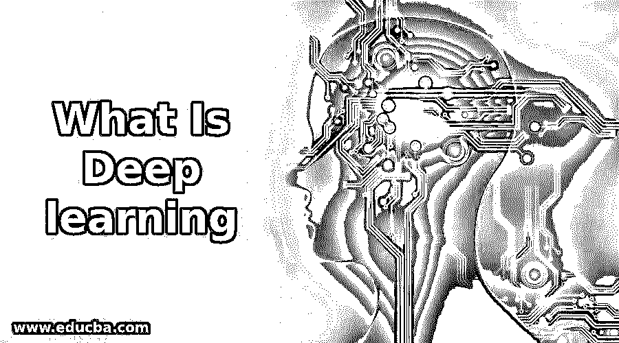
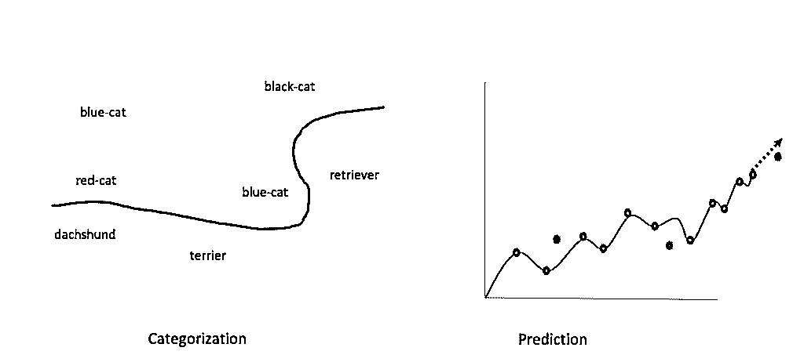

# 什么是深度学习

> 原文：<https://www.educba.com/what-is-deep-learning/>

## 深度学习简介

深度学习是人工智能中机器学习的子集，即，基于人工神经网络和表示学习，因为它能够实现用于通过创建模式和处理数据来模仿大脑功能的功能。深度学习还用于无人驾驶汽车(检测行人、路灯、其他汽车等)等领域的决策。)、语音识别、图像分析(例如识别血液和肿瘤中的癌症)、智能电视等。

### 什么是深度学习？

一般来说，我们会一直有意识或无意识地做两件事，也就是把我们通过感官感受到的东西归类(比如感觉热、冷杯子等等。)和预测，例如根据以前的温度数据预测未来的温度。

<small>Hadoop、数据科学、统计学&其他</small>

我们对日常生活中的几个事件或任务进行分类和预测，例如:

*   捧着一杯茶/水/咖啡等。，可能是热的，也可能是冷的。
*   电子邮件分类，如垃圾邮件/非垃圾邮件。
*   日光时间分类，如白天或夜晚。
*   基于我们当前的位置和我们所拥有的东西对未来的长期规划被称为预测。
*   世界上的每一种生物都会在他们的一生中完成这些任务，例如，像乌鸦这样的动物会根据白天和夜晚的分类来分类一个地方是否要筑巢，蜜蜂会根据一些因素来决定何时何地获取蜂蜜，蝙蝠会在晚上来，而在早上睡觉。

让我们想象一下这些任务的分类和预测，它们看起来就像下图一样；对于分类，我们是通过数据点画线来做猫和狗之间的分类，预测的话，通过数据点画线来预测什么时候会增加和减少。

#### 1.分门别类

*   一般来说，在猫和狗之间，或者男人和女人之间进行分类，我们不会在大脑中画一条线，狗和猫的位置只是出于说明的目的而任意确定的，不用说，我们在大脑中对猫和狗进行分类的方式比上面画一条红线要复杂得多。
*   我们将根据形状、大小、高度、外观等对两个事物进行分类。，有时很难用这些特征进行分类，如愤怒的小狗和新生的猫，所以这不是一个明确的分类。
*   当我们还是孩子时，一旦我们能够在猫和狗之间进行分类，那么我们就能够对任何狗或猫进行分类，即使我们以前没有见过它们。

#### 2.预言；预测；预告

*   对于基于直线的预测，如果我们能够预测它最有可能向上或向下的位置，我们就通过数据点来绘制。
*   曲线也是在现有数据点范围内拟合新数据点的预测，即新数据点与曲线有多接近。
*   上图(右侧)中红色的数据点是现有数据点范围内和范围外的例子，曲线试图预测两者。

最后，任务分类和预测都在相似的点结束，即从数据点画一条曲线。如果我们能够训练计算机模型根据我们完成的数据点绘制曲线，那么我们可以将其扩展到不同的模型，例如在三维平面上绘制曲线等等。上面的事情可以通过用大量的有标签和无标签的数据训练一个模型来实现，这就是深度学习。

### 深度学习的例子

我们知道，深度学习和机器学习是人工智能的[子集，但深度学习技术代表了机器学习的下一次进化。机器学习将基于人类开发的算法和程序工作，而深度学习通过神经网络模型进行学习，该模型的行为类似于人类，并允许机器或计算机以类似于人类的方式分析数据。随着我们用大量数据训练神经网络模型，这成为可能，因为数据是神经网络模型的燃料或食物。](https://www.educba.com/subsets-of-artificial-intelligence/)

以下是现实世界中的一些例子:

*   **计算机视觉:**计算机视觉处理计算机使用图像和视频数据理解世界的算法和任务，例如图像识别、图像分类、对象检测、图像分割、图像恢复等。
*   语音和自然语言处理:自然语言处理处理计算机理解、解释和操纵人类语言的算法。NLP 算法处理文本和音频数据，并将它们转换为音频或文本输出。使用 NLP，我们可以完成诸如情感分析、语音识别、语言转换和自然语言生成等任务。
*   **自动驾驶汽车:**用海量数据训练深度学习模型，用于识别路牌；有些模型专门识别行人，识别人类等。，对于行驶中的无人驾驶汽车。
*   **文本生成:**通过使用语言、语法、文本类型等训练的深度学习模型。，可用于创建从维基百科到莎士比亚的拼写和语法正确的新文本。
*   **图像过滤:**通过使用深度学习模型比如给黑白图像添加颜色，这是深度学习模型可以做到的，如果我们手动做的话会花费更多的时间。

### 结论

最后，这是深度学习技术的概述，它在现实世界中的应用。希望你看完这篇文章后能很好的理解什么是深度学习。正如我们今天所知，在某些情况下，通过深度学习训练的机器的图像识别能力优于人类，例如，在识别血液中的癌症和核磁共振扫描中的肿瘤方面，谷歌的 alphaGo 学习了这种游戏，并通过反复与它对弈来训练其神经网络，从而为它的“围棋”比赛进行训练。

### 推荐文章

这是什么是深度学习的指南。这里我们讨论了深度学习的基本概念和例子。您也可以阅读以下文章，了解更多信息——

1.  [深度学习职业](https://www.educba.com/careers-in-deep-learnings/)
2.  [深度学习面试问题](https://www.educba.com/deep-learning-interview-questions/)
3.  [监督学习 vs 深度学习](https://www.educba.com/supervised-learning-vs-deep-learning/)
4.  [神经网络 vs 深度学习](https://www.educba.com/neural-networks-vs-deep-learning/)

