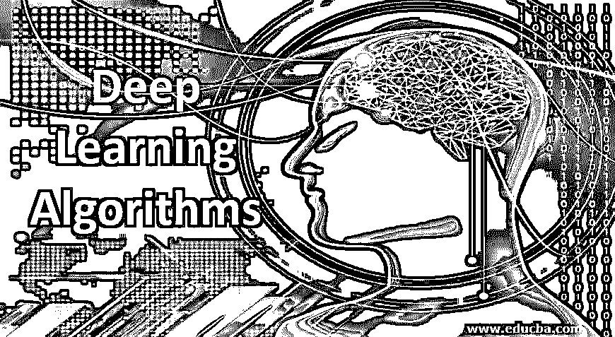

# 深度学习算法

> 原文：<https://www.educba.com/deep-learning-algorithms/>

## 深度学习算法简介

深度学习算法用于开发由神经网络中几层神经元组成的模型。这些数据中的每一个都代表下一层的数据。像图像数据那样的非结构化数据集的大部分可能具有数百万个特征；由于如此大量的特征，使用机器学习算法变得不可行。而深度学习算法可以在从神经网络的每一层移动的同时，逐步学习更多关于这些类型的数据。

### 深度学习算法

为了创建一个深度学习模型，人们必须编写几个算法，将它们混合在一起，并创建一个神经元网络。深度学习的计算成本很高。为了辅助深度学习模型，有深度学习平台，如张量流、Py-Torch、Chainer、Keras 等。在深度学习中，我们已经尝试用人工神经网络来复制人类的神经网络；人类的神经元在深度学习模型中被称为感知器。

<small>Hadoop、数据科学、统计学&其他</small>

我们将这些感知器单元连接在一起，创建一个神经网络；它有 3 个部分:

*   输入层
*   隐蔽层
*   输出层

感知器有输入节点(人脑中的树突)，做出小决定的驱动功能和输出节点(人脑中的轴突)。我们将看到一个感知器是如何工作的；将它们连接在一起将创建一个深度学习模型。输入信息(输入变量/特征的数量)被赋予一定的权重，并被提供给驱动功能。驱动功能做出决定并发送输出。这个感知器的输出会被输入到其他神经元。一旦批次被处理，在成本函数/交叉熵的帮助下，在每个神经元计算反向传播误差。这样，输入权重被重新分配，并且整个过程继续，直到交叉熵满足条件。

我们有不同的驱动函数，如 Sigmoid 函数、双曲正切函数、校正线性单元(ReLU)来做小的决定。一个[深度学习模型](https://www.educba.com/deep-learning-model/)需要海量的数据来建立一个好的模型。通常，具有 3 个以上隐藏层的模型被视为深度神经网络。基本上，深度学习是一组神经元，为每一层定义了许多参数。为了创建深度学习模型，流行的架构有 RNN、CNN 等。

### 深度学习算法的架构方法

为了构建这种架构，使用了以下算法:

#### 1.反向传播

在这个算法中，我们计算偏导数。一般来说，梯度下降法优化，导数(梯度)是在每次迭代计算。在深度学习中，函数并不简单；它们是不同功能的组合。在这种情况下，很难计算梯度，所以我们使用近似微分来计算导数。参数的数量越多，近似微分的代价就越大。

#### 2.随机梯度下降

在梯度下降中，目标是找到全局最小值或最优解。但是为了达到这个目的，我们还必须考虑局部极小解(不可取)。如果目标函数是凸函数，很容易找到全局极小值。函数和学习率的初始值是决定寻找全局最小值的参数。这可以很容易理解，从山顶考虑一条河，并寻找一个山脚(全局最小值)。但是在这种方式下，会有一些必须避免的起伏(局部最小值)。河流起点和速度(在我们的例子中是初始值和学习率)是寻找全局最小值的决定因素。

#### 3.学习率

学习速度就像河流的速度；它可以减少训练时间，提高成绩。一般来说，学习任何一项技术/运动，在开始时，学习率相对高于结束时的速度。中级阶段后，学习会比较慢；重点将是微调。深度学习也是如此；过大的变化通过较高的学习速率来解决，并通过稍后缓慢降低学习速率来进行微调。

#### 4.批量标准化

在深度学习的权重初始值(随机选择)和学习中，速率是为小批量定义的。开始时，会有许多异常值，在反向传播过程中，必须对这些异常值进行补偿，以计算得到输出的权重。这种补偿导致额外的历元。因此，为了避免这种情况，我们使用批处理规范化。

#### 5.退出

在深度学习中，我们一般会遇到过拟合的问题。具有几个参数的大型网络中的过度拟合使得很难根据测试数据进行预测。因此，为了避免这种情况，我们使用了丢弃法，通过创建不同的“稀疏网络”在训练过程中丢弃随机单元。测试时，这些稀疏网络的预测被平均，这有助于避免过度拟合。

#### 6.一袋单词

我们用一个连续的单词包来预测下一个单词。例如，我们在电子邮件写作中看到，完成句子的自我暗示是 NLP 的一部分。这是通过考虑大量的句子和被捕获的单词周围的特定单词来完成的。这些特定的单词和周围的单词被输入到神经网络中。训练模型后，它可以根据周围的单词预测特定的单词。

#### 7.长短期记忆

LSTM 在序列预测问题中非常有用，如语言翻译、预测销售额和寻找股票价格。LSTM 比其他技术有优势，因为它能够考虑以前的数据。LSTM 通过细胞状态机制进行修改。它记得忘记事情。LSTM 的三个主要方面使其从其他深度学习技术中脱颖而出。第一是神经元何时应该有输入，第二是何时记住以前的数据和忘记什么，第三是何时传递输出。

### 结论

深度学习模型是复制人类思维的一步。深度学习使用人工[神经网络](https://www.educba.com/what-is-neural-networks/)，而不是生物神经元。深度学习的计算成本很高，可以通过使用张量流和 Py-Torch 等深度学习框架来降低。RNN，CNN 是深度学习模型的架构方法。本文讨论了这些架构中使用的不同深度学习算法。

### 推荐文章

这是深度学习算法指南。这里我们讨论深度学习算法的架构方法以及层。您也可以浏览我们推荐的其他文章，了解更多信息——

1.  [机器学习算法](https://www.educba.com/machine-learning-algorithms/)
2.  [机器学习的应用](https://www.educba.com/applications-of-machine-learning/)
3.  [人工智能 vs 机器学习 vs 深度学习](https://www.educba.com/artificial-intelligence-vs-machine-learning-vs-deep-learning/)
4.  [深度学习面试问题及答案](https://www.educba.com/deep-learning-interview-questions/)

