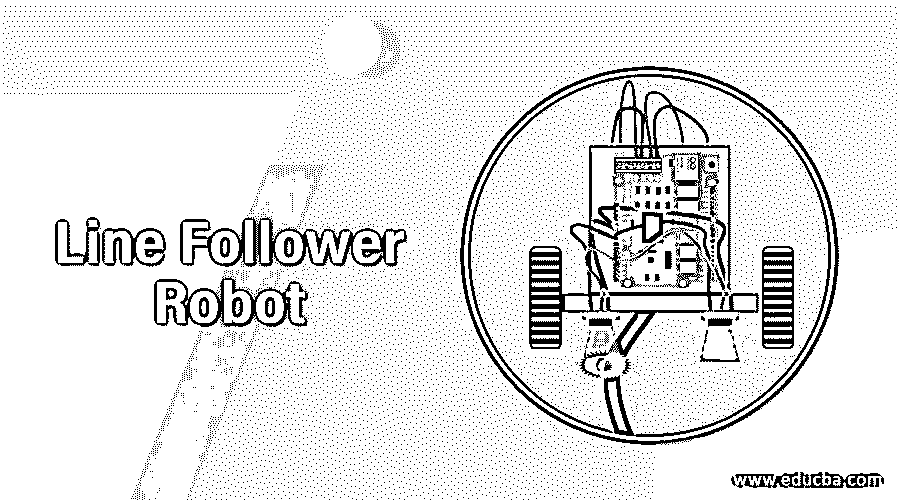
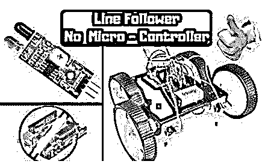
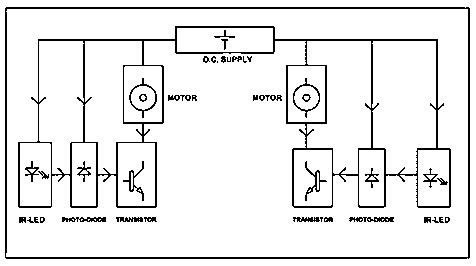
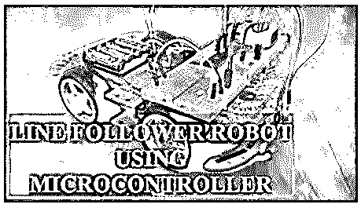
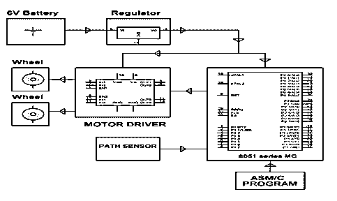

# 线跟随机器人

> 原文：<https://www.educba.com/line-follower-robot/>

## 直线跟随机器人简介

线跟随机器人是一种简单的机器人，它基于自动化，根据特定的线(通常是亮表面上的暗线)遵循特定的方向。该机器人由安装在机器人主体前端的两个传感器和由 DC 电机驱动的两个轮子组成。机器人中的电路板根据来自传感器的输入信号控制车轮速度。机器人的控制是这样完成的，当机器人看到一条黑线时，它就停下来。

### 什么是直线跟随机器人？

在说跟线机器人之前，我们先了解一下什么是机器人。机器人基本上是一种自动化的机器，它在没有人类存在或要求的情况下自行工作，并以这样的方式实现，即它可以做几乎相同的工作，承担人类相同的负担，为人类带来方便和节省时间。

<small>Hadoop、数据科学、统计学&其他</small>

有各种方法来控制机器人，乔治·德沃尔介绍了第一个机器人，并在 20 世纪 60 年代初投放市场。有一些法律是在机器人推出的时候制定的。

*   首先，机器人在任何情况下都不应该对公众造成任何伤害。
*   第二，机器人应该认可人类的决定、指导和建议。
*   第三定律是，如果不违反前两条定律，机器人应该保护自己免受任何原因的伤害。

在最近的技术进步趋势中，机器人被设计成可以自由移动到任何他们想去的地方，在自由移动的机器人中，最强大和最先进的机器人之一是线跟随机器人。

*   线跟随机器人是一种沿着特定方向或路径并根据其面临的情况保持其自身工作性质的机器人。
*   线跟随机器人实际上遵循一种反馈机制，其中路径基本上是白色或浅色表面上的黑线或暗线。
*   线跟随机器人在当今应用中有很多用途，包括携带小婴儿到商场、家庭、娱乐场所等等。
*   在工业领域中，线跟随机器人起着重要的作用，因为它主要用于运载各种工业货物并将这些货物从一个位置运输到另一个位置。
*   线跟随器机器人沿着已经设置好的相同路径行进。它遵循同样的轨道，从不偏离，在工业生产中，机器人扮演着制造产品的角色。
*   市场上有两种类型的线跟随机器人。第一种是基于移动的循线机器人，第二种是基于射频的循线机器人。

### 如何制作线从机器人？

如何制造线跟随机器人解释如下:

基本设计包括以下几个步骤:

1.  首先设计机器人的整个外部结构。
2.  二是定义机器人的运动学是什么。
3.  三是机器人控制系统的设计。

#### 1.设计机器人的外部结构

机器人的主体主要是利用 AutoCAD 技术设计的。基本的线从动机器人由机器人将形成的基座组成，在两端有轮子。基本上，硬塑料主要用于其基地的创作。圆柱体与其他形式的物质体一起附着，通过关节相互连接，并为特定路径定义其运动。因此，机器人具有固定的轴距和通过关节相互连接的身体。

#### 2.定义运动学

这部分是至关重要的，因为机器人的整个运动取决于这个，抛射体部分和运动。机器人的整体动态运动完全取决于坐标系的结构和组合。工作空间软件负责运动学部分。

#### 3.设计控制系统

机器人的控制系统也起着重要作用，因为它完全依赖于控制运动。轮子的运动也是利用这种现象来控制的。线跟随机器人遵循基本轨迹，机器人的运动和控制取决于轮子的旋转，由电机和传感器控制。

有两种控制方式，一种是使用微控制器，另一种是不使用微控制器。

**无微控制器:**

它由红外传感器、光电二极管和晶体管组成。该机制主要通过操作晶体管来控制。

当有光亮表面时，红外光传感器被反射，通过光电二极管的电流发生变化，电压显著降低。在电压电平增加并且与晶体管连接的马达由于运动而开始旋转之后，晶体管开始导通。当机器人面对一条黑线或暗线时，红外光不会被反射，电机停止转动。

**使用微控制器:**

它可以立即检测到一条路径，并根据它来跟踪它。该系统被设计成能够使用传感器从远距离感应线路。在这种布置中，涉及两种类型的传感器，一种是 IR 和接近传感器。微控制器控制系统，在该系统中，IR 检测任何存在的物体，近程检测要遵循的路径。

### 线跟随机器人的例子

*   它在工业领域用于移动障碍物和货物。
*   它用于汽车应用中，例如在道路上看到的自动汽车。
*   它用于清洁地板等家庭用途。
*   它也用于公共场所，如商场和娱乐区，为旅客显示和指引路径。

### 推荐文章

这是一个线跟随机器人指南。在这里，我们也讨论了什么是线跟随机器人以及如何使线跟随机器人。您也可以看看以下文章，了解更多信息–

1.  [移动测试工具](https://www.educba.com/mobile-testing-tools/)
2.  [安卓棒棒糖](https://www.educba.com/android-lollipop/)
3.  [机器人的类型](https://www.educba.com/types-of-robots/)
4.  [UiPath 职业生涯](https://www.educba.com/uipath-careers/)

