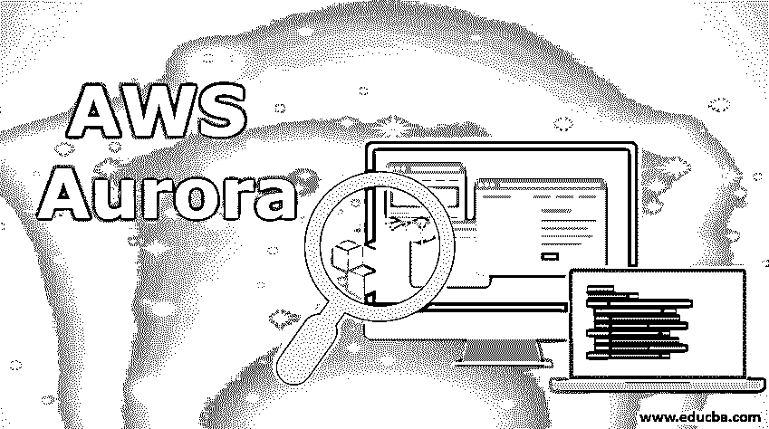

# AWS 极光

> 原文：<https://www.educba.com/aws-aurora/>

## AWS 极光简介

AWS Aurora 是亚马逊云提供的托管数据库服务。这是广泛使用的数据存储服务之一，用于低延迟和事务性数据存储和处理。AWS aurora 服务提供了 MySQL 和 PostgreSQL 等开源数据库的全面功能，以及企业标准的可靠性和可扩展性。它与 AWS 可用性区域中的数据复制的集群方法一起工作，以实现高效的数据可用性。与原生 MySQL 和 PostgreSQL 数据库相比，它的工作速度要快得多，并且服务器维护的可行性较低。它支持高存储容量，可以扩展到高达 64tb 的数据库大小，用于企业实施。

### 什么是 AWS 极光？

AWS Aurora 是一个关系数据库，由完全托管的云构建。它兼容 MySQL 和 Postgresql。开发人员和 DBA 已经知道如何处理 MySQL 和 PostgreSQL。Aurora 将为您提供企业数据库的速度和可靠性与开源数据库的成本效益和简单性的结合。如果您当前的应用程序是用 MySQL 或 Postgresql 开发的，您可以使用 Aurora。Aurora 的速度和吞吐量是 MySQL 的 5 倍，PostgreSQL 的 3 倍，这意味着您不需要改变现有的系统。

<small>Hadoop、数据科学、统计学&其他</small>

Aurora 配备了高性能子系统。可以利用快速分布式存储的是 MySQL 和 PostgreSQL 引擎。底层存储可自动扩展至高达 64tb。标准化和自动化数据库集群和复制被认为是数据库配置和管理中最具挑战性和最重要的方面，使用 Aurora 可以轻松处理。Aurora 完全管理数据库，将其作为亚马逊关系数据库服务(Amazon RDS)的一部分。Amazon RDS 是一项网络服务，您可以在其中获得一个可以轻松设置、扩展和管理的数据库。

### Aurora 与亚马逊 RDS 的引擎有什么关系？

以下几点将说明 Amazon RDS 的标准引擎，即 MySQL 和 PostgreSQL 与 Aurora 的关系:

*   在用 Amazon RDS 设置新的数据库服务器时，您选择了 Aurora 作为 DB 引擎选项。
*   如果你熟悉亚马逊 RDS，那么你会发现设置 Aurora 很容易。您可以使用 Amazon RDS 管理控制台来设置 Aurora、CLI 命令和 API 的集群，以处理数据库日常任务，如备份、恢复、修复等。
*   Aurora 的自动集群和复制以及其他管理操作是在整个数据库服务器集群上进行管理的，而不仅仅是一个实例，它可以让您轻松、低成本地处理您的大型 MySQL 和 PostgreSQL 服务器。
*   您在 Amazon RDS for MySQL 和 PostgreSQL 中的现有数据可以通过复制或使用快照带到 Aurora。还有一个功能是按钮迁移，可用于将您现有的 Amazon RDS MySQL 和 PostgreSQL 转换为 Aurora。

### 极光是如何工作的？

Aurora 数据库集群由主数据库和 Aurora 副本数据库以及管理这些数据库实例数据的集群卷组成。Aurora 集群卷不是物理的，而是虚拟的数据库存储卷，它跨越多个可用性区域以更好地支持全局应用程序。每个区域都有其数据库集群数据的副本。

*   主数据库是在群集卷上完成所有读写操作的地方。Aurora 中的每个集群都有一个主数据库实例。
*   它只是主数据库实例的副本，其唯一职责是只提供数据，即只进行读取操作。一个主数据库实例可以有 15 个副本，以保持所有区域的高可用性。在故障安全条件下，当主数据库不可用时，Aurora 将切换到副本数据库。副本有助于减少主数据库上的读取工作负载。您可以为副本配置故障转移优先级。
*   Aurora 也可以有一个多主集群。在多主机中，所有数据库实例都具有读写能力。在 AWS 术语中，我们可以称之为多主机复制，它们被称为 reader 和 writer DB 实例。
*   您还可以配置在亚马逊 S3 上保留数据库的备份。这确保了数据库的安全性，即使在整个集群崩溃的最坏情况下也是如此。
*   对于不可预测的工作负载，您可以使用 Aurora Serverless 自动开始伸缩并关闭数据库以满足应用程序需求。

### 极光的优势

以下是 Aurora 的不同优势:

*   **企业级安全性:** Aurora 是亚马逊的一项服务，因此您可以放心使用 IAM 功能。
*   **企业级可用性:**数据库实例在多个区域的多次复制确保了高可用性。
*   **企业级可扩展性:**借助 Aurora 无服务器解决方案，您可以设置您的数据库，使其根据应用需求自动扩展和缩减。
*   **企业级性能:**具有简单性&性价比不亚于开源 DB。
*   **企业级兼容性:** Aurora 兼容 MySQL 和 PostgreSQL。因此，如果您当前的应用程序在 MySQL 或 PostgreSQL 中，您可以迁移它或使用 Amazon RDS 来转移您的数据库并使用 Aurora 引擎。
*   **AWS 管理控制台:** Amazon 管理控制台易于使用，具有点击和拖动功能，可以快速设置您的 Aurora 集群。
*   **维护:**极光几乎零服务器维护。比 MySQL 快 5 倍，比 PostgreSQL 快 3 倍。

### AWS 极光的局限性

下面给出了提到的限制:

*   目前支持 MySQL-5.6.10，所以如果你需要新功能或者你有一个旧版本的 MySQL，那么你不能。未来，亚马逊将为 Aurora 带来 MySQL 的新功能，但你必须等待。
*   如果你想使用 MyISAM 表，你不能，因为 Aurora 目前只支持 InnoDB。
*   对于 Aurora，您无法选择使用比 r3.large 更小的 RDS。

### 结论–AWS Aurora

从上面的内容中，我们很好的了解了极光是什么，它有什么特点。在当前时代，高度可用和快速非常重要，我们不想丢失数据，在这种情况下，Aurora 是一个不错的选择。公司可以让他们的开发人员专注于业务逻辑，数据库将被自动管理。但是，如果您的应用程序使用的是较旧的 MySQL 或 PostgreSQL，那么要使它与 RDS 兼容可能需要付出很大的努力。也许不是现在，但在某个时候，你需要寻找一个高度可扩展的分布式数据库系统，那时 Aurora 可能是一个选择。

### 推荐文章

这是 AWS 极光的指南。在这里，我们讨论什么是 AWS aurora，它是如何工作的，以及它的局限性和优点。您也可以浏览我们推荐的其他文章，了解更多信息——

1.  [AWS 替代品介绍](https://www.educba.com/aws-alternatives/)
2.  [具有优势的 AWS EMR](https://www.educba.com/aws-emr/)
3.  [9 大 AWS 服务简介](https://www.educba.com/aws-services/)
4.  [13 个最佳 AWS 面试问题](https://www.educba.com/aws-interview-questions/)

