# AWS 容器

> 原文：<https://www.educba.com/aws-containers/>

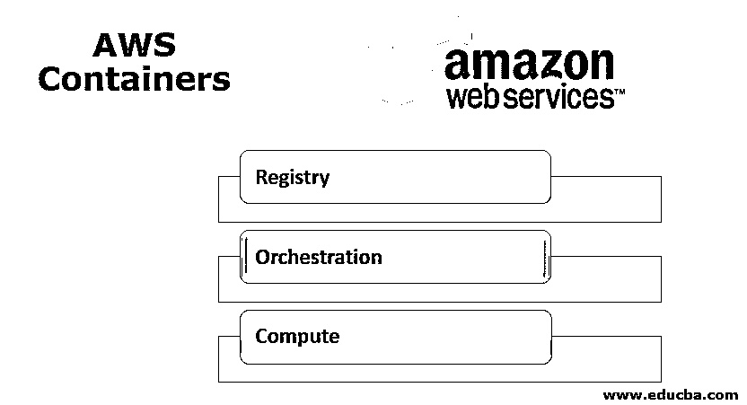

## AWS 容器简介

AWS 有一个容器工具管理服务，可以分为三类:-注册表，编排和计算，AWS 提供了一个安全的地方，您可以在那里存储和管理您的容器映像，编排是管理容器何时运行的服务，灵活计算为您的容器管理电源，这一切都成为管理容器和易于部署的软件包，因此您不必担心基础设施；无论你在构建什么，AWS 容器服务都是有帮助的，它被业内所有大公司使用，如三星、Expedia、GoDaddy 和许多其他公司。

### 容器的类型

容器管理工具可以分为三种类型:注册、编排和计算。注册服务帮助您安全地存储和管理您的容器图像。编排管理容器何时何地运行。和计算引擎为您的容器提供动力。所有底层基础设施都由 AWS 负责。容器使开发和部署变得简单高效。

<small>Hadoop、数据科学、统计学&其他</small>

#### 1.登记处

##### 亚马逊弹性容器注册中心(ECR)

这是一个高度可伸缩、高度可用、高度安全和完全可管理的 Docker 容器注册表。它帮助开发人员高效地存储、管理和部署 Docker 容器映像。Amazon ECR 与 Amazon Elastic Container Service(ECS)集成，简化了部署。Amazon ECR 仅针对您存储在存储库中的数据量和在互联网上传输的数据量进行支付。

一个简单 web 应用程序的 Docker 映像创建并将其推入 Amazon ECR 的示例:

1.  创建一个文件，Dockerfile。

2.  编辑 Dockerfile 文件。

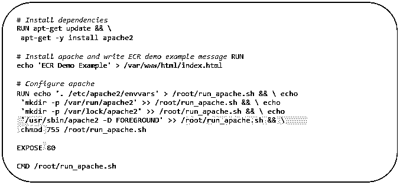

3.  建立码头工人形象。

4.  通过运行 Docker 映像来验证它。

**输出:**

5.  运行新构建的映像。

6.  将您的浏览器指向[http://locallhost.com/](http://locallhost.com/)，输出将是:

7.  通过键入 Ctrl + c 停止 Docker 容器。
8.  把你的图片推送到亚马逊 ECR。创建一个 Amazon ECR 存储库来存储图像。

**输出:**

9.  用 Uri 值标记 ecr 示例图像。

10.  为您的注册表运行 Docker 登录验证命令。

11.  运行 Docker 登录命令。
12.  使用存储库 Uri 将图像推送到 Amazon ECR

#### 2.管弦乐编曲

##### 亚马逊弹性容器服务(ECS)

这是一种完全托管、高度可扩展的高性能容器管理服务。它支持 Docker 容器，并允许用户在 EC2 实例的托管集群上高效地运行应用程序。容器编排的安装和操作由 AWS 管理。

在 Amazon ECS 上部署 Docker 容器的示例:

1.  **Amazon ECS——首次运行设置**:它将让您创建集群并启动示例 web 应用程序。您将进入 Amazon ECS 控制台并启动向导。您还可以使用 Amazon ECR 创建一个图像存储库，并将图像推送到其中。

选择选项，然后选择继续。

2.  **任务定义创建:**它是你的应用的蓝图。查看默认值并选择下一步。

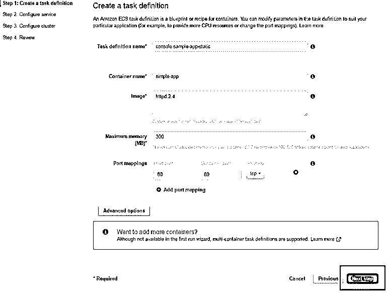

3.  **服务配置:**服务在您的集群中启动并维护任务定义的副本。

*   **服务名:** AWS 默认提供了一个基于 web 的“Hello World”应用样例-web-app。
*   **期望的任务数:**默认值为 1，用于 AWS 自由层。
*   **弹性负载平衡:**您可以在服务中使用负载平衡器。
*   **容器名称:主机端口:**选择简单应用 *:* 80，其余字段默认。

如果您已经有服务 IAM 角色，请从下拉列表中选择，否则 Amazon ECS 将默认创建一个 ECS 服务角色。

检查您的输入并选择下一步。

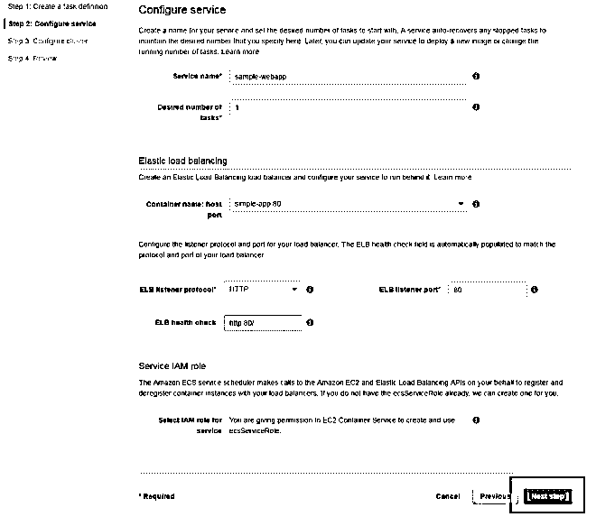

4.  **集群配置**

*   **集群名称:**默认名称为样本集群*。*
*   **EC2 实例类型:**AWS 自由层的默认类型是 t2.micro。
*   **实例数量:**默认值为 1，表示 AWS 自由层。
*   **密钥对:**选择一个*–*[无法 SSH](https://www.educba.com/ssh-vs-ssl/) *可以继续。*
*   **安全组:**默认任何地方。它允许从整个互联网访问。
*   **容器实例 IAM 角色:**如果您已经有，请从下拉列表中选择一个，或者

亚马逊 ECS 会默认创建一个。

选择查看并启动。

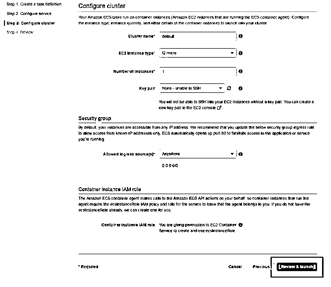

5.  **启动并查看资源**

在启动之前，您可以查看您的任务定义、任务配置和集群配置。

选择启动实例并运行服务。

*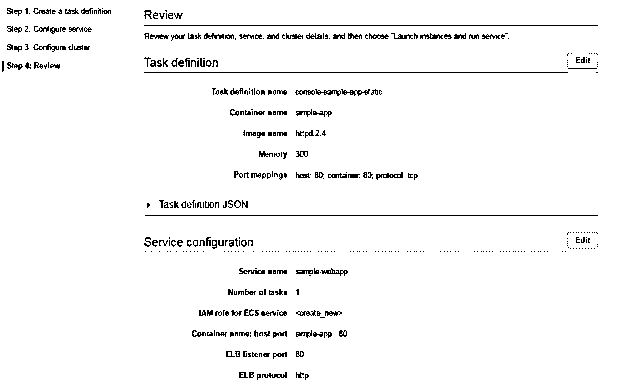

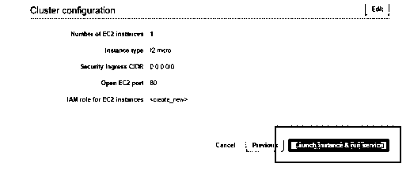

* 

启动完成后，选择查看服务。

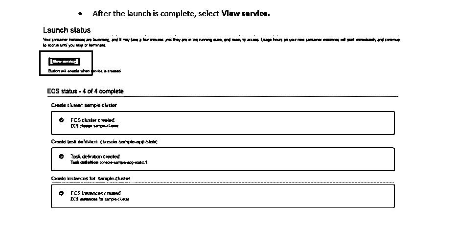

6.  **打开示例应用程序:**您可以通过将浏览器指向负载平衡器 DNS 名称来验证和运行示例应用程序。

打开 sample-web-app 页面并选择您的负载平衡器名称。

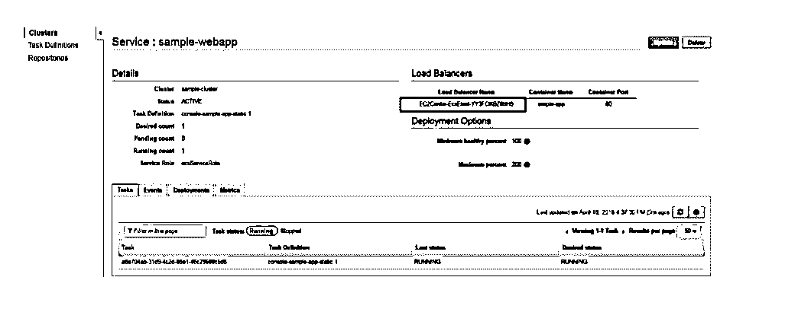

复制 ELB DNS 名称并将其粘贴到一个新的浏览器中，然后按键盘上的 Enter 键。

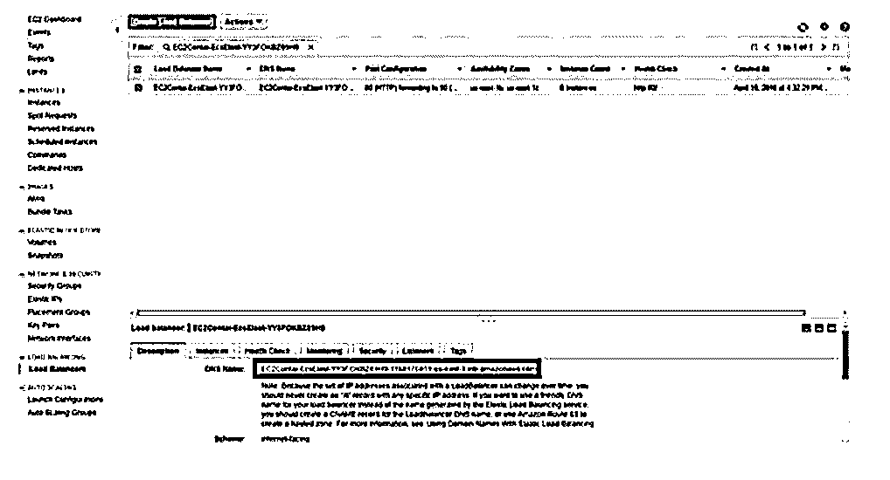

您可以查看您的示例应用程序。

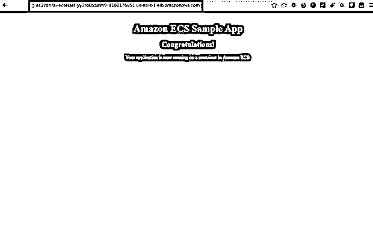

你也可以随时清理你的资源，以避免不必要的费用。

##### 亚马逊弹性库柏服务(EKS)

它让您可以在 AWS 上使用 Kubernetes 轻松管理、部署和扩展容器化的应用程序。它跨多个 AWS 区域运行 Kubernetes 服务，以消除单点错误。亚马逊 EKS 是经过认证的 Kubernetes 集成，您可以轻松地将运行在任何标准 Kubernetes 环境中的应用程序迁移到 AWS EKS。

#### 3.计算

##### 亚马逊弹性计算云(亚马逊 EC2)

它是云中的一种安全且可调整大小的计算能力，在虚拟机基础架构上运行容器，完全控制扩展和配置。它让你完全控制你的计算资源。它将获取和启动新服务器实例所需的时间减少到了几分钟。Amazon EC2 为开发人员提供了构建抗失败应用程序的工具。

**示例:**用 Amazon Linux AMI 安装 LAMP Web 服务器。

这个例子帮助您在 Amazon Linux 实例(也称为 LAMP web 服务器)上安装一个支持 PHP 和 MySQL 的 Apache web 服务器。

1.  连接到 Linux 实例。
2.  更新软件包，如果有的话。

3.  使用 yum install 命令安装 Apache web 服务器、MySQL 和 PHP 软件包。

4.  启动 Apache 服务器。

5.  将 Apache web 服务器配置为在每次系统启动时启动。

6.  验证 httpd 是否打开。

7.  使用以下值添加新的入站安全规则:

*   类型:HTTP
*   协议:TCP
*   端口范围:80
*   来源:海关

8.  通过在 web 浏览器中键入 DNS 地址来测试 web 服务器。
9.  如有必要，设置必要的文件权限。
10.  测试您的 LAMP 服务器。
11.  保护数据库服务器。

### AWS Fargate

它是一个用于 Amazon ECS 的无服务器计算引擎，允许您在不管理服务器的情况下运行容器。Amazon 负责所有底层服务器管理，让您专注于设计和构建您的应用程序

它有两种模式:

**Fargate 启动类型:**将应用打包到容器中，指定 CPU 和内存需求，定义网络和 IAM 策略，并启动应用。

**EC2 启动类型:**它允许您对运行容器应用程序的设备进行服务器级控制。

### AWS 容器的优势

好处如下。

*   **在任何地方运行:**容器将您的代码与它需要在任何环境中一致运行的配置文件和依赖项打包在一起。
*   **提高资源利用率:**容器提供了进程隔离，允许您设置 CPU 和内存利用率，以便更好地利用计算资源。
*   **快速伸缩:**每个容器都作为一个独立的进程运行，共享底层操作系统的资源。这使得容器可以快速启动和停止。

### 它是如何工作的？

1.  **构建容器映像:**将您的代码及其所有依赖项打包到一个容器中。
2.  自动化测试和部署:标准化的代码单元，容器充当一致的构建
3.  **在任何地方运行:**您的容器将在任何环境中一致地运行。
4.  **快速伸缩:**容器可以快速启动和终止，因此您的应用程序可以伸缩

### 结论

Amazon 为存储、管理和运行容器提供了广泛的服务。容器使开发人员的开发和部署更加容易，因为所有底层基础设施包括服务器管理都由 Amazon 负责，让开发人员专注于他们的开发。为您的工作负载选择正确的 [AWS 服务](https://www.educba.com/aws-storage-services/)。

### 推荐文章

这是 AWS 容器的指南。在这里，我们将讨论简介、容器类型(包括注册、编排和计算)以及 AWS 容器的优势。您也可以阅读以下文章，了解更多信息——

1.  [AWS 服务](https://www.educba.com/aws-services/)
2.  [AWS Kinesis](https://www.educba.com/aws-kinesis/)
3.  [AWS 架构](https://www.educba.com/aws-architecture/)
4.  [了解亚马逊网络服务功能列表](https://www.educba.com/aws-features/)

