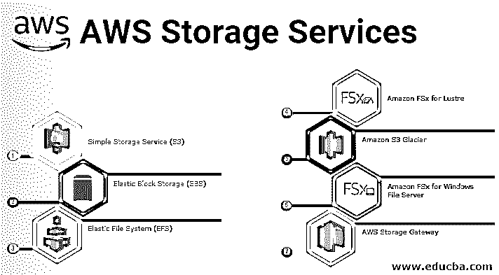

# AWS 存储服务

> 原文：<https://www.educba.com/aws-storage-services/>

## AWS 存储服务简介

亚马逊简单存储服务(亚马逊 S3)是使用最广泛的对象存储服务，由于其可扩展性、数据可用性、安全性和性能，大多数公司甚至初创企业都在使用该服务。存储在 S3 上的任何数据都受到保护、安全且始终可用，无论各种使用情形下的数据量有多大，例如网站、生成大量数据的移动应用程序、应用程序备份、物联网设备、 大数据分析和所有这些成本极低，耐用性高达 99.99999999999%，S3 被用作许多其他 AWS 服务的存储，如代码提交、流媒体服务等。

### AWS 存储服务的类型

AWS 提供七种类型的存储服务，可以选择备份、归档和恢复丢失的数据。让我们看看这些服务是什么及其特点:

<small>Hadoop、数据科学、统计学&其他</small>

#### 1.简单存储服务(S3)

亚马逊 S3 是一个对象存储服务，存储任何类型和大小的数据。它可以存储任何业务的数据，例如 web 应用程序、移动应用程序、备份、归档、分析。它还为您的所有特定需求提供了简单的访问控制管理，并且几乎 100%耐用，我的意思是 99%。(11 个九)%。它还可以用来存储各种文件格式，就像你用 dropbox 一样。S3 还允许一个简单的基于网络的文件浏览器上传文件，创建文件夹或删除它们。

#### 2.弹性块存储

EBS 提供类似于硬盘驱动器的块存储，可永久存储任何类型的数据。这可以附加到任何 EC2 实例并用作块存储，甚至允许您安装任何操作系统。EBS 卷被放置在可用性区域中，以便复制它们来防止由于单个组件故障而丢失数据。它们提供绝对的低延迟性能，并且您还可以根据需要扩展或缩减您的资源。EBS 有固态硬盘和硬盘两种格式，具体取决于您对速度和容量的要求。

#### 3.弹性文件系统(EFS)

EFS 是一个托管的网络文件系统，很容易从亚马逊控制台或 CLI 设置。当您需要多个 EC2 实例来访问同一个文件系统时，EFS 正好可以满足您的需求。与 EBS 不同，EFS 是在 SSD 上使用 NFS4.x 协议构建的，具有更快的吞吐量。这也意味着 EFS 比 EBS 昂贵得多，因为它可以用于非常大的分析工作负载。EFS 可以根据您存储的文件大小进行扩展，也可以从多个可用性区域进行访问。文件系统的分布式特性会诱使您将其用作 CDN。但是 CDN 的成本超过了使用 EFS 的好处。因此，最好使用 CDN，并将 EFS 与无法存储在 CDN 上的文件结合使用。

#### 4.用于 Lustre 的亚马逊 FSx

Luster 是一种用于计算密集型工作负载的文件系统。这主要是当您在大型数据集上运行机器学习操作时，或者当您需要运行媒体编码工作负载时。单独运行 Lustre 需要大量专业知识来设置和配置它以适应适当的工作负载。在 Amazon FSx 的帮助下，这可以避免，控制台上的简单界面可以帮助您快速入门并开始处理数据。将它无缝连接到 S3 的能力以及在 VPC 运行它的选项提供了一种低成本、高性能的方式来利用 luster 实现您的计算密集型工作负载，而没有运行它的管理开销。

#### 5.亚马逊 S3 冰川

冰川主要用于存档和长期数据存储。这意味着此存储系统的检索率很低，因此它的价格非常便宜。它还具有兼容的安全特性来加密您的数据。Glacier 允许你直接在上面运行查询和分析，你只需为阅读数据的几分钟或几小时付费。在耐用性方面，它提供了 99。(11 个 9)%的耐用性，这是业界最高的耐用性之一。Glacier 希望用一种更加经济高效、更加耐用的解决方案来取代传统的本地磁带备份服务。

#### 6.Amazon FSx for Windows 文件服务器

每当您需要运行需要访问云上专有 windows 文件系统的 windows 特定软件时， [AWS 为您提供了](https://www.educba.com/aws-features/)Amazon FSx 来轻松实现这一点。基于 Windows。Net 应用程序、ERP 和 CRM 需要共享文件存储来在它们之间移动工作负载。此外，Amazon FSx 还支持所有基于 windows 的原生技术，如 NTFS、 [SMB 协议](https://www.educba.com/what-is-smb/)、活动目录(AD)和分布式文件系统(DFS)。与 luster 类似，Amazon FSx 消除了设置和维护 windows 文件服务器的管理开销，并为您提供了一种在 AWS 上运行 windows 文件服务器的简单而经济的方法。

#### 7.AWS 存储网关

Storage Gateway 是一种简单的方法，可让您的内部应用程序将数据存储、访问或归档到 AWS 云中。这是通过在数据中心的一台机器上运行虚拟机管理程序来实现的，该机器包含存储网关，然后可在 AWS 上连接到 S3、Glacier 或 EBS。它提供了一种高度优化、具有网络弹性和低成本的方式，将您的数据从本地移动到云中。本地缓存也可用于本地，以允许访问更活跃的数据。Storage gateway 还支持传统的备份存储，如磁带作为虚拟磁带直接备份到 AWS Glacier 中。

### 结论

所以你有它。AWS 为您提供了从传统备份到现代高吞吐量分布式文件系统的多种存储选项。根据您的需求，您可以选择一种或多种存储服务来实现您的业务目标。AWS 为您提供高可用性和高耐用性，因此您可以始终确保您的数据安全可靠，并且随时可用于您的所有使用情形。

### 推荐文章

这是 AWS 存储服务指南。在这里，我们讨论 AWS 存储服务的简介及其 7 种类型的 AWS 存储服务。您也可以浏览我们的其他相关文章，了解更多信息——

1.  [AWS EBS](https://www.educba.com/aws-ebs/)
2.  [什么是谷歌云平台](https://www.educba.com/what-is-google-cloud-platform/)
3.  [云数据存储服务](https://www.educba.com/cloud-data-storage-service/)
4.  [什么是 AWS EC2？](https://www.educba.com/what-is-aws-ec2/)
5.  [Linux 中的 NFS |如何设置 NFS？](https://www.educba.com/nfs-in-linux/)
6.  [DFS 算法的例子和优点](https://www.educba.com/dfs-algorithm/)
7.  [什么是对象存储？|主要优势和使用案例](https://www.educba.com/what-is-object-storage/)

