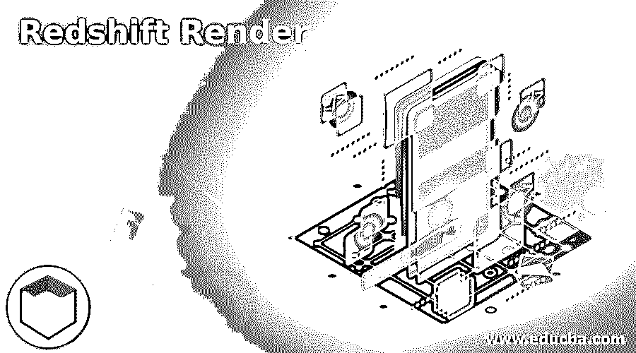

# 红移渲染

> 原文：<https://www.educba.com/redshift-render/>

## 红移渲染简介

红移渲染被定义为能够处理轮廓以在三维空间中构建图像的软件，并通过表示以 GPU 加速系统的笛卡尔形式存储的几何数据，在计算机图形的帮助下使其看起来像固体。这个软件是由 Redshift Rendering Technologies Inc .开发的,“Redshift Render”这个名字就是由此而来的。该软件被称为是一个有偏见的 GPU 加速渲染器，用户可以调整个别技术的质量，以便有可能获得最佳性能并保持质量平衡。

### 红移渲染怎么用？

这里要回答的重要问题是红移中的渲染过程，使用下面的流程，我们将能够解释红移渲染的用法。

<small>Hadoop、数据科学、统计学&其他</small>

1.  首先，创建 3D 线框模型。
2.  需要成为渲染过程一部分的不同特性需要在托盘中明确解释。下面列出了一些功能。

*   光
*   阴影
*   材料
*   反光
*   使渲染对象看起来真实所需的一切。

1.  然后，整个包被传递给渲染引擎
2.  这个渲染引擎现在开始从 3D 模型中吸收数据并创建 3D 图像。
3.  将传递的不同特征作为输入，运行相应的命令，并使它们组合在一起，生成一个照片般真实的动画！
4.  在后面的段落中解释的特性允许在需求稍微改变的情况下隔离单独的对象。
5.  最后，渲染后的产品被发送到像 Photoshop 或 Adobe After-Effects 这样的后期制作程序。

### 应用红移渲染

Redshift 应用程序下有不同的功能来处理不同的使用情形，它们是:

*   **GPU 加速**:如前所述，GPU 加速适合任何渲染对象的快速周转。
*   **核心优势**:任何应用程序都需要在拥有一些花哨的其他功能之前在核心上表现最佳，Redshift 确保它坚持这一点。
*   **照片真实感**:红移中的不同特征使得通过它渲染的物体具有真实感，哪怕是一张照片。换句话说，一个人将无法分辨这个物体是真是假。
*   **纹理和阴影**:红移中的特性在复杂和其他高级阴影网络的支持下，负责渲染对象中的阴影和纹理。
*   真实人物:红移能够把人物刻画成真实的人物，即使他们是想象出来的！
*   **集成**:最后但并非最不重要的一点，Redshift 允许与生产流水线轻松集成。

### 红移渲染中的功能

*   **核心几何和纹理之外**:场景包含大量多边形和相应的大量纹理数据，redshift 的内存管理允许高效渲染场景。
*   **全局照明**:全局照明表示灯光效果从表面反弹到任何表面上，这里红移提供了基于点的强力全局照明技术。
*   **世界领先的性能**:另一个被高度讨论的特性是 GPU 加速伴随着一些类似红移的采样技术；它提供了世界领先的渲染器性能。
*   代理:代理有助于移除一个或多个网格项目，并将它们卸载到一个外部文件中。这个外部文件不是每次都加载，只是在场景再次渲染时才会加载。使用红移，开发人员可以将一些对象和灯光组移动到代理文件中。利用这一点，人们可以开发一个强大的阴影，哑光完成和能见度标志，往往会被忽视的情况下生产。
*   **变换和变形模糊**:该功能允许 Redshift 进行多步模糊变换和两步模糊变形。
*   **体光照和渲染**:通过在 3D 应用和原生体渲染中使用 OpenVDB，红移能够赋予体渲染能力，包括红移以根据需要投射体光照。借助灯光的特殊效果，红移可以轻松创造出‘上帝射线’效果。
*   **使用“最小像素宽度”的头发渲染**:红移的经典功能之一是平滑渲染事物头发的能力。这是因为渲染对象中的细头发往往会产生大量的噪声，因此使用 MPW 渲染功能，细头发的外观会变得平滑。
*   **镶嵌和位移**:这个特性允许红移使用 UV 平滑控制来支持镶嵌边缘和顶点折痕。
*   **每个对象的灵活性**:这个特性提供了跨对象的灵活性，拥有高级的遮罩特性和描摹选项。
*   **烘焙**:这个功能有助于烘焙出任何单个物体的 AOV 数据。
*   命令行渲染:这个特性类似于开发人员的 CLI，可以使用 redshiftCmdLine 工具独立地进行渲染
*   **SDK**:c++ SDK 有专门的规定，方便与其他管道进行更深层次的集成。
*   Altus Densoiser :该功能通过减少渲染时间来加快与 Altus denoiser 的集成，但仍保持高质量的清晰图像。
*   **射线开关**:该功能使开关能够控制暴露于不同射线类型时材料的行为。
*   **头发着色器**:除了细头发渲染，头发着色器功能使用物理原理模型模拟光散射效果。
*   **专用皮肤着色器**:专用皮肤着色器的功能支持多达 3 层的子表面，并暗示了逼真的皮肤后期渲染。
*   **圆角**:该功能通过 NVIDIA 的授权技术，无需几何镶嵌即可实现更平滑的边缘。
*   **没有纹理限制**:红移提供了无限数量和大小的纹理，与 VRAM 的大小无关。
*   **圆顶和网格灯**:红移中的照明功能可以通过使用纹理来有效地照亮整个场景，然后使用任何网格来合并相同的功能，以获得与公共区域中的灯光相同的采样效率。红移在灯光变化上提供了充分的灵活性，从区域灯到光度/IES 灯，不要忘记入口灯和遮光板！
*   物理太阳和天空:红移的这一特性可以模拟自然的阳光和天空。
*   **多种相机镜头类型**:鱼眼，球面，柱面相机，镜头畸变。
*   VR :这也是一个重要的特性，通过 Reshift，一种称为立体球形渲染的特定类型的渲染对于 VR 应用程序来说是可能的。
*   **物理镜头效果**:利用该功能可以合成不同的镜头效果。这些控制不同于曝光控制，如 ISO、快门、渐晕、色彩平衡和纹理散景效果等。
*   多种 AOV 类型:利用红移的特征，如反照率、漫射、阴影成分、深度识别、运动矢量化等，多种 AOV 类型是可能的。

### 结论

不妥协的质量意味着 CPU 渲染器的质量，但在速度方面，它与 GPU 的渲染速度相同。该软件还提供了适合开发人员的强大功能，并允许与标准 CG 应用程序集成。

### 推荐文章

这是一个红移渲染指南。在这里我们详细讨论如何使用红移渲染以及容易理解的功能。您也可以看看以下文章，了解更多信息–

1.  红移日期差值
2.  [什么是 AWS 红移？](https://www.educba.com/what-is-aws-redshift/)
3.  [红移创建表](https://www.educba.com/redshift-create-table/)
4.  [红移物化视图](https://www.educba.com/redshift-materialized-views/)

