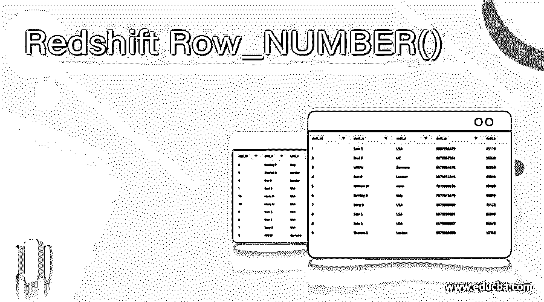
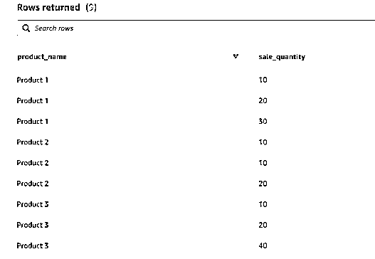
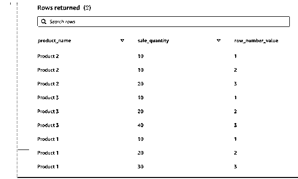
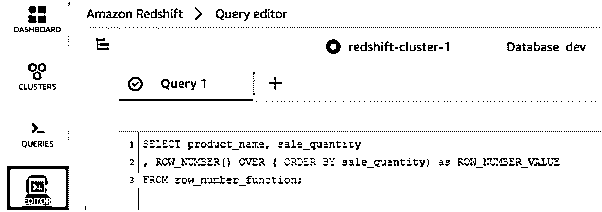
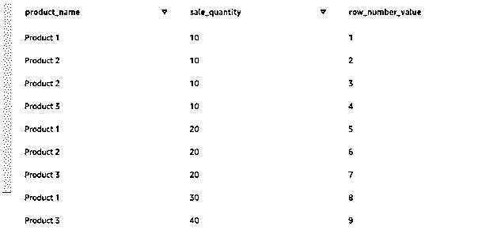
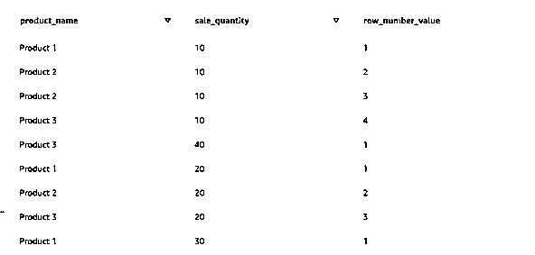
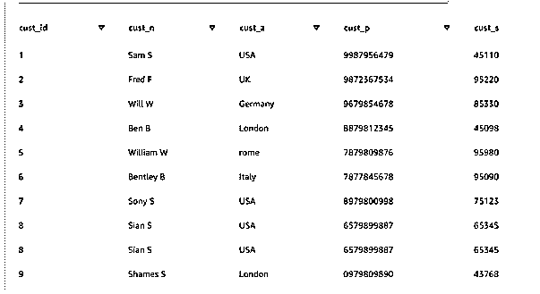
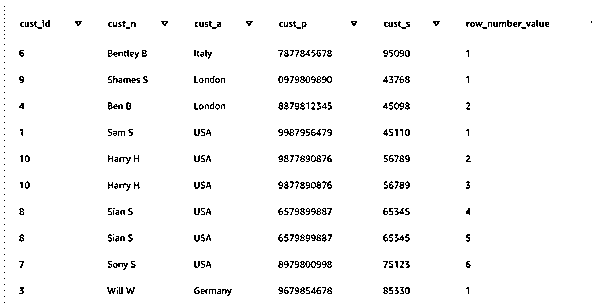
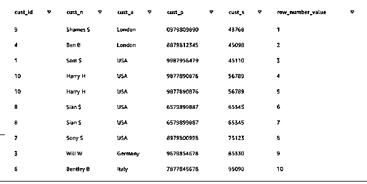

# 红移行数()

> 原文：<https://www.educba.com/redshift-row_number/>

## 红移 ROW_NUMBER()函数简介

Redshift row_number()函数通常通过语句中指定的分区集和 order by 子句为每一行分配一个行号。如果分区的行具有相同的值，则行号将由 order by 子句指定。

`ROW_NUMBER() OVER ( [PARTITION BY column_partition_expression, ... ] ORDER BY sort_column_expression [ASC | DESC], ... )`

<small>Hadoop、数据科学、统计学&其他</small>

在上面的语法中，我们可以说基于表达式的 **partition，行集合被划分为 partition by expression 的结果集合，函数将被应用。**

Order by 用于按升序或降序对每个分区中的行进行逻辑排序。

**语法:**

`ROW_NUMBER() OVER ( [PARTITION BY column_partition_expression, ... ] ORDER BY sort_column_expression [ASC | DESC], ... )`

row_number 函数的返回类型是“BIG INT”

**论据** **以上语法:**

**( )**

该函数不带参数，但空括号是必需的。

**超过**

ROW_NUMBER 函数的窗口子句。

**按分区表达式进行分区**

它可以是可选的。在 ROW_NUMBER 函数中，可以在 partition by 中定义一个或多个表达式。

**ORDER BY sort_expression**

它可以是可选的。如果没有指定分区依据，Order by 将使用整个表。

### row_number()函数如何在红移中工作？

让我们创建一个表并应用 Rank 函数来看看它是如何工作的:

`create table row_number_function
(
Product_name Varchar(10),
Sale_quantity int
);`

现在让我们插入一些重复的值如下，并应用等级。

`insert into row_number_function values ('Product 1', 10);
insert into row_number_function values ('Product 1' , 20);
insert into row_number_function values ('Product 1', 30);
insert into row_number_function values ('Product 2', 10)
insert into row_number_function values ('Product 2', 10)
insert into row_number_function values ('Product 2', 20)
insert into row_number_function values ('Product 3', 10)
insert into row_number_function values ('Product 3', 20)
insert into row_number_function values ('Product 3', 40)`

现在让我们选择上表。

`SELECT * FROM row_number_function;`

上述语句返回表中的所有值。

在表 row_number_function 的输出中。现在让我们对“row_number_function”表应用 row_number()函数。

`SELECT Product_name, sale_quantity
, ROW_NUMBER() OVER (PARTITION BY product_name ORDER BY sale_quantity) as ROW_NUMBER_VALUE
FROM row_number_function;`

相同的截图:

在上面的输出中，您可以看到行号是根据“产品名称”的分区依据列和“销售数量”的订单给出的。

现在让我们只对“字母表”列应用 order by，而不应用任何划分。让我们检查输出和差异。

`SELECT product_name, sale_quantity
, ROW_NUMBER() OVER ( ORDER BY sale_quantity) as ROW_NUMBER_VALUE
FROM row_number_function;`

相同的截图:

在上面的输出中，因为没有给定的表达式分区。将根据 order by 表达式给出行号。

`SELECT product_name, sale_quantity
, ROW_NUMBER() OVER ( PARTITION BY sale_quantity) as ROW_NUMBER_VALUE
FROM row_number_function;`

**上述语句输出截图:**

现在，在上面的输出中，只在“sale_quantity”列的基础上应用了 partition by。默认情况下，行号将按升序排列，并考虑 partition by 表达式。

### 例子

现在让我们考虑一个实时示例，应用 ROW_NUMBER 函数并检查输出:

让我们创建一个“CUST 数据”表，其中列有客户标识、客户名称、客户地址、客户电话和客户薪金，如下所示:

`create table CUST_DATA
(
Cust_id int,
cust_N varchar(20),
cust_A varchar(20),
cust_P varchar(10),
cust_S int );`

让我们在上表中插入几行，如下所示，并应用等级函数:

`insert into CUST_DATA values (1, 'Sam S', 'USA', '9987956479', 45110 );
insert into CUST_DATA values (2, 'Fred F', 'UK', '9872367534', 95220 );
insert into CUST_DATA values (3, 'Will W', 'Germany', '9679854678', 85330 );
insert into CUST_DATA values (4, 'Ben B', 'London', '8879812345', 45098 );
insert into CUST_DATA values (5, 'William W', 'rome', '7879809876', 95980 );
insert into CUST_DATA values (6, 'Bentley B', 'Italy', '7877845678', 95090 );
insert into CUST_DATA values (7, 'Sony S', 'USA', '8979800998', 75123 );
insert into CUST_DATA values (8, 'Sian S', 'USA', '6579899887', 65345 );
insert into CUST_DATA values (9, 'Shames S', 'London', '0979809890', 43768 );
insert into CUST_DATA values (10, 'Harry H', 'USA', '9877890876', 56789 );
select * from CUST_DATA;`

输出的屏幕截图:

现在让我们在表“CUST _ 数据”中应用行号函数。

`select *,
ROW_NUMBER() OVER (PARTITION BY cust_a order by cust_s) AS ROW_NUMBER_VALUE
from CUST_DATA;`

**输出:**

| **客户标识** | **客户编号** | **cust_a** | **cust_p** | **客户 _s** | **行编号值** |
| six | 宾利 | 意大利 | Seven billion eight hundred and seventy-seven million eight hundred and forty-five thousand six hundred and seventy-eight | Ninety-five thousand and ninety | one |
| nine | 羞辱者 | 伦敦 | 0979809890 | Forty-three thousand seven hundred and sixty-eight | one |
| four | 本·贝 | 伦敦 | Eight billion eight hundred and seventy-nine million eight hundred and twelve thousand three hundred and forty-five | Forty-five thousand and ninety-eight | Two |
| one | Sam S | 美利坚合众国 | Nine billion nine hundred and eighty-seven million nine hundred and fifty-six thousand four hundred and seventy-nine | Forty-five thousand one hundred and ten | one |
| Ten | 哈里·H | 美利坚合众国 | Nine billion eight hundred and seventy-seven million eight hundred and ninety thousand eight hundred and seventy-six | Fifty-six thousand seven hundred and eighty-nine | Two |
| Ten | 哈里·H | 美利坚合众国 | Nine billion eight hundred and seventy-seven million eight hundred and ninety thousand eight hundred and seventy-six | Fifty-six thousand seven hundred and eighty-nine | three |
| eight | 西安的 | 美利坚合众国 | Six billion five hundred and seventy-nine million eight hundred and ninety-nine thousand eight hundred and eighty-seven | Sixty-five thousand three hundred and forty-five | four |
| eight | 西安的 | 美利坚合众国 | Six billion five hundred and seventy-nine million eight hundred and ninety-nine thousand eight hundred and eighty-seven | Sixty-five thousand three hundred and forty-five | five |
| seven | 索尼 S | 美利坚合众国 | Eight billion nine hundred and seventy-nine million eight hundred thousand nine hundred and ninety-eight | Seventy-five thousand one hundred and twenty-three | six |
| three | 柳树 | 德国 | Nine billion six hundred and seventy-nine million eight hundred and fifty-four thousand six hundred and seventy-eight | Eighty-five thousand three hundred and thirty | one |

截图如下:

现在让我们在没有任何分区的情况下，在表“CUST 数据”中应用行号函数。

`select * ,
ROW_NUMBER() OVER ( order by cust_s) AS ROW_NUMBER_VALUE
from CUST_DATA;`

以上输出的屏幕截图:

`select *,
ROW_NUMBER() OVER (PARTITION BY cust_address ) AS ROW_NUMBER_VALUE
from CUST_DATA;`

这里我们只给出了划分，而没有给出排序。因此，排序将默认为 cust_address 列的升序。

### 推荐文章

这是红移 Row_NUMBER()的指南。这里我们讨论一下引言，row_number()函数是如何在红移中工作的？以及代码实现的例子。您也可以看看以下文章，了解更多信息–

1.  [什么是 AWS 红移？](https://www.educba.com/what-is-aws-redshift/)
2.  [关系数据库](https://www.educba.com/relational-database/)
3.  [耦合 vs 内聚](https://www.educba.com/coupling-vs-cohesion/)
4.  [亚马逊替代品](https://www.educba.com/amazon-alternatives/)

