# 红移物化视图

> 原文：<https://www.educba.com/redshift-materialized-views/>

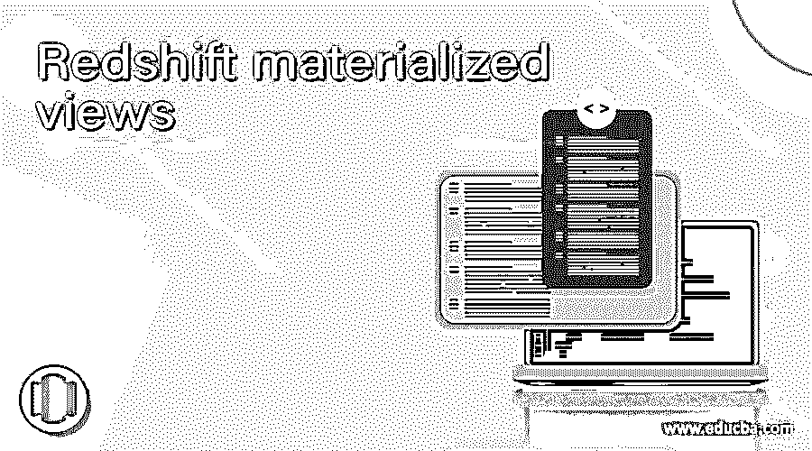

## 红移物化视图简介

以下文章提供了红移实体化视图的概述。在大型表上执行大型密集查询(如聚合、连接)会降低性能，为了克服这一点，Redshift 引入了物化视图概念，应用程序将查询物化视图并获得预计算的结果集(这可能是重复的)。这样，性能也会提高。

红移物化视图在不访问基表的情况下获得预计算的数据结果集，从而提高了性能。如果我们考虑一个场景，我们必须从基表中获取数据，对数据进行一些分析，并以任何仪表板或报告格式为用户填充数据。这里可以频繁地进行分析，而不是一次又一次地分析和查询基表。我们可以创建物化视图，它可以保存我们计划在仪表板中描绘的分析数据。当我们创建物化视图时，红移将运行用户指定的查询，获取数据，并存储结果。

<small>Hadoop、数据科学、统计学&其他</small>

让我们在下面的讨论中看到更多。

**语法:**

`CREATE MATERIALIZED VIEW NAME_MV
[ BACKUP { YES | NO } ] [ Mention_table_attributes ] [ Auto refresh { YES | NO } ] AS query`

**Backup:** Backup 是指定物化视图是否包含在集群快照中的子句。默认值为是。

**表属性:**指定数据在物化视图中的分布方式。对于分发样式 DISTSTYLE { EVEN | ALL | KEY } ]。用于分发密钥 DISTKEY(标识符)。

**自动刷新:**指定物化视图是否要用基表的最新数据自动刷新。默认值是“否”

### 物化视图如何在红移中工作？

现在让我展示物化视图的图形表示，稍后我们将继续创建、修改和自动刷新。

下面是桌子剧场和价格的物化视图。

**物化视图**

| **电影 _ 名称** | **剧场 _ 课堂** | **剧院 _ID** | **总计(客户编号*价格)** | **平均值(客户数量/价格)** |
| 钢铁侠 | 交流电（alternating current） | One hundred and twenty-three | Two hundred | One hundred |
| 蜘蛛侠 | 常态 | Three hundred and forty-five | Two hundred | One hundred |

**剧院桌(基础桌)**

| **电影 _ 名称** | **剧场 _ 课堂** | **剧院 _ID** |
| 钢铁侠 | 交流电（alternating current） | 123 |
| 钢铁侠 | 交流电（alternating current） | 123 |
| 蜘蛛侠 | 常态 | N_345 |
| 蜘蛛侠 | 常态 | N_345 |

**价格表(基础表)**

| **剧院 _ID** | **客户数量** | **价格** |
| 123 | One hundred | One hundred |
| N_345 | Two hundred | One hundred |

**例子:**

创建一个如下的表格，并在其中插入数据。

`Create table Theatre
(
Movie_name varchar(20),
Theatre_class varchar(20),
Theatre_id varchar(15)
);`

相同的截图:

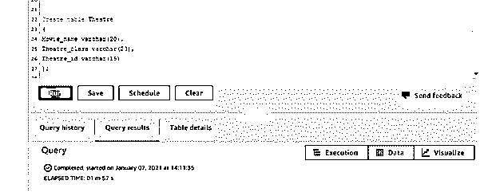

插入如下数据:

`Insert into theatre values ( 'Iron Man', 'AC', 'A_123' );
Insert into theatre values ( 'Iron Man', 'Normal', 'N_123' );
Insert into theatre values ( 'Spider Man', 'AC', 'A_345' );
Insert into theatre values ( 'Spider Man', 'Normal', 'N_345' );
Insert into theatre values ( 'Frozen', 'AC', 'A_456' );
Insert into theatre values ( 'Frozen', 'Normal', 'N_456' );
Insert into theatre values ( 'Bat Man', 'AC', 'A_777' );
Insert into theatre values ( 'Bat Man', 'Normal', 'N_777' );
Insert into theatre values ( 'X-Man', 'AC', 'A_888' );
Insert into theatre values ( 'X-Man', 'Normal', 'N_888' );`

相同的截图:

`select * from theatre;`

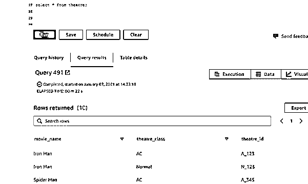

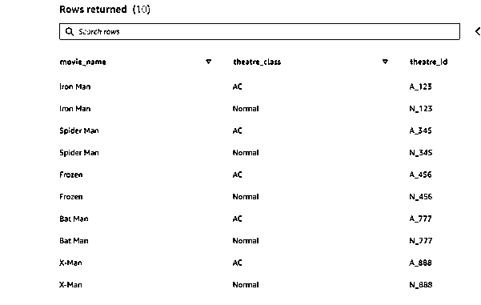

表格创建和数据插入。

`Create table PRICE
(
Theatre_id varchar(15),
No_of_cust INT,
Price INT
);`

相同的截图:

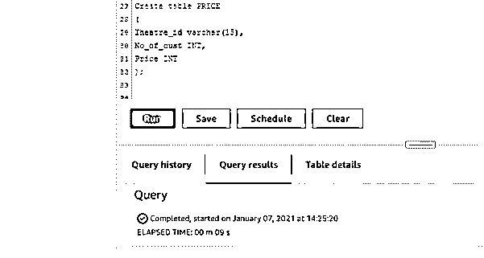

`Insert into PRICE values ( 'A_123' , 50, 150 );
Insert into PRICE values ( 'N_123' , 60, 100 );
Insert into PRICE values ( 'A_345' , 50, 250 );
Insert into PRICE values ( 'N_345' , 50, 150 );
Insert into PRICE values ( 'A_456' , 40, 200 );
Insert into PRICE values ( 'N_456' , 50, 150 );
Insert into PRICE values ( 'A_777' , 50, 300 );
Insert into PRICE values ( 'N_777' , 50, 200 );
Insert into PRICE values ( 'A_888' , 50, 250 );
Insert into PRICE values ( 'N_888' , 50, 150 );`

相同的截图:–

`Select * from price;`

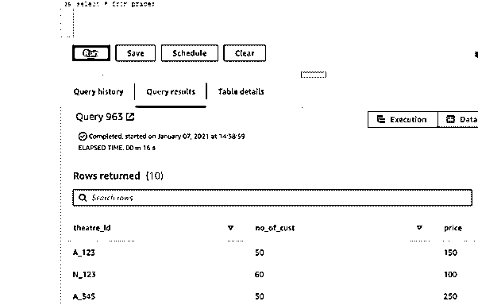

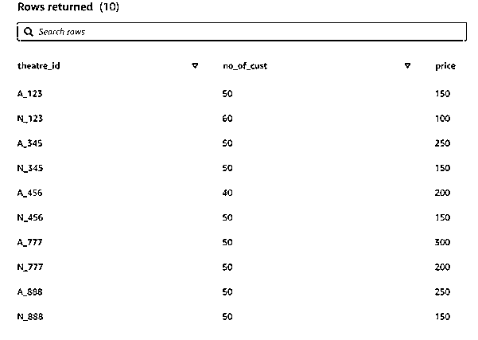

**创建物化视图:**

将物化视图 MV_theatre_analysis 创建为

`Select t.movie_name,
T.theatre_class ,
T.Theatre_id,
P.No_of_cust * p.price as Total_Price,
AVG (p.PRICE) as Average_Price
From theatre t , price p
Where t.theatre_id = p.theatre_id
group by 1,2,3,4 ;`

相同的截图:–

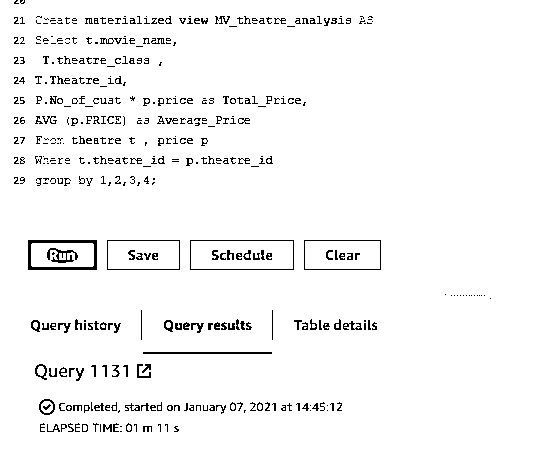

使用以下语句从实体化视图中选择数据:–

`Select * from MV_theatre_analysis;`

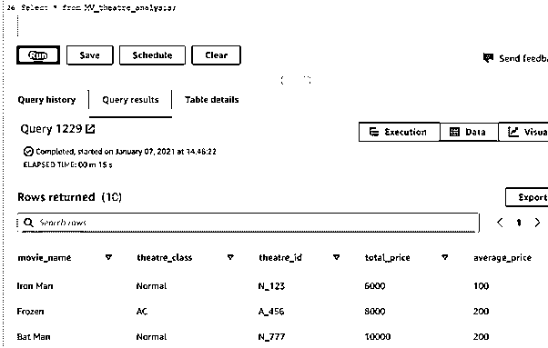

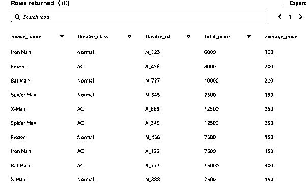

**输出:**

| **电影 _ 名称** | **剧场 _ 课堂** | **剧院 _id** | **总价** | **平均价格** |
| 钢铁侠 | 常态 | N_123 | Six thousand | One hundred |
| 冰冻的 | 交流电（alternating current） | 456 | Eight thousand | Two hundred |
| 勤务兵 | 常态 | N_777 | ten thousand | Two hundred |
| 蜘蛛侠 | 常态 | N_345 | Seven thousand five hundred | One hundred and fifty |
| x 战警 | 交流电（alternating current） | A_888 | Twelve thousand five hundred | Two hundred and fifty |
| 蜘蛛侠 | 交流电（alternating current） | A_345 | Twelve thousand five hundred | Two hundred and fifty |
| 冰冻的 | 常态 | N_456 | Seven thousand five hundred | One hundred and fifty |
| 钢铁侠 | 交流电（alternating current） | 123 | Seven thousand five hundred | One hundred and fifty |
| 勤务兵 | 交流电（alternating current） | 777 | Fifteen thousand | Three hundred |
| x 战警 | 常态 | N_888 | Seven thousand five hundred | One hundred and fifty |

**更改物化视图:**

`Alter materialized view MV_theatre_analysis AUTO REFRESH YES ;`

相同的截图:

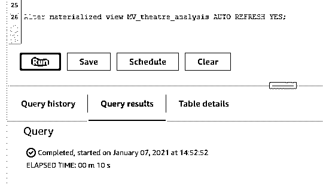

**刷新物化视图:**

`REFRESH materialized view MV_theatre_analysis ;`

相同的截图:

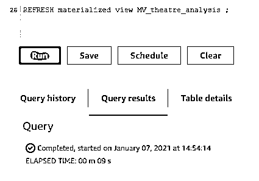

### 推荐文章

这是一个红移物化视图的指南。这里我们讨论物化视图如何在红移中工作，以及物化视图的图形表示。您也可以看看以下文章，了解更多信息–

1.  [什么是 AWS 红移？](https://www.educba.com/what-is-aws-redshift/)
2.  [云计算平台](https://www.educba.com/cloud-computing-platforms/)
3.  [AWS 极光](https://www.educba.com/aws-aurora/)
4.  [AWS 的优势](https://www.educba.com/benefits-of-aws/)

