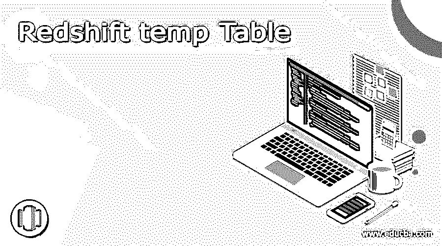
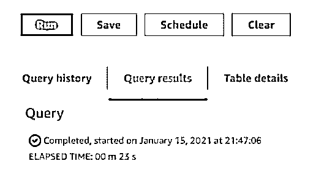
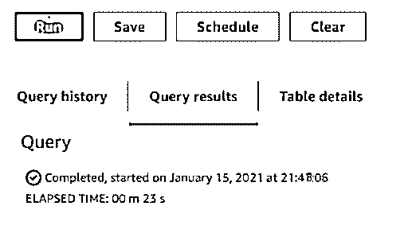
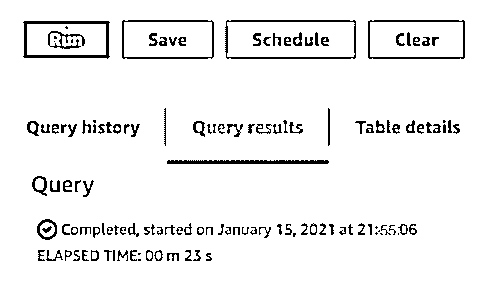

# 红移临时表

> 原文：<https://www.educba.com/redshift-temp-table/>

## 红移临时表简介

红移临时表是在 Amazon 红移数据库或数据仓库中创建的临时表。为临时目的而创建的表只能在创建它的当前会话中有效。在 redshift 实例的会话期间，您可以创建临时表，该表只有在会话有效时才在任何其他查询或过程中有用。一旦会话结束，保存在临时表中的数据将被丢弃，并且不能被进一步访问。有三种方法可以在 Amazon redshift 中创建临时表。

在本文中，我们将了解什么是临时表，如何创建临时表，用于创建临时表的所有三种方法的语法，以及演示如何创建临时表的示例。

<small>Hadoop、数据科学、统计学&其他</small>

### 红移中的临时表是如何工作的？

临时表也称为临时表，是在会话内部创建的。这个表的工作方式与 redshift 中的普通表相同，redshift 中的普通表以表格的行列格式存储数据，可以操作、插入、更新甚至删除其中的数据。但是，您应该注意到，对于临时表来说，唯一不同的是这些表是活动的，并且只能在有限的时间内使用，该时间限于当前会话的持续时间。一旦会话结束，表中的数据将被丢弃，并且该表不再存在于我们的内存中。

**语法:**

有三种方法可以在 redshift 中创建临时表。这包括在临时表的名称前使用散列符号(#)，在表的名称前指定关键字 TEMP，以及在表的名称前指定临时关键字。所有三种方法的语法如下所示

**方法 1**

通过使用以下语法，可以使用散列符号来创建临时表

`CREATE TABLE #name of the table (name of the columns along with their data types);`

表名可以是您希望临时表被调用的任何有效的表名。您可以指定列的名称，还可以在括号内指定要存储的值的类型。

**方法二**

我们可以在 redshift 中创建一个临时表，只需在 create table 命令的表名前加上一个关键字 temp。使用此方法创建临时表的语法如下所示

`CREATE TABLE TEMP name of the table (name of the columns along with their data types);`

其中所有剩余的参数和术语具有与方法 1 所述相同的含义。

**方法三**

我们可以在 redshift 中创建一个临时表，只需在 create table 命令的表名前面加上一个关键字 temporary。使用此方法创建临时表的语法如下所示

`CREATE TABLE TEMPORARY name of the table (name of the columns along with their data types);`

其中所有剩余的参数和术语具有与 Amazon redshift 中的方法 1 相同的含义。

### 要记住的要点

使用 Amazon redshift 中的临时表时，您应该记住以下几点

*   为临时目的创建的表对其他会话或用户不可见，因为它仅在当前会话中可用，在当前会话中，它仅由有权访问该会话和表的一个或多个用户创建和使用。以表格形式存储在临时表中的数据是不可恢复的，这意味着一旦会话结束，redshift 系统将在内部删除临时表，从而使任何地方的任何人都无法访问该临时表。
*   无法指定在其中创建表的模式的名称，因为不允许用户查看该名称，并且该名称由 redshift 在内部设置，因为所有临时表都是在特定的 redshift 模式中创建的。

### 例子

让我们尝试创建一个名为 Educba_writers 的临时表，其中包含 5 列，分别是名字、姓氏、文章数量、写作经历、加入日期。现在，我们将看到一个示例，说明如何使用所有三种语法在特定会话中创建这个临时表。使用每种方法形成的查询如下所述

#### 示例#1

`CREATE TABLE # Educba_writers
(first_name varchar (20),
last_name varchar (20),
no_of_articles integer (10),
experience_in_writing integer (10),
joining_date date);`

在 Amazon redshift 中执行上述命令的输出给出了以下结果

#### 实施例 2

`CREATE TABLE TEMP Educba_articles
(article_name varchar (20),
Topic varchar (20),
no_of_words integer (10),
time_for_writing integer (10),
submission_date date);`

在 Amazon redshift 中执行上述命令的输出给出了以下结果

#### 实施例 3

`CREATE TABLE TEMPORARY Educba_subjects
(subject_name varchar (20),
Branch varchar (20),
no_of_topics integer (10),
available_MCQ integer (10),
publish_date date);`

在 Amazon redshift 中执行上述命令的输出给出了以下结果

此外，通过使用 INSERT SQL query，您可以像在 Amazon redshift 中为永久表插入数据一样，将数据插入临时表中。但是区别在于访问临时表和永久表的值。在永久表的情况下，需要提及其内容将被访问的模式的名称，而在临时表的情况下，在检索数据时没有提及模式。例如，如果我们发出下面的命令，那么它将检索我们创建的名为 Educba_writers 的临时表的内容。

`SELECT * FROM Educba_writers;`

其输出如下所示

### 结论

通过遵循上面提到的三种语法中的任何一种，可以在 amazon redshift 中创建临时表。然而，我们应该在创建上面讨论的相同内容时考虑一些要点。

### 推荐文章

这是红移临时表的指南。这里我们讨论一下引言，临时表在红移中是如何工作的？以及更好理解的例子。您也可以看看以下文章，了解更多信息–

1.  [红移 Row_NUMBER()](https://www.educba.com/redshift-row_number/)
2.  [红移子串](https://www.educba.com/redshift-substring/)
3.  红移日期差值
4.  [Hadoop vs 红移](https://www.educba.com/hadoop-vs-redshift/)

