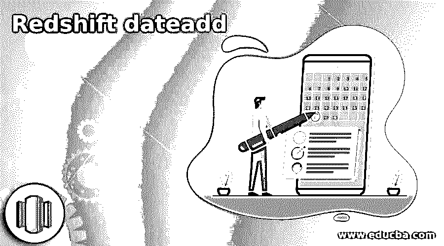

# Redshift dateadd

> 原文：<https://www.educba.com/redshift-dateadd/>

## 红移日期简介

Redshift 提供了不同类型的内置函数来根据用户需求对数据执行不同的操作。例如，dateadd()是 Redshift 提供的函数之一。基本上，dateadd()函数用于通过添加所需的日期和时间戳来返回新的日期-时间值，或者我们可以根据用户要求指定日期和时间戳。换句话说，我们可以说 dateadd()函数用于根据添加的时间间隔返回特定的日期和时间。通常，当我们需要根据需要指定未来和过去的日期和时间时，会使用 dateadd()函数。

**红移日期添加的语法:**

<small>Hadoop、数据科学、统计学&其他</small>

`dateadd (specified datepart, specified interval, {specified date| specified time|specified timetz| specified timestamp })`

**说明:**

在上面的语法中，我们使用 dateadd()函数和不同的参数，如下所示:

*   **指定日期部分:**指定日期部分是指我们可以将数据分成年、月、日等不同的部分，也可以说是小时，也就是说我们可以根据自己的需要来划分日期。
*   **指定间隔:**间隔是指指定的间隔，或者我们可以说我们需要的天数，可以是正数，也可以是负数。这也取决于用户需求。
*   **specified date | specified time | specified timetz | specified timestamp:**基本上是用来根据用户需求转换日期、时间或者时间戳，但是这个表达式需要一个 specified date 部分。

### dateadd 在红移中是如何工作的？

下面给出了 dateadd()函数在 Redshift 中的工作方式:

在执行 dateadd()函数之前，我们需要确定以下几点，然后才能执行 dateadd()函数，如下所示:

*   首先，我们需要连接到托管我们想要的数据库的服务器。
*   我们必须知道我们需要连接的数据库名称。
*   我们还需要用户名和密码。

通过利用窗口容量，您可以让您的客户更有效率地进行有见地的业务查询。窗口容量作用于结果集的片段或“窗口”,并为该窗口中的每一列返回激励。相反，对于结果集中的每一行，没有窗口容量完成它们的计算。不同于总结果推送的集束作品，表格连接中的所有列都被持有。通常 dateadd()函数处理不同的参数，比如日期和时间。同样，我们可以将“日期”分成不同的部分:年、月、日和时间。我们可以根据用户的要求将它分为小时、秒、毫秒和微秒。假设我们需要指定项目的未来日期；我们可以使用 dateadd()函数，添加间隔，并根据需要添加过去的日期和时间。

让我们看看如何以各种格式(如秒、毫秒和微秒)来表示日期，如下所示:

通过使用窗口限制，您可以让您的客户更有利地提出精明的业务请求。窗口限制作用于结果集的片段或“窗口”,并为该窗口中的每个片段返回推动力。同样，对于结果集中的每一行，没有窗口限制会执行它们的计算。与完成结果推送的捆绑作品不同，表中的所有片段都是固定的。

### 红移日期示例 add

以下是红移日期的示例:

#### 示例#1

让我们看看如何将月份添加到当前日期中，如下所示。

**代码:**

`select dateadd(month,10,'2021-02-23');`

**说明:**

*   在上面的例子中，我们使用 dateadd 函数，如下所示；这里，我们需要将 10 个月加到指定的日期中，或者我们可以说，当时我们可以使用上面的语句表示日期的文字值。
*   这里我们使用默认的列名 date_add，以及默认的时间戳值 00。我们使用下面的屏幕截图展示了上述语句的最终输出。

**输出:**

#### 实施例 2

让我们看看如何使用 dateadd()函数将时间戳添加到日期中，如下所示。

**代码:**

`select dateadd(m,20,'2021-08-04');`

**说明:**

*   在上面的例子中，我们使用 dateadd()函数，如下所示；假设我们当时需要把时间戳添加到指定的日期中，我们可以使用上面的语句。
*   在本例中，我们需要使用 dateadd()函数将 20 分钟添加到指定的日期中，如上面的语句所示；类似地，我们使用与上面例子相同的默认列名。我们使用下面的屏幕截图展示了上述语句的最终输出。

**输出:**

#### 实施例 3

让我们看看如何以不同的方式使用 dateadd()函数，如下所示。

**代码:**

`select dateadd(month,1,'2021-04-30');`

**说明:**

*   在上面的例子中，我们使用 dateadd()函数；假设我们需要在当时的指定日期上加上一个月，我们可以使用上面的语句。
*   **dateadd:** 如果要添加的日期的天数少于结果月的天数，则结果是结果月的比较日，而不是该月的最后一天。
*   例如，4 月 30 日+多月是 5 月 30 日。类似地，这里我们使用与上面例子相同的默认列名。我们使用下面的屏幕截图展示了上述语句的最终输出。

**输出:**

通过使用 dateadd()函数，我们还可以根据用户需求处理闰年。因此，通过这种方式，我们也可以根据用户需求实现时间、时间表和带日期的时间戳功能。

### 结论

从上面的文章中，我们看到了 Redshift dateadd()函数的基本概念和语法，还看到了 Redshift dateadd()函数的不同示例。从本文中，我们看到了如何以及何时使用 Redshift dateadd()函数。

### 推荐文章

这是红移 dateadd 的指南。这里我们讨论一下引言，dateadd 在红移中是如何工作的？和示例。您也可以看看以下文章，了解更多信息–

1.  [红移物化视图](https://www.educba.com/redshift-materialized-views/)
2.  [红移子串](https://www.educba.com/redshift-substring/)
3.  [红移创建表](https://www.educba.com/redshift-create-table/)
4.  红移日期差值

