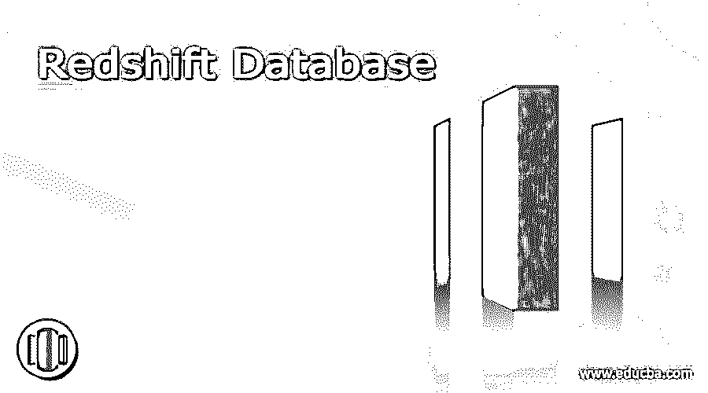
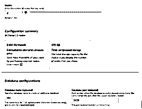

# 红移数据库

> 原文：<https://www.educba.com/redshift-database/>

## 红移数据库的定义

通常红移数据库是亚马逊提供的基于云的解决方案，我们也可以称之为大数据仓库。红移数据库为组织提供存储系统，这意味着组织可以通过云存储数据，我们可以根据用户要求随时随地轻松访问数据，用户可以通过 SQL 访问这些数据。换句话说，我们可以说，集群和集群可以包含不同的节点，节点可以由组织和应用程序独立访问。基本上，Redshift 设计用于不同类型的工具，如现有的 SQL。

**语法:**

<small>Hadoop、数据科学、统计学&其他</small>

`create database specified database name;`

**说明:**

在上面的语法中，我们使用 create database 命令来创建数据库，这里指定的数据库名称意味着我们需要创建的实际数据库名称。

### 数据库如何在红移中工作？

现在让我们看看数据库在红移中是如何工作的，如下所示。

基本上，对数据库的理解是基础的和重要的进步，它将使你的数据集计划建立在一个坚实的基础上。根据您对数据库的理解，您可以使用许多条件来获得您的潜在利益，就像您可以选择基于受过教育的选择和合理的执行愿景。数据库帮助你设置不同界限的权力，包括你正常的数据库储备，甚至问题执行得如何。在继续构建您的查询之前，先努力完全理解您的数据库和当前的连接。在制作数据集之前，你需要设置你的 Amazon redshift 包，并保证一切都与你的 SQL 客户设备相关联。一个孤立的集群可以有许多数据库。
假设你需要为你的互联网业务组装一个数据集；首先，您需要与您调度组时生成的底层数据集进行交互。

现在让我们看看如何将数据加载到数据库中，如下所示。

首先，我们需要使用上述语法创建我们想要的数据库。之后，我们需要使用 create table 命令在新创建的表中创建表。成功创建表后，我们可以根据用户需求执行不同的操作，如选择、插入和删除。

现在让我们看看如何管理数据库以及如何维护它，如下所示。

数据库维护和管理基本上不是数据库最关键的部分，但却是数据库过程中最重要的部分。在数据库管理中，我们可以考虑以下几点来进行维护和管理。

*   我们总是需要进行备份，还需要设置备份和恢复。
*   我们只需要及时维护数据库表。
*   我们需要根据需求低效地管理工作负载。
*   我们需要定期优化数据库查询。

这种进展保证了您将从数据集执行中获得理想的结果，就像扩展执行一样，它利用了 Redshift 扩展演示背后的主要元素，即:

*   非常平等的准备，
*   柱状信息储存
*   指定信息压力编码计划。

现在让我们看看可以对数据库执行哪些类型的操作，如下所示。

**更改数据库操作:**

假设我们需要一个现有数据库的属性，那么我们可以按照用户的要求修改数据库命令，如下所示。

假设我们需要更改数据库名称，我们可以使用如下语法。

`alter database existing specified database name rename to new specified database name;`

假设如果我们需要在那时改变数据库所有者，我们可以使用如下语法。

`alter database existing specified database name existing owner name to new owner name;`

**删除数据库操作:**

假设我们需要删除现有的数据库，我们可以使用如下语法。

`drop database specified database name;`

通过使用 select 子句，我们可以列出红移集群的所有现有数据库，如下所示。

`select * from pg_database;`

### 例子

现在，为了更好地理解，让我们看看 Redshift 中数据库的不同示例，如下所示。在创建数据库之前，我们只需要指定集群，这意味着我们需要创建集群，如下图所示。

之后，我们可以在 JDBC 连接
的帮助下，根据用户需求连接到 SQL 工作台或任何其他数据库。首先，让我们看看如何创建数据库，如下所示。

假设我们需要在那时创建数据库，我们可以使用如下语句。

`create database sample_red;`

**说明:**

在上面的例子中，我们使用 create a database 命令创建一个新的数据库；这里 sample_red 是我们需要创建的数据库名，如上面的语句所示。最后的输出或者我们可以说上面语句的结果我们可以用下面的截图来说明如下。

但是要创建数据库，我们需要验证正在运行的集群的术语，我们也可以使用所有者名称创建数据库。假设我们需要改变数据库，我们可以使用如下语句。

`alter database sample_red rename to red_sample;`

**说明:**

在上面的示例中，我们使用 alter 命令重命名现有的数据库名称，这里我们需要将 sample_red 数据库名称更改为 red_sample，如上面的语句所示。最后的输出或者我们可以说上面语句的结果我们可以用下面的截图来说明如下。

alter 命令的另一个用途是，假设我们需要更改现有数据库的所有者名称，我们可以根据需要使用 alter database 命令。类似地，我们可以使用 drop database 命令删除数据库。

### 结论

我们希望从这篇文章中你能学到更多关于红移数据库的知识。从上面的文章中，我们已经了解了红移数据库的基本概念和语法，我们还看到了红移数据库的不同示例。从本文中，我们了解了如何以及何时使用红移数据库。

### 推荐文章

这是一个红移数据库指南。这里我们分别讨论红移的定义、语法、数据库如何工作以及代码实现的例子。您也可以看看以下文章，了解更多信息–

1.  [红移 Row_NUMBER()](https://www.educba.com/redshift-row_number/)
2.  [红移创建表](https://www.educba.com/redshift-create-table/)
3.  [红移物化视图](https://www.educba.com/redshift-materialized-views/)
4.  [红移子串](https://www.educba.com/redshift-substring/)

