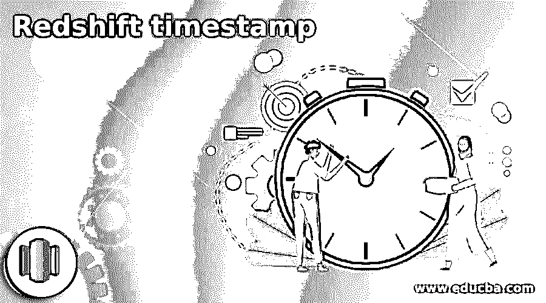
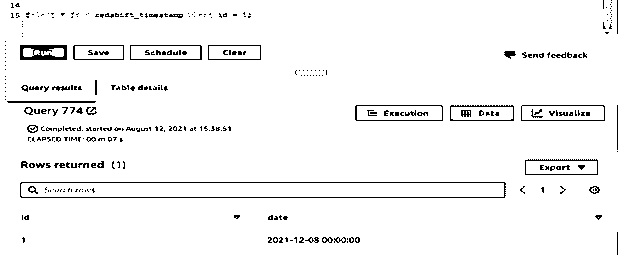
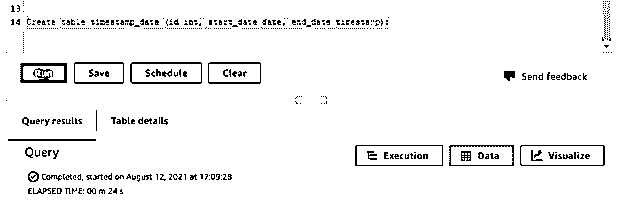
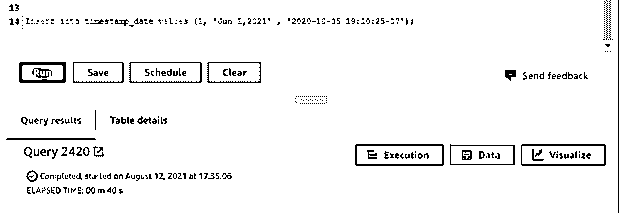
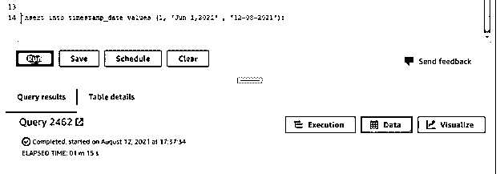
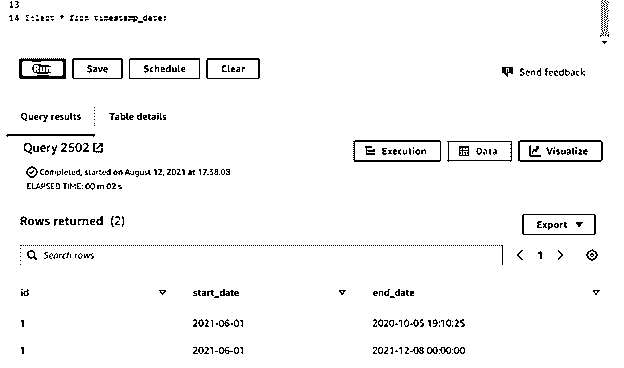
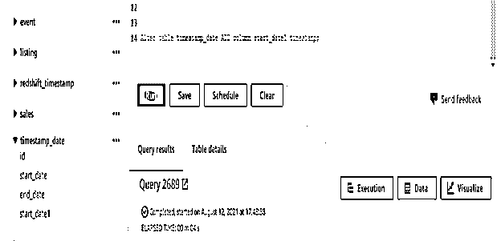
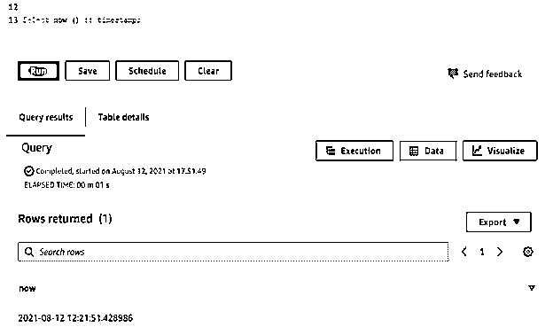
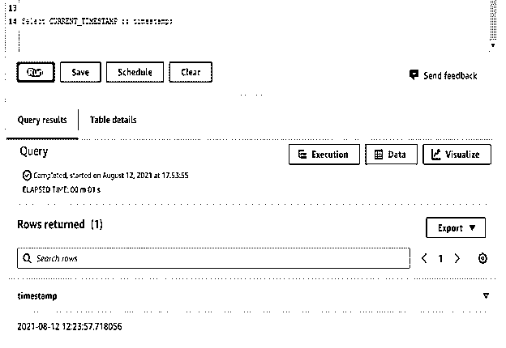

# 红移时间戳

> 原文：<https://www.educba.com/redshift-timestamp/>

## 红移时间戳简介

红移时间戳用于以日期和时间格式存储我们的日期类型列，它将以时间戳而不是时区格式保存我们的日期。时间戳只不过是没有时区的时间戳的别名，在对我们的列使用时间戳数据类型后，它将以日期和时间格式存储日期，而不会存储时区。我们可以在 redshift 中使用 timestamptz 数据类型存储时区，使用 timestamp 数据类型我们只存储一天中的完整日期和时间。红移中时间戳数据类型的存储大小是 8 个字节。

**语法:**

<small>Hadoop、数据科学、统计学&其他</small>

下面是红移中时间戳数据类型的语法如下。

*   **在创建表时将时间戳数据类型分配给列—**

`Create table name_of_table (column_name1 datatype, column_name2 datatype, column_name3 timestamp, ….., column_nameN timestamp);`

*   **在向表中添加新列时，将数据类型指定为时间戳—**

`ALTER TABLE name_of_table ADD COLUMN name_of_column timestamp;`

*   **将列的数据类型更改为时间戳—**

`ALTER TABLE name_of_table ALTER COLUMN name_of_column type timestamp;`

*   **检查当前日期和时间戳—**
*   select now()::timestamp；—显示当前日期和时间
*   Select 当前时间戳::时间戳；—它还会显示当前日期和时间。

**红移中时间戳的参数描述语法。**

*   **Create table–**该命令用于在 redshift 中创建表。使用该命令，我们将时间戳数据类型分配给新创建的列。我们可以将时间戳数据类型分配给 redshift 中的一个或多个列。
*   **表格名称–**这是表格的名称，在该表格中，我们将数据类型指定为时间戳。
*   **列名–**这就是我们已经将数据类型定义为时间戳的列的名称。我们还可以为不同的列分配不同的数据类型。
*   **数据类型–**这被定义为在创建表时我们必须分配给列的数据类型。我们可以根据已经加载到表中的数据来分配数据类型。
*   **更改表格–**该命令用于更改表格，以添加和改变列的数据类型。我们可以使用 alter table 命令将列数据类型更改为时间戳。
*   **添加列–**该命令用于在红移中添加一列。在向表中添加新列后，我们将数据类型指定为时间戳。
*   **时间戳–**这是 redshift 中使用的数据类型，用于以日期和时间格式存储日期。时间戳不会存储时区。

### 时间戳在红移中是如何工作的？

*   红移中时间戳数据类型的范围是从公元前 4713 年到公元 294276 年，时间戳数据类型的存储大小也是 8 个字节。
*   时间戳和 timestamptz(带时区的时间戳)数据类型的存储大小与 8 字节相同。
*   红移中的时间戳数据类型将存储最大值，精确到小数秒中的六位数字。
*   在将 date 插入时间戳数据类型列时，date 的值将被隐式转换为完整的时间戳值。
*   完整的时间戳值包含缺省值(00 ),表示缺少的秒、分和小时。输入值中会忽略时区值。
*   下面的示例显示，如果列包含的数据类型为 timestamp，则日期会隐式转换为时间戳值。
*   在第一个示例中，我们将日期插入为“12-08-2021”，我们可以看到它不包含任何时间戳，但是我们的日期列包含时间戳数据类型，因此它将隐式地将日期转换为日期和时间格式。
*   我们可以看到使用时间戳数据类型的日期“12-08-2021”的结果是“2021-12-08 00:00:00”。

**代码—**

`Insert into redshift_timestamp values (1, '12-08-2021');
Select * from redshift_timestamp where id = 1;`

*   在上面的结果中，我们可以看到小时、分钟和秒的值隐式地以“00”的格式出现。
*   下面是红移中可用的时间戳函数如下。
*   时间戳 _CMP 函数。
*   时间戳 _ CMP _ 日期函数。
*   TIMESTAMP_CMP_TIMESTAMPTZ 函数。
*   时间戳比较函数用于比较两个时间戳的值，并以整数格式返回该值。
*   如果假设我们的时间戳值相同，那么时间戳比较函数将返回值为零。
*   第二个函数 timestamp compare date 用于比较时间戳和日期值。
*   如果假设我们的时间戳和日期值相同，那么这个函数将返回值为零。

### 例子

下面是红移时间戳的例子如下。

*   **使用数据类型作为时间戳创建表格-**
*   以下示例显示了使用 datatype 作为时间戳创建一个表，如下所示。我们必须将表名创建为 timestamp_date，在 end_date 列上，我们必须将数据类型指定为时间戳。

**代码—**

创建表 timestamp_date (id int，start_date 日期，end_date 时间戳)；

**将值插入时间戳数据类型列–**

*   以下示例显示了将值插入时间戳数据类型列，如下所示。
*   在第一个示例中，我们插入了时间戳值“2020-10-05 19:10:25-07”。在第二个示例中，我们插入了时间戳值“12-08-2021”。
*   在第一个例子中，我们使用了带有时间值的日期，但是在第二个例子中，我们只使用了日期值。

**代码**

`Insert into timestamp_date values (1, 'Jun 1, 2021', '2020-10-05 19:10:25-07');
Insert into timestamp_date values (1, 'Jun 1, 2021', '12-08-2021');
Select * from timestamp_date;`

**使用数据类型作为时间戳向表中添加新列—**

*   以下示例显示了使用 datatype 作为时间戳向表中添加新列，如下所示。
*   在下面的例子中，我们将列名添加为 start_date1，并将数据类型指定为时间戳。

**代码—**

`Alter table timestamp_date ADD column start_date1 timestamp;`

**使用时间戳-**选择当前日期和时间

*   以下示例显示了如何使用时间戳选择当前日期和时间。
*   在第一个示例中，我们使用 now 函数选择日期，在第二个示例中，我们使用 current_timestamp 函数选择日期。

**代码—**

`Select now () :: timestamp;
Select CURRENT_TIMESTAMP :: timestamp;`

### 结论

Timestamp 是 redhat 中时区为的时间戳的别名。基本上，timestamp 和 timestamptz 是两种不同的数据类型，用于在 redshift 中存储日期。时间戳对于用时间格式存储日期非常有用和重要。在 redshift 中有多个时间戳函数可用。

### 推荐文章

这是红移时间戳指南。在这里，我们将讨论时间戳在红移中是如何工作的，并给出一些例子。您也可以看看以下文章，了解更多信息–

1.  [红移子串](https://www.educba.com/redshift-substring/)
2.  红移日期差值
3.  [红移物化视图](https://www.educba.com/redshift-materialized-views/)
4.  [什么是 AWS 红移？](https://www.educba.com/what-is-aws-redshift/)

