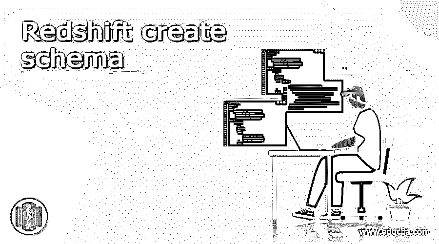

# 红移创建模式

> 原文：<https://www.educba.com/redshift-create-schema/>

## 红移创建模式简介

Redshift create schema 是 Redis 数据库管理系统中创建和定义当前数据库结构的过程。在创建和构造模式时，我们必须非常小心，因为数据的存储方式对数据的管理和操作有很大的影响。在本文中，我们将了解 redshift 中 create schema 语法的语法，还将详细讨论该命令中指定的参数。此外，我们将借助一些示例来理解 create schema 命令的演示。

**语法:**

<small>Hadoop、数据科学、统计学&其他</small>

Redis Create Schema 命令的语法如下所示:

`CREATE SCHEMA [IF NOT EXISTS] name of the schema [AUTHORIZATION name of user] [QUOTA {amount of memory or quota [TB | GB |MB] | UNLIMITED}] [elements of schema [ …] CREATE SCHEMA AUTHORIZATION name of user [ QUOTA {amount of memory or quota [TB | GB |MB] | UNLIMITED}] [elements of schema] ]`

上述语法中使用的参数在下面包含其描述的部分中逐一解释

*   模式名称–这是不能具有公共权限的模式名称。模式名需要是有效的字母数字字符串，这与声明标识符和名称时遵循的规则相同。
*   IF NOT EXISTS–这是一个可选子句，当我们希望确保数据库中存在同名模式时不会出现错误，并且系统不应对现有模式进行任何更改并返回一条消息，说明数据库中已存在同名模式时，可以指定该子句。这个可选子句最重要的是用在可以反复运行的脚本中，如果创建了模式，就不应该修改它。这确保了如果在创建模式时出现错误，脚本的执行不会停止。
*   QUOTA–这是正在创建的模式将使用的最大内存量。磁盘空间利用率是数据库中的一个重要因素。这有助于优化磁盘空间。该配额包括按材料创建的视图、永久表以及克隆对象，这些克隆对象是所有指定表的副本，并且是在每个单独的节点上为计算而创建的。请注意，配额内存量不包括临时表、模式和名称空间消耗的内存。

我们可以在参数 STL_SCHEMA_QUOTA_STATE 中检查为模式保留的内存量。如果您想检查哪些表超过了配额，可以检查 STL_SCHEMA_QUOTA_VIOLATIONS 的参数值。
默认情况下，如果未指定配额单位，则会考虑 GB，即千兆字节。在内部，无论您指定什么单位，无论提到多少配额，都会转换为兆字节。

*   授权–这有助于为命令中指定的用户指定权限和所有权。
*   用户名–这是模式所有者的名称。
*   模式元素——这些是要在模式及其定义中创建的对象。
*   UNLIMITED—当我们将配额指定为 UNLIMITED 时，即指定不应对模式的大小施加任何限制。

**注意:**在 Redshift 中，Amazon 对每个数据库的模式有一个限制，即每个数据库有 9900 个模式。

### 例子

让我们考虑一些例子来理解如何在 Amazon redshift 数据库中使用 CREATE SCHEMA 命令。

#### 示例#1

假设我们想要创建一个名为 customers_details 的模式，其所有权和访问权需要分配给名为 educba_user 的用户。为此，我们将使用以下命令–

`create schema customers_details authorization educba_user`

执行上述命令的输出如下所示

要确认用户是否被分配了所创建模式的所有权，您可以启动以下命令–

`select nspname as schema, usename as owner from pg_namespace, pg_user
where pg_namespace.nspowner = pg_user.usesysid and pg_user.usename ='{{username}}';`

上述命令的输出如下所示

#### 实施例 2

让我们考虑一个例子，在这个例子中，我们将创建一个模式，该模式在创建时就指定了特定的空间或内存配额。假设，我们必须创建名为 customers_details 的模式，配额量为 25 GB，然后我们可以使用下面的查询语句–

`create schema customers_details authorization educba_user QUOTA 25 GB;`

执行上述查询语句的输出如下所示

为了确认所创建的模式是否存在，我们可以使用以下查询对名为 PG_NAMESPACE 的目录表进行选择查询

`select nspname as schema, usename as owner
from pg_namespace, pg_user
where pg_namespace.nspowner = pg_user.usesysid
and pg_user.usename 'educba_user';`

执行上述查询语句的输出如下所示，显示了模式的名称以及我们为其分配了所有权的用户

#### 实施例 3

现在，我们将尝试使用其中一个可选参数来执行 CREATE SCHEMA 查询，该参数为 IF NOT EXISTS，它可以根据当前数据库中是否存在 customers_details 模式来返回模式已经存在的消息，或者返回模式创建成功的消息。我们的查询语句如下所示

`create schema if not exists customers_details;`

在我的例子中，执行上述命令的输出如下所示

### 结论

当您想要创建一个定义对象和元素并指定要创建的模式的所有权和配额相关详细信息的新模式时，可以使用 CREATE SCHEMA 命令。我们看到了如何从目录表中验证模式的创建。

### 推荐文章

这是一个红移创建模式的指南。这里我们分别讨论介绍，语法，参数，代码实现的例子。您也可以看看以下文章，了解更多信息–

1.  [什么是 AWS 红移？](https://www.educba.com/what-is-aws-redshift/)
2.  [红移创建表](https://www.educba.com/redshift-create-table/)
3.  [红移子串](https://www.educba.com/redshift-substring/)
4.  [红移物化视图](https://www.educba.com/redshift-materialized-views/)

