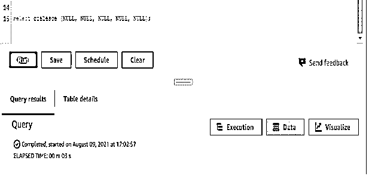
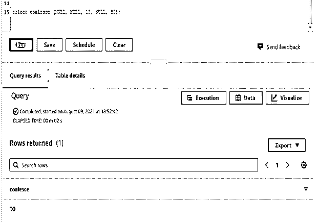
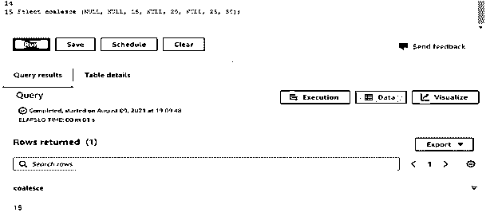
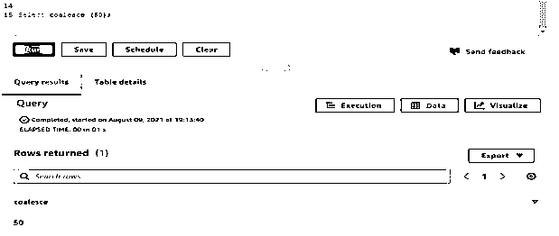
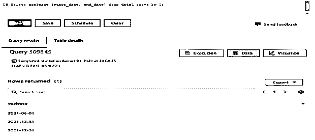

# 红移融合

> 原文：<https://www.educba.com/redshift-coalesce/>

## 红移融合的定义

红移合并函数将返回第一个非空值作为结果，合并函数是红移的内置函数。Coalesce 函数的工作方式与 SQL 中的 IFNULL 函数相同，该函数将从左到右计算参数，在找到非 NULL 值后，它不会计算剩余的参数。这个函数将接受参数的个数，但是它将返回第一个不为空的参数，如果所有的值都为空，那么它将返回空的结果集。当我们返回备份值时，这个函数很有用。

**语法:**

<small>Hadoop、数据科学、统计学&其他</small>

下面是 redshift 中 coalesce 函数的语法。

1) `COALESCE (Value1, Value2,….,ValueN);`

2) `COALESCE (Argument1, Argument2,…., ArgumentN);`

3) `Select column1, column2,…., COALESCE (column_name1, column_name2)
From table_name;`

**参数**

1) Value1 到 ValueN–我们在红移中与 coalesce 函数一起使用的任何值。对于多个值，联合函数将在结果中返回第一个非空值。

2)Coalesce–Coalesce 是 redshift 中的函数名，它返回第一个非空值作为结果。聚结函数在红移中也称为 NVL 函数。

3)Select–Select 用于通过使用红移中的合并函数从表中提取数据。我们可以一次使用多列或单列从表中获取数据。

4)参数 1 到参数 N——参数只是一个我们在红移中用 coalesce 函数传递的整数值。假设我们用联合函数传递了五个参数，如果第一个参数包含空值，那么联合函数将返回下一个非空值。

5)列名–这是我们使用 coalesce 函数的表的列名。如果我们想在 redshift 中使用 coalesce 函数从表中获取数据，那么我们需要传递列名。

6)表名——这只是我们使用 coalesce 函数来检索第一个非空值的表的名称。

### 聚结在红移中是如何工作的？

*   Redshift coalesce 函数用于从我们在查询中使用的表列或参数列表中返回第一个非 null 值。
*   该函数将从左到右计算值或参数，以找到非空值或参数。找到第一个参数后，它将不会计算查询中使用的列或值的剩余参数。
*   如果我们的表列包含多个空值，但在结果中我们不需要任何空值，此时我们在 redshift 中使用了 coalesce 函数。
*   当我们在查询中传递了所有的空值时，Coalesce 函数将返回空结果。
*   下面的例子表明，当我们传递所有的空值时，coalesce 函数将返回空结果。

**代码:**

`Select coalesce (NULL, NULL, NULL, NULL, NULL);`

*   在上面的例子中，我们可以看到所有的参数都是空值。检查所有空值后，结果显示空集。
*   在找到第一个非空值后，联合函数将停止执行查询，不会检查其他参数或值。
*   下面的例子表明，在找到第一个非空值后，coalesce 函数将停止查询执行。

**代码:**

`Select coalesce (NULL, NULL, 10, NULL, 50);`

*   在上面的例子中，我们可以看到参数列表(NULL，NULL，10，NULL，50)的结果是 10。找到 10 个值后，coalesce 函数不会搜索下一个值，也不会搜索下 50 个不为空的值。它将在 10 个值处停止评估。
*   联合函数与大查询中使用的 NVL 函数相同。在将代码迁移到红移时，我们需要将这个函数重写为 big query。
*   在 redshift 中使用 coalesce 函数计算数据时，我们可以使用单列和多列。如果我们希望查询同时返回某个函数的空值结果，我们可以在红移中使用 coalesce。
*   redshift 中的 Coalesce 函数也用于我们在查询中使用的参数列表。它将使用参数列表显示第一个非空值。

### 例子

下面的例子显示了红移中的聚结现象。

#### 1)结合函数和参数列表–

下面的例子显示了带有参数列表的联合函数如下。我们用 coalesce 函数传递了(NULL，NULL，15，NULL，20，NULL，25，30)参数列表。

争论的结果是 15。我们可以看到，它将检索第一个非空值 15，并跳过 15 之后的所有值。

**代码:**

`Select coalesce (NULL, NULL, 15, NULL, 20, NULL, 25, 30);`

#### 2)具有单个自变量的联合函数

*   以下示例显示了具有单个参数的 coalesce 函数。我们只传递了一个参数 50。
*   以下示例的结果是 50，因为 coalesce 函数在第一个参数中找到了 not null 值。

**代码:**

`Select coalesce (50);`

#### 3)使用单列作为参数列表的联合函数–

*   以下示例显示了使用单个列作为参数列表的 coalesce 函数，如下所示。
*   我们使用了日期表中的 start_date 列。

**代码:**

`Select coalesce (start_date) from date1 order by 1;`

#### 4)使用多列作为参数列表的联合函数–

*   以下示例显示了使用多列作为参数列表的联合函数，如下所示。
*   我们使用了日期表中的开始日期和结束日期列。

**代码:**

`Select coalesce (start_date, end_date) from date1 order by 1;`

### 结论

红移合并函数对于从列或参数列表中查找第一个非空值非常有用。如果假设所有列值都包含非空值，那么 coalesce 函数将返回空结果。找到第一个非空值后，联合函数将停止执行。

### 推荐文章

这是一个红移聚结指南。在这里，我们讨论定义，语法，如何结合工作在红移？示例分别用代码实现。您也可以看看以下文章，了解更多信息–

1.  红移日期差值
2.  [红移子串](https://www.educba.com/redshift-substring/)
3.  [红移创建表](https://www.educba.com/redshift-create-table/)
4.  [红移 Row_NUMBER()](https://www.educba.com/redshift-row_number/)

