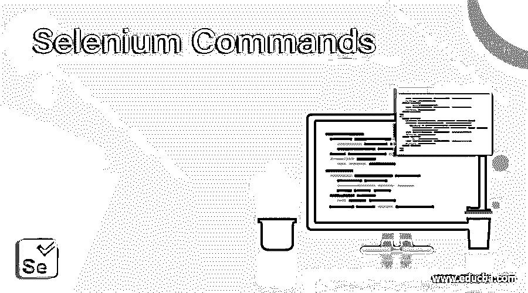

# Selenium 命令

> 原文：<https://www.educba.com/selenium-commands/>

## Selenium 命令简介

Selenium 命令专门用于 Selenium Web 驱动程序框架，用于在 Web 浏览器中测试应用程序。这些命令可以分为四大类，即浏览器命令、WebElement 命令、Get 命令和导航命令。Selenium 测试脚本中一些常用的命令有 sendKeys、click、IsDisplayed、IsSelected、refresh、navigate、back、quit、close、getTitle、getCurrentTitle、getSize 等。用于执行操作、获取值、启用 web 应用程序上的操作。

### 基本 Selenium 命令

下面是 selenium 中的几个基本命令。

<small>网页开发、编程语言、软件测试&其他</small>

*   **Get 方法:**该方法是 driver 类的一部分，可以通过使用 driver.get()方法访问。通过将 URL 作为参数传递，它可用于导航到网页。

*   **Navigate 方法:**此方法类似于“get ”,是同一类和 driver.navigate()的一部分。to()方法像 driver.get()方法一样打开网页。

*   在文本框中书写:sendKeys()方法帮助在文本框中书写。它还可以输入文本输入类型的任何元素。

*   **刷新浏览器:**一个浏览器可以用多种方式刷新。这些问题如下:

1.  使用**导航()。刷新()**命令
2.  使用**发送键(键。F5)** 在网页上的任意文本框上
3.  使用当前 URL 使用 **get("URL")**
4.  使用**导航()。to("URL")** 与当前 URL

*   **关闭命令:**这个 Selenium 命令[帮助关闭当前正在工作的窗口](https://www.educba.com/windows-interview-questions/)，WebDriver 可以控制这个窗口。此命令的返回类型是 void。

*   **Get Title 命令:**该方法有助于在浏览器中返回当前页面的标题字符串。此方法的返回类型是字符串。建议将该对象保存为字符串对象或变量。

*   **获取当前 URL 命令:**该方法在窗口中包含浏览器当前打开的 URL 的字符串时使用。这对于日志记录非常有用。

*   **获取页面源代码命令:**该方法帮助获取[网页的源代码](https://www.educba.com/web-page-design-layout/)。这会返回一个字符串值。

*   **void forward():** 这个 Selenium 命令帮助模拟窗口浏览到浏览器的前进按钮动作。它应该向前移动一页，进入浏览器的历史数据。

*   **点击命令:**该方法用于 web 元素执行点击动作。这是一种最常见的方法，可以与复选框、按钮、窗口等 web 元素进行交互。

### 中间命令

一旦您熟悉了基本的 Selenium 命令，就应该知道下面的命令。

*   **GetWindowHandle 命令:**这个 Selenium 命令帮助获取当前窗口的窗口句柄。
*   GetWindowHandles 命令:该命令帮助获取浏览器中打开的所有当前窗口的窗口句柄。
*   **SwitchTo Window 命令:**该 Web 驱动程序命令通过使用 SwitchTo 方法帮助在命名窗口之间移动。用户也可以向 switchto()发送一个窗口句柄。window()方法，在该方法中也可以迭代任何打开的窗口。
*   **切换到框架命令:**通过使用该命令，可以使用切换到方法在指定框架之间移动。
*   **SwitchTo PopUp 命令:**类似于上面的 SwitchTo 命令，这个方法也可以帮助切换弹出窗口。一旦触发此操作，将打开一个弹出窗口，可以通过警报访问该窗口，并返回当前打开的警报对象。在这个对象的帮助下，用户可以接受、取消或读取任何提示中的内容。
*   **IsDisplayed 命令:**这个方法有助于检查一个元素是否可见。如果元素存在并且在页面上可见，则返回 true。如果元素不存在，它将引发必要的异常。
*   **IsEnabled:** 该方法根据元素的状态返回 true 或 false。除了那些被有意禁用的项之外，它通常为所有项返回 true。
*   **提交命令:**这个方法帮助启动一个 [HTML 表单](https://www.educba.com/html-form-elements/)的提交。它不允许任何参数，如果它指向当前页面，那么它将等待，直到加载新页面。
*   **GetCssValue 命令:**该方法提供了属于元素的 CSS 属性的值。
*   GetLocation 命令:这个方法有助于获取页面上任何元素的位置。用户可以很容易地得到任何指定元素的 X 和 Y 坐标。

### 高级命令

以下是 selenium 中的一些高级命令:

*   #### processing iframes 【T1] by ID or name

为了识别 iframe，用户必须识别要使用的框架的 ID 或名称。为此，用户必须首先使用 web inspector 工具检查网页。完成后，可以使用下面的 web 驱动命令在不同的 iframes 之间切换。

`driver.switchTo().frame("frameID");
driver.switchTo().frame("frameName");`

*   #### Exception handling

可能会有程序被中断的情况，这些中断可以说是异常。和其他语言一样， [Selenium web driver](https://www.educba.com/what-is-selenium-web-driver/) 也支持异常处理。它可以捕捉单个异常，甚至多个异常。

*   #### Processing Waiting and Condition

有不同的命令可以处理等待。它们可以被命名为:

PageLoadTimeOut(时间，单位)和 implicitlyWait()

类似地，可以使用以下条件:

isDisplayed()，isEnabled()，isSelected()

### 使用 Selenium 命令的提示和技巧

*   **创建 Web 驱动实例的最佳方法**

通过使用<factory>设计模板，用户可以为特定的浏览器类型创建对象。</factory>

*   **检查元素是否存在的方法**

用户可以利用<findelements>来检查一个元素是否存在。</findelements>

*   **避免异常并一起检查元素**

上面的标签可能会导致<nosuchelementexception>。通过使用等待功能，可以避免这种错误，并且还允许测试 web 元素。</nosuchelementexception>

### 结论

通过使用 Selenium 和这些命令，任何 web 应用程序都可以轻松实现自动化。Selenium 是一个开源工具，很容易获得，因此可以用于测试所有基于 web 的应用程序。以上命令可以简要地帮助您了解 Selenium 中使用的基本和高级命令。

### 推荐文章

这是 Selenium 命令的指南。在这里，我们讨论了概念、基本、中级和高级 Selenium 命令以及有效使用的技巧和诀窍。您也可以阅读以下文章，了解更多信息——

1.  [硒软件](https://www.educba.com/selenium-software/)
2.  [硒工具](https://www.educba.com/selenium-tools/)
3.  [硒架构](https://www.educba.com/selenium-architecture/)
4.  [硒的成分](https://www.educba.com/components-of-selenium/)

