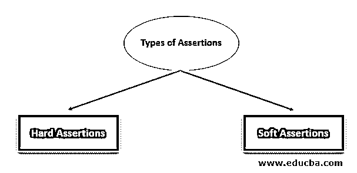
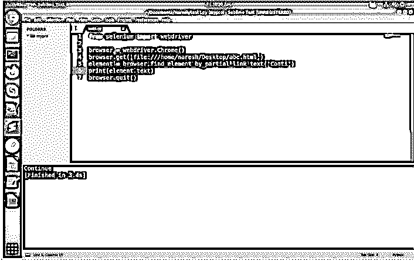
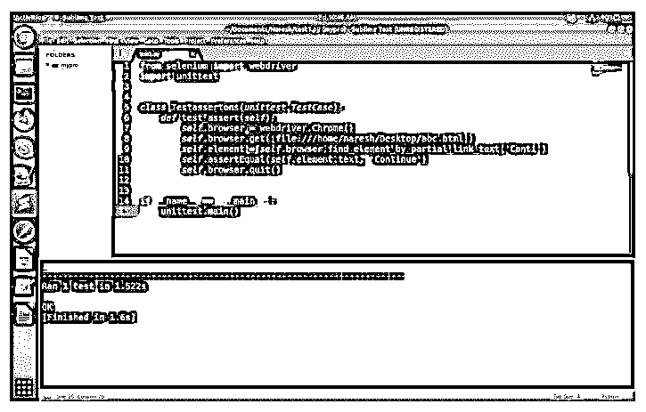
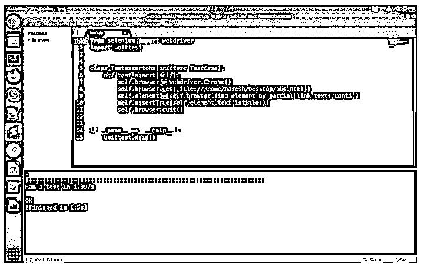
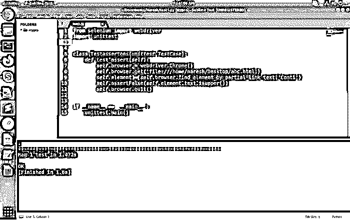

# 硒中的断言

> 原文：<https://www.educba.com/assertions-in-selenium/>

## Selenium 中的断言简介

下面的文章概述了 Selenium 中的断言。断言用于将应用程序的实际结果与预期结果进行比较。AssertEquals 方法将预期结果与实际结果进行比较。如果预期结果与实际结果不匹配，它将抛出 AssertionError，并在 assertequals 方法处终止程序执行。

AssertTrue 方法断言指定的条件为真。如果传递给 asserttrue 方法的条件不满足，它将引发 AssertionError。AssertFalse 方法断言指定的条件为假。如果传递给 assert false 方法的条件不满足，它将抛出 AssertionError。AssertEquals、AssertTrue 和 AssertFalse 方法是 selenium 中最常用的断言。一般来说，当我们检查预期时，断言会验证应用程序是否相同。

<small>网页开发、编程语言、软件测试&其他</small>

Selenium 断言有三种类型。

1.  维护
2.  核实
3.  等待

**断言语法:**

`assert Expression[, message]`

在上面的语法中，如果条件为真，则返回结果。如果条件为假，它将打印消息，而不是断言错误。

### Selenium 中的断言类型

在 selenium 中有两种类型的断言。

*   强硬的主张
*   软断言

#### 1.强硬的主张

*   在断言条件为真之前，硬断言不会继续执行。
*   每当断言条件失败时，硬断言通常会抛出断言错误。
*   当硬断言条件失败时，测试用例将立即被标记为失败。

#### 2.软断言

*   即使断言条件失败，软断言也会继续测试执行。
*   当断言条件失败时，软断言不会抛出任何错误，而是继续测试用例的下一步。

### 断言方法

下面是不同类型的断言方法，适用于 java。

#### 1.assertEquals

assertEquals 方法将预期结果与实际结果进行比较。如果预期结果与实际结果不匹配，则抛出 AssertionError，并终止程序执行。

**举例:**

`String expected = “https://www.google.com”;
String actualURL= “https://www.google.com”;
Assert.assertEquals(expected, actualURL);`

#### 2.assertTrue

assertTrue 方法检查条件是否为真。

它接受两个参数，即一个是消息，另一个是需要应用断言的条件。如果传递给 assertTrue 方法的条件不满足，它将引发 AssertionError。

**举例:**

`Assert.assertTrue(“Assert True test message”, true);`

#### 3.assertFalse

assertFalse 方法检查条件是否为真。

它接受两个参数，即一个是消息，另一个是需要应用断言的条件。如果传递给 assertFalse 方法的条件不满足，它将引发 AssertionError。

**举例:**

`Assert.assertFalse(“Assert false test message” false);`

#### 4 .断言 Null

assertNull 用于验证提供的对象是否包含空值。它将一个对象作为参数，如果提供的对象不包含空值，则引发 AssertionError。

**举例:**

`DemoClass demo = new DemoClass();
Assert.assertNull(demo);`

#### 5.assertNotNull

assertNotNull 用于验证所提供的对象不包含空值。它将一个对象作为参数，如果提供的对象不包含空值，则引发 AssertionError。

**举例:**

`DemoClass demo = new DemoClass();
Assert.assertNotNull(demo);`

#### 6.资产相同

assertSame 方法检查作为参数提供的两个对象是否引用同一个对象。如果提供的对象没有引用与提供的消息相同的对象，它将引发 AssertionError。

**举例:**

`DemoClass1 demo1 = new DemoClass1();
DemoClass2 demo2= new DemoClass2();
Assert.assertSame(“Two objects are equal”, demo1, demo2);`

#### 7.assertNotSame

assertNotSame 验证两个对象不相等。如果两个对象引用同一个对象，那么将抛出 AssertionError。

**举例:**

`DemoClass1 demo1 = new DemoClass1();
DemoClass2 demo2= new DemoClass2();
Assert.assertNotSame(“Two objects are not equal”, demo1, demo2);`

#### 8.assertArrayEquals

assertArrayEquals 验证两个对象数组是否相等。如果两个数组都包含空值，则可以认为它们是相等的。如果两个对象数组被认为不相等，此方法将引发 AssertionError 并提供消息。

**举例:**

`String[] expected = {“Mango”,”Apple”,”Banana”}
String[] actual = {“ Mango”,”Apple”,”Banana”}
Assert.assertArrayEquals(expected,actual);`

### 用于应用程序测试的断言方法

下面是用于应用程序测试的主要 selenium 断言方法:

*   assertequals
*   assertTrue
*   assertFalse

考虑以下是我们的来源:

**代码:**

`<html>
<body>

Are you sure you want to do this?

<a href="continue.html">Continue</a>
<a href="cancel.html">Cancel</a>
</body>
<html>`

下面是检查来自 selenium 源的元素的代码。

**代码:**

`from selenium import webdriver
browser = webdriver.Chrome()
browser.get('file:///home/naresh/Desktop/abc.html')
element = browser.find_element_by_partial_link_text('Conti')
print(element.text)
browser.quit()`

**输出:**

在上面的图片中，我们使用 selenium 部分链接文本方法从一个 web 源获取文本。

现在，我们在相同的源代码和代码中执行断言。

在这个例子中，我们采用单元测试来执行断言方法。

#### 1.assertEqual

assertEqual 检查预期的结果。

**代码:**

`<html>
<body>

Are you sure you want to do this?

<a href="continue.html">Continue</a>
<a href="cancel.html">Cancel</a>
</body>
<html>`

下面的代码用于检查 assertEqual 方法。

**代码:**

`from selenium import webdriver
import unittest
class Testassertons(unittest.TestCase):
def test_assert(self):
self.browser = webdriver.Chrome()
self.browser.get('file:///home/naresh/Desktop/abc.html')
self.element = self.browser.find_element_by_partial_link_text('Conti')
self.assertEqual(self.element.text, 'Continue')
self.browser.quit()
if __name__ == '__main__':
nittest.main()`

**输出:**

#### 2.assertTrue

它检查条件是否为真。

**代码:**

`<html>
<body>

Are you sure you want to do this?

<a href="continue.html">Continue</a>
<a href="cancel.html">Cancel</a>
</body>
<html>`

**编程代码:**

`from selenium import webdriver
import unittest
class Testassertons(unittest.TestCase):
def test_assert(self):
self.browser = webdriver.Chrome()
self.browser.get('file:///home/naresh/Desktop/abc.html')
self.element = self.browser.find_element_by_partial_link_text('Conti')
self.assertTrue(self.element.text.istitle())
self.browser.quit()
if __name__ == '__main__':
unittest.main()`

在上面的例子中，我们正在检查条件，如果为真，它返回“OK ”,否则返回 AssertionError。

**输出:**

#### 3.assertFalse

它检查条件是否为假。

**代码:**

`<html>
<body>

Are you sure you want to do this?

<a href="continue.html">Continue</a>
<a href="cancel.html">Cancel</a&gt
</body>
<html>`

**编程代码:**

`from selenium import webdriver
import unittest
class Testassertons(unittest.TestCase):
def test_assert(self):
self.browser = webdriver.Chrome()
self.browser.get('file:///home/naresh/Desktop/abc.html')
self.element = self.browser.find_element_by_partial_link_text('Conti')
self.assertFalse(self.element.text.isupper())
self.browser.quit()
if __name__ == '__main__':
unittest.main()`

在上面的代码中，它检查条件是否为假。

如果条件为假，则返回“OK”，否则返回 AssertionError。

**输出:**

### 推荐文章

这是 Selenium 中的断言指南。这里我们讨论 selenium 中的简介、断言类型和方法。您也可以看看以下文章，了解更多信息–

1.  [硒软件](https://www.educba.com/selenium-software/)
2.  [硒框架](https://www.educba.com/selenium-framework/)
3.  [什么是 Selenium Web 驱动？](https://www.educba.com/what-is-selenium-web-driver/)
4.  [硒替代品](https://www.educba.com/selenium-alternatives/)

