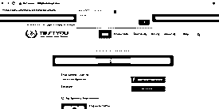

# selenium javascriptexecutor 执行器

> 原文：<https://www.educba.com/selenium-javascriptexecutor/>


## selenium javascriptexecutor 简介

javascriptexecutor 是 selenium 接口之一，可用于允许和运行脚本，这需要了解如何在 selenium 中使用 JavaScript executor；它被认为是一个正常的优先事项，用于安装 web 驱动程序，以便使用浏览器与一些 html 组件进行通信。它已经有 javascript 实现，它可以理解 javascript 命令，并且需要知道 selenium 脚本的结果，以便快速、优雅地执行各种任务，并且易于用于在应用程序中执行 javascript 代码。

### 什么是 selenium javascriptexecutor？

这是一个允许使用 selenium 驱动程序运行 javascript 的接口，它有一些默认的方法来运行所选 UI 框架、窗口、面板等的代码上下文。主要部分是“执行脚本和 executeAsyncScript ”,它单独显示，位于 WebDriver 类下。它使用 ExecuteScript。这些脚本使用 Xpath 和 selenium 命令查找元素，这些命令广泛用于运行端到端测试场景。它使各种操作能够有效地与 java 语言一起工作。

<small>网页开发、编程语言、软件测试&其他</small>

### 如何使用 selenium javascriptexecutor？

selenium web 驱动程序不能执行特定的任务，也不能与自己实例的 web 组件进行交互，而这些任务是确保正确执行操作和更好地理解其重要性所必需的。测试人员必须构建一个自动化脚本，点击按钮等 UI 组件，标记脚本失败，并利用 JavascriptExecutor 来解决问题。一般来说，我们知道 executeAsyncScript 和 executeScript 等方法的类型，以及在 selenium web 驱动程序中使用的定位器，如 ID、Class、Xpath 等，用于在 web 页面上执行用户接受度测试。基于依赖性，有时会使用这些 web 驱动程序；它不能让 javascriptexecutor 在指定的网页上运行。executor 的一个优点是不需要安装插件和插件；它使的 web 驱动程序能够在任何浏览器中与 html dom 进行交互。我们必须使用 selenium 脚本导入 org . open QA . Selenium . JavaScript executor

### 成分

组件可以是任何类型，如 executeScript 和 executeAsyncScript，任何这些方法都需要执行和操作元素，如 click()、button 等。这些 UI 标签元素将在 javascriptexecutor 方法的帮助下在应用程序中执行脚本。

**执行脚本**

**executeAsyncScript**

以上两种方法类型将充当 javascriptexecutor 的组件和方法。通常，selenium webdriver 使用 click()方法和 class like 元素。我们将在下面看到方法的类型。

### JavaScriptExecutor 方法

一般来说，我们知道类型，在 selenium 中 javascriptexecutor 被分为两种类型。因此，executeScript 和 executeAsyncScript 是 selenium 的两个方法和组件。

**执行脚本:**

它是使用上下文语言中的脚本和选定的组件(如窗口或框架)来执行测试用例的方法之一。这个脚本和方法将只在匿名函数上运行，它将返回包含 html 元素的具有选定值的语句，然后它充当并返回 WebElement。如果假设它将返回十进制值，它将返回一个长类型值；否则，非十进制值将返回相同的长整型值。布尔返回值使用布尔类型初始化；否则，其他格式将只返回字符串类型的值。

**executeAsyncScript:**

这是另一种返回异步 javascript 代码片段的方法，这些代码片段将被视为 UI 窗口和框架。但是，异步脚本仍然需要与网页的其余部分一起执行；数据正在被解析，它将通过应用程序响应和性能得到增强。

#### 示例#1

**代码:**

```
import org.openqa.selenium.By;
import org.openqa.selenium.JavascriptExecutor;
import org.openqa.selenium.WebDriver;
import org.openqa.selenium.chrome.ChromeDriver;
public class New {
public static void main(String[] args) {
System.setProperty("webdriver.chrome.driver", "C:\\Users\\Kripya-PC\\Downloads\\chromedriver_win32 (1)\\chromedriver.exe");
WebDriver dr = new ChromeDriver();
dr.manage().window().maximize();
dr.get("http://www.testyou.in/Login.aspx");
dr.findElement(By.id("ctl00_CPHContainer_txtUserLogin")).sendKeys("ramansiva57@gmail.com");
dr.findElement(By.id("ctl00_CPHContainer_txtPassword")).sendKeys("ramansiva57@gmail.com");
JavascriptExecutor j= (JavascriptExecutor)dr;
j.executeScript("document.getElementById('ctl00_CPHContainer_chkRememberMe').click()");
dr.findElement(By.xpath("//input[@id='ctl00_CPHContainer_btnLoginn']")).click();
}
}
```

**输出:**


在上面的例子中，我们曾经登录到应用程序，这里我们没有注册应用程序。所以它显示一个错误，首先我们需要注册应用程序，然后我们将能够登录到应用程序。这里，我们已经使用 setProperty()方法为 selenium 框架设置了 chrome 驱动程序，然后将使用 WebDriver 创建 chrome driver()的实例，并将其分配给单独的变量。然后我们将调用 web 驱动程序的默认方法，如 manage()。窗口()和最大化()来执行应用程序。然后 get()方法获取应用 url 之后，我们将从应用程序中获取用户并传递 id，然后使用 findElement()方法调用它。javascriptExecutor 类将使用 executeScript()方法装箱并执行元素脚本。

#### 实施例 2

**代码:**

```
import org.openqa.selenium.By;
import org.openqa.selenium.JavascriptExecutor;
import org.openqa.selenium.WebDriver;
import org.openqa.selenium.chrome.ChromeDriver;
public class New {
public static void main(String[] args) {
System.setProperty("webdriver.chrome.driver", "C:\\Users\\Kripya-PC\\Downloads\\chromedriver_win32 (1)\\chromedriver.exe");
WebDriver dr = new ChromeDriver();
dr.manage().window().maximize();
dr.get("http://www.testyou.in/Login.aspx");
dr.findElement(By.id("ctl00_CPHContainer_txtUserLogin")).sendKeys("ramansiva57@gmail.com");
dr.findElement(By.id("ctl00_CPHContainer_txtPassword")).sendKeys("12345");
dr.findElement(By.xpath("//input[@id='ctl00_CPHContainer_btnLoginn']")).click();
JavascriptExecutor j= (JavascriptExecutor)dr;
j.executeAsyncScript("window.setTimeout(function(){alert('Selected');},1000);alert('Please select Stay Signed In box');");
}
}
```

**输出:**




在第二个例子中，我们使用了相同的 web 应用程序，但是在这里，我使用了 executeAsyncScript()方法和命令，它只使用了异步类型的 javascript 代码。基本上，时间是异步类型的 javascript 代码最重要的约束，就像这里一样；用户登录页面将根据 javascript alert()方法的顶部进行验证。

### 结论

在 javascript 中，它有许多因变量和非因变量、方法和其他函数来执行基于 web 的应用程序。在 selenium 自动化测试框架中，将采用 javascript 语言，通过自动化使用 javascriptexecution 接口及其方法来执行用户验收测试。

### 推荐文章

这是 selenium javascriptexecutor 的指南。在这里，我们讨论如何使用 selenium javascriptexecutor 以及示例和输出。您也可以看看以下文章，了解更多信息–

1.  [如何使用硒？](https://www.educba.com/how-to-use-selenium/)
2.  [Selenium IDE 命令](https://www.educba.com/selenium-ide-commands/)
3.  [Selenium Webdriver 命令](https://www.educba.com/selenium-webdriver-commands/)
4.  [硒的成分](https://www.educba.com/components-of-selenium/)


