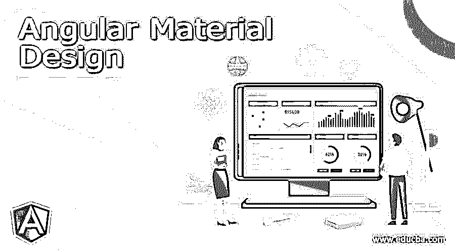
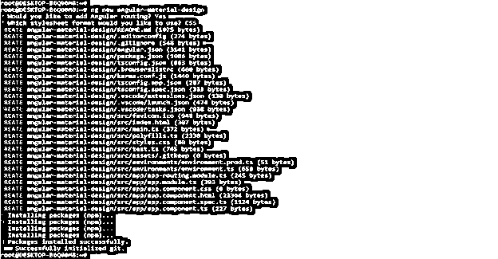
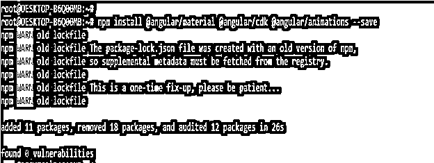
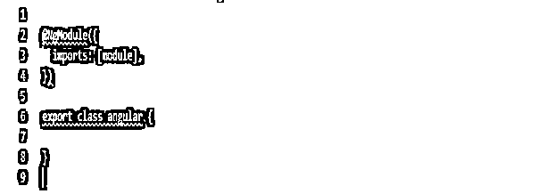
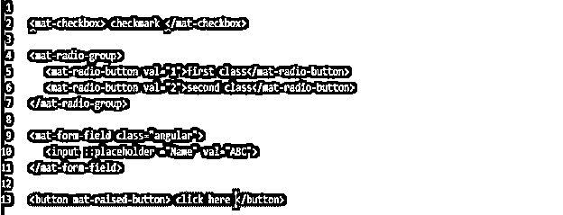
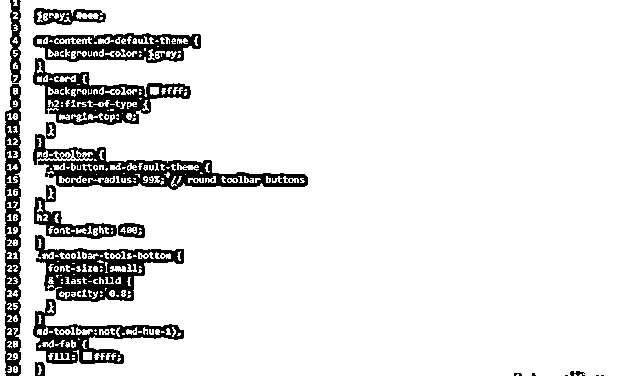

# 棱角分明的材料设计

> 原文：<https://www.educba.com/angular-material-design/>




## 角形材料设计的定义

它只是我们的应用程序中存在的 UI 库组件或元素。这将有助于在样式和形状上设计我们的应用程序。棱角分明的设计材料将使我们的应用程序或网站更加一致，反应更加灵敏。它还将把成功的设计和经典原则与技术和创新结合起来。谷歌是在 2014 年开发的。

### 角形材料设计概述

*   我们可以创建响应更快的网站。它将受到谷歌材料设计的启发。
*   它将吸引用户并访问应用程序中没有的元素和组件。
*   角状材料的设计是内置的响应。
*   它将包含标准的 CSS。
*   新版本的组件 UI 是按钮、复选框和文本字段，用于角形材料的设计概念。
*   它包含非常专业的功能，如工具栏、卡片、快速拨号等。
*   它包含跨平台浏览器，用于创建 web 组件。
*   创建的网站与 PC 和移动设备兼容。
*   我们可以说它是非常平坦和最小的。它在设计时会考虑这样一个事实，即添加任何 CSS 规则比覆盖现有的 CSS 规则更容易。
*   它为 UI 小部件提供了一个很好的库。它将允许拥有高级功能的用户与应用程序进行交互。
*   布局是用于指定布局方向的容器元素。
*   正如我们所知，它包含了面向 angular 开发者的 UI 组件库。
*   它提供了跨移动和 web 应用程序工作的 UI 的现代组件。

### 如何利用棱角分明的材质设计？

*   Angular material 通过使用可重用的组件来促进开发过程。风格只不过是视觉、交互设计和动作的统一系统的规范。
*   我们需要在我们的系统中安装 Angular CLI。我们可以使用 npm 命令安装 angular CLI。

```
npm install -g @angular/cli
```


<small>网页开发、编程语言、软件测试&其他</small>


*   在这一步中，我们将为 angular 项目创建工作空间。我们正在创建一个名为“角度-材料-设计”的工作空间。

```
ng new angular-material-design
```

**=**




3.在这一步，我们正在安装角度 CDK，角度动画和角度材料如下。

```
npm install @angular/material –save
```




*   在这一步中，我们将添加如下配置。

**代码—**

```
@NgModule ({

  imports: [module],

})

export class angular { 

}
```




5.在此步骤中添加配置后，我们将导入角形材料组件，如下所示。

**代码—**

```
import { MatButtonModule, MatInputModule, MatCheckboxModule , MatRadioModule } from '@angular/material';

@NgModule({

imports: [

     MatButtonModule,

     MatCheckboxModule,

     MatRadioModule,

     MatInputModule

] } )
```


6.在这一步中添加了角度材质组件后，我们正在实现示例。




### 角度材料设计工具

*   棱角分明的材料包括令人惊叹的和精心设计的组件，这是基于谷歌材料设计的规格。下面是如下工具。

1.  **简装与棱角分明的材质–**

**2。AirPair(带棱角的材料设计)–**

**3。Codepen(入门应用)–**




**4。更改弹性值**–

**5。使用角度材料的弹出窗口、模块和导航-**

**6。融合管理主题–**

7 .**。** **设计代码和原型制作—**

**8。棱角分明的材料包装(大气)–**

**9。** **材料仪表板—**

10。Metrica 物料管理仪表板—

**11。材料设计管理模板和登陆—**

**12。** **带 AngularJS 的角度模板自举-**

13。具有角度材料幻灯片共享的构建应用程序—

**14。** **Teradata 共价(UI 平台)–**


### 结论

Angular material 包含一个响应性的内置设计，以便在使用 angular material design 创建网站时，可以根据设备提供的大小进行设计。我们可以创建类的方式，网站将适合每个屏幕大小。

### 推荐文章

这是一个有角度的材料设计指南。在这里我们分别讨论定义，概述，如何使用角材料设计，以及代码实现的例子。您也可以看看以下文章，了解更多信息–

1.  [棱角分明的物质 NPM](https://www.educba.com/angular-material-npm/)
2.  [角形材料展开面板](https://www.educba.com/angular-material-expansion-panel/)
3.  [有角度的材料覆盖图](https://www.educba.com/angular-material-overlay/)
4.  [有角度的材料分页](https://www.educba.com/angular-material-pagination/)


