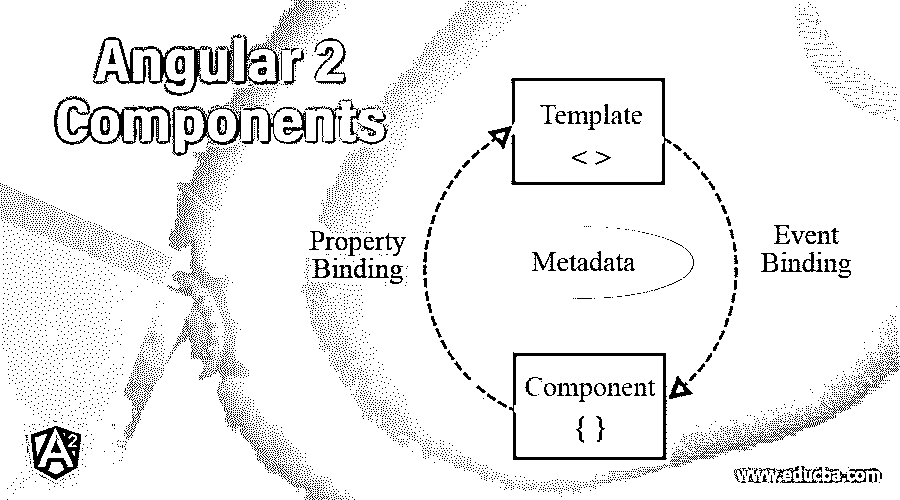
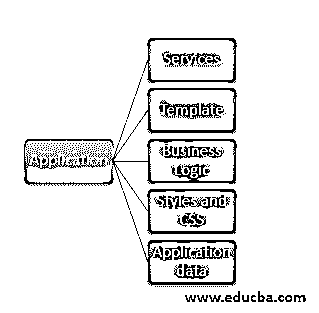

# 角度 2 分量

> 原文：<https://www.educba.com/angular-2-components/>




## 角度 2 分量介绍

以下文章提供了 Angular 2 组件的概述。Angular 2 被分成子部分或小部分，以使应用程序的结构更简单。它与以前版本的 angular 有很大不同。角度组件是模块的一部分，或者我们可以说，模块包含实现应用程序的业务逻辑的组件，还包含调用时将触发的模板。

因此，angular 应用程序可以有任意数量的组件，它是包含视图和业务逻辑的应用程序的主要构件。Angular 2 组件充当视图和业务逻辑之间的控制器。因此，我们可以说，通过使用 angular 2 中的组件，可以创建、添加或显示任何自定义元素、数据或逻辑。

<small>网页开发、编程语言、软件测试&其他</small>

因此，它包含了应用程序的主要内容，如:




*   服务
*   模板
*   业务逻辑
*   样式和 CSS
*   应用数据

### 角度 2 分量的解释

现在我们可以更仔细地看看这个组件是如何工作的，以及它包含什么类型的元数据。我们必须遵循一些步骤来创建 angular 2 中的组件。

**第一步:**创建一个用@Component 标注标注的类。在这里，我们设置了各种元数据属性，以便这个类可以被标识为 angular 2 组件。

**第二步:**导出这个类。这将包含业务逻辑和获取数据的服务器调用。它还将在构建方法中包含 angular 2，该方法将在角度组件的生命周期中自动调用。

步骤 3: 我们可能需要不同的库和其他组件，为了使用它们，我们需要通过指定它们的路径来导入它们。

### 创建角度为 2 的组件

我们可以举一个例子，来说明如何创建第一个角度为 2 的分量。

**例子**

```
import { Component, Inject, OnInit } from '@angular/core';
@Component({
selector: 'app-root',
templateUrl: './app.component.html',
styleUrls: ['./app.component.css'] ,
providers: [BookService]
})
export class AppComponent implements OnInit{
displayedColumns: string[] = ['name', 'price', 'symbol'];
private object: any = {};
private dataSource: any[] = new Array<any>();
constructor() {}
ngOnInit() {
consoloe.log("component invoked.");
}
}
```

在上面的例子中，我们必须定义导入@angular/core 库中的@Component 注释的路径。

这里我们还使用了 OnInit 接口，它提供了 ngOnInit()方法，这个方法可以用来加载页面加载时需要的任何数据。

#### 1.构造函数()

它用于创建服务对象或任何自定义组件。我们可以用它来写我们自己的逻辑，我们想首先执行它。

@Component 批注包含许多元数据属性，让我们逐一讨论它们:

*   **选择器:**是组件的名称。它在整个应用程序中应该是唯一的，两个角度组件不能与选择器同名。因为我们使用这个选择器向用户呈现我们的视图。然后，我们的 HTML 方法和函数调用我们的事件业务逻辑。
*   **templateUrl:** 这个 templateUrl 就是 HTML 页面。这里我们需要提供我们的 HTML 页面的正确路径，否则它会给出一个错误。我们一次只能有一个 HTML 页面。
*   样式 URL:这个样式 URL 是 CSS 的数组。其中可以包含任意数量的 CSS。但是这里路径是正确的。
*   **提供者:**这些提供者是可选的，基本上取决于我们是否要调用当前组件中的任何服务的业务需求。这是 angular 2 中的可注入类。

所以这个类将包含业务逻辑。我们的 templateUrl 和 styleUrls 负责向用户显示视图并显示数据。最后，我们有定义组件行为的元数据。

现在，组件使用不同种类的绑定来与视图交互。

**a .插值:**用于向模板或视图显示组件属性。为此，我们使用双花括号。我们可以用它来显示任何东西，如字符串、数字、数组等。

**语法:**

```
{{ your_property_name }}
class AppComponent
{
name: string;
object: any;
}
{{ name }}
{{ object.roll_number }}
```

**b .属性绑定:**属性绑定允许我们直接访问 HTML 的元素属性。我们可以直接将变量赋给 HTML 元素。

**例子**

```
[value]="demo"
```

在这里，我们使用属性绑定直接将 demo 赋值。

**c .事件绑定:**此绑定使用事件绑定值。我们有各种可用的事件，例如点击。

```
(click) = "methodName($event)"
```

它使用括号，后跟您要调用的函数名。在被调用的函数中，我们可以编写我们的逻辑。

**d .双向绑定**:这基本上是属性绑定和事件绑定的结合。其中我们可以同时调用我们的方法并将值绑定到元素属性。

**例子**

```
<input [(ngModel)]="username">
<p>Hello {{username}}!</p>
```

#### 2.组件装饰器

这个装饰器将类装饰成一个组件。angular 通过它识别出这是组件。这个装饰器获取不同属性的值，设置它们的值，并决定组件的行为。最常用的属性如下:

*   样式 URL
*   模板 Url
*   指令
*   选择器
*   风格
*   管道
*   模板
*   提供者

我们还有其他属性，描述如下。我们也可以有一个内联模板和一个外部模板。

让我们通过例子来看看。

**例题**

下面是提到的例子:

**1。内嵌模板**

```
@Component({
selector: "app-root",
template:`
<h1>{{ message}}</h1>
`,
styles:["h1{color:red}"]
})
```

**2。外部模板**

```
@Component({
selector: "app-root",
templateUrl: '/app/demo/demo.component.html',
styles:["h1{color:red}"]
})
```

此外，我们还有用于内联和外部 CSS 的样式 URL 和样式数组。

**3。样式示例**

在这里，我们在内部应用 CSS 而不使用任何路径。

```
@Component({
selector: "app-root",
template:`
<h1>{{ message}}</h1>
`,
styles:["h1{color:red}"],
})
```

**4。StyleUrls 示例**

这里我们为 CSS 文件提供了一个从外部加载的路径。

```
@Component({
selector: "app-root",
template:`
<h1>{{ message}}</h1>
`,
styleUrls:['app.component.css','./app/demo.css']
})
```

### 结论

因此，要使任何 typescript 文件成为 angular 组件，我们需要使用@Component decorator 使其可用。此外，它为不同的属性提供了价值。

### 推荐文章

这是对 Angular 2 组件的指导。在这里，我们已经讨论了基本概念，如何创建角度 2 组件详细与各自的例子。您也可以看看以下文章，了解更多信息–

1.  [棱角 2 小抄](https://www.educba.com/angular-2-cheat-sheet/)
2.  [角度版本](https://www.educba.com/angularjs-versions/)
3.  [角度选择](https://www.educba.com/angularjs-alternatives/)
4.  [角度单位测试](https://www.educba.com/angularjs-unit-testing/)


