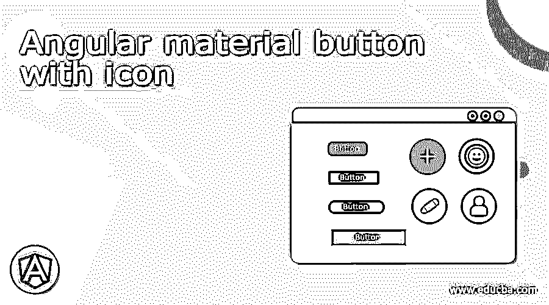

# 带图标的角形材料按钮

> 原文：<https://www.educba.com/angular-material-button-with-icon/>




## 带图标的角形材质按钮介绍

在 angular 中，我们可以创建一个按钮；在 material API 的帮助下，这非常容易，非常容易。我们可以像创建简单按钮一样利用材料中的按钮库。我们可以在按钮标签中附加图标标签来实现这一点。我们可以在按钮上插入任何类型的图标，只需改变图标名称；另外，图标库应该存在于索引文件中；否则，它不会将图标加载到 UI。这些按钮提供了默认的样式和动画，使用户界面更加友好，更具交互性。在下一节中，我们将看到如何在素材库提供的应用程序中同时使用按钮和图标，以便初学者更好地理解它。

**语法**

<small>网页开发、编程语言、软件测试&其他</small>

正如我们已经知道的，在这篇文章中，我们将一起看到图标和按钮的用法。

让我们仔细看看语法，以便更好地理解代码。

```
<button mat-icon-button aria-label="your label">
<mat-icon>our icon here ..</mat-icon>
</button>
```

正如你在上面的代码中所看到的，我们试图同时使用图标和按钮，在确定按钮的同时使用我们想要的图标。在教程的下一部分，我们将有一个更接近

为了更加清晰，请查看练习示例。

### 如何用有角的材质创建一个带图标的按钮？

要创建按钮并为它们附加一个图标，我们可以利用素材库中的按钮和图标。它已经有了一个构建模块，可以直接用来创建带有图标的按钮。在本节中，我们将看到如何通过下面的简单步骤来创建它们，所以让我们开始看下面的内容；

1) MatButtonModule:我们需要将此模块导入或呈现在根模块或我们希望使用它的任何子模块中；有了这个的帮助，我们就可以利用素材库提供的按钮了。作为参考，请参见下面的代码并粘贴到 module.ts 文件中(见下文);

**例如:**

```
import {MatButtonModule} from '@angular/material/button';
```

2)我们有几个按钮变体，由下面的材料提供；

1.  a)垫凸起按钮
2.  b)垫子按钮
3.  c) mat-fab
4.  d)小型工厂
5.  e)垫平按钮
6.  f)垫子-图标-按钮
7.  g)垫笔画按钮

3)要使用图标，我们需要进行如下配置，见下图；

4) MatIconModule:这个模块需要存在于我们想要使用它的子模块的根模块中。在这之后，只有我们能够正确无误地使用材料库中的 mat 图标；否则，它将生成错误。作为参考，请遵循以下代码并粘贴到 modult.ts 文件中(见下文);

**例如:**

```
import {MatIconModule} from '@angular/material/icon';
```

5) mat-icon:这个选择器可以用来向 UI 显示我们的图标，并使用正确的名称。

现在，我们将按照步骤从头开始创建 angular 应用程序，并在其中安装材质；遵循以供参考，使这项工作。

*   我们可以使用下面的命令安装 angular cli 对于全局，我们在这里使用-g。

**例如:**

```
npm install -g @angular/cli)
```

3)完成 CLI 安装后，我们可以使用它来创建我们的 angular 项目。遵循下面的命令，给你的项目起一个名字，然后运行它，

**语法:**

ng 新的项目名称

**例如:**

```
ng new my-first-project
```

转到您创建它的目录，以便查看更改。

4)现在让我们进行 npm 安装，以安装所有需要的依赖项，这是一个可选步骤，但我们应该遵循它；

**例如:**

```
npm install
```

5)现在，一旦正确安装了依赖项，我们就可以启动应用程序了。按照下面的命令查看更改；

**例如:**

```
ng serve
```

6)我们可以在我们拥有的本地 URL 上看到变化；默认情况下，它运行在 4200 端口上；在浏览器上执行下面的命令来查看更改

**例如:**

```
http://localhps:4200
```

7)现在，我们要安装素材库，以便利用它提供的所有模块或组件；执行以下命令，见下文；

**例如:**

```
ng add @angular/material
```

我们准备使用 angular 中的素材库进行一些动手操作；让我们来看看我们有更好清晰度的实践例子。

### 带图标的角形材质按钮示例

下面提到了不同的例子:

**1)index.html 代码:**

```
<!DOCTYPE html>
<html lang="en">
<head>
<meta charset="utf-8">
<meta name="viewport" content="width=device-width, initial-scale=1.0">
<link href="https://fonts.googleapis.com/icon?family=Material+Icons&display=block" rel="stylesheet">
<title> buttons icon</title>
</head>
<body class="mat-app-background">
<button-demo>Loading...</button-demo>
Current build: 12.1.1
</body>
</html>
```

**2) module.ts 代码:**

```
import {NgModule} from '@angular/core';
import {MatButtonModule} from '@angular/material/button';
import {MatIconModule} from '@angular/material/icon';
@NgModule({
exports: [
MatButtonModule,
MatIconModule,
]
})
export class DemoButtonIconModule {}
```

**3)demo . button-icon . component . ts 代码:**

```
import {Component} from '@angular/core';
/**
* @title  buttons icon
*/
@Component({
selector: 'button-icon',
templateUrl: 'demo.button-icon.component.html',
styleUrls: ['demo.button-icon.component.css'],
})
export class IconButtonComponent {}
```

**4)demo.button-icon.component.html 代码:**

```
<mat-divider></mat-divider>
<h5><u><i> Button with Icon using Angular material!! </i></u></h5>

<h5>Icon(Simple) button icon in angular material</h5>
<div >
<div >
<button mat-icon-button>
<mat-icon>face</mat-icon>
</button>
<button mat-icon-button color="primary" >
<mat-icon>home</mat-icon>
</button>
<button mat-icon-button color="accent" >
<mat-icon>favorite</mat-icon>
</button>
<button mat-icon-button color="warn" >
<mat-icon>thumb_up</mat-icon>
</button>
<button mat-icon-button >
<mat-icon>savings</mat-icon>
</button>
<button mat-icon-button>
<mat-icon>flutter_dash</mat-icon>
</button>
</div>
</div>

<mat-divider></mat-divider>
<h5>Fab button icon in angular material</h5>

<div class="example-button-row">
<div class="example-flex-container">
<div >
<button mat-fab color="primary" >
<mat-icon>outlet</mat-icon>
</button>
</div>
<div >
<button mat-fab color="accent" >
<mat-icon>bookmark</mat-icon>
</button>
</div>
<div >
<button mat-fab color="warn" >
<mat-icon>maps_home_work</mat-icon>
</button>
</div>
<div >
<button mat-fab >
<mat-icon>emoji_emotions</mat-icon>
</button>
</div>
<div >
<button mat-fab >
<mat-icon>sentiment_satisfied</mat-icon>
</button>
</div>
<div >
<button mat-fab >
<mat-icon>sentiment_very_satisfied</mat-icon>
</button>
</div>
</div>
</div>

```

**输出:**


### 结论

我们可以通过在按钮上添加图标来使按钮对用户更具代表性。这使得它们越来越用户友好，但也不稳定。所有需要的包、模块和标签都在 angular material 内部，可以直接使用，无需任何进一步的修改，使用起来更加方便快捷。

### 推荐文章

这是一个带图标的角度材质按钮的指南。在这里，我们讨论如何创建一个按钮的图标在角材料以及例子和输出。您也可以看看以下文章，了解更多信息–

1.  [角度 CLI](https://www.educba.com/angular-cli/)
2.  [有棱角的材料图标](https://www.educba.com/angular-material-icons/)
3.  [角度 7 特征](https://www.educba.com/angular-7-features/)
4.  [角的 ng-if](https://www.educba.com/angularjs-ng-if/)


