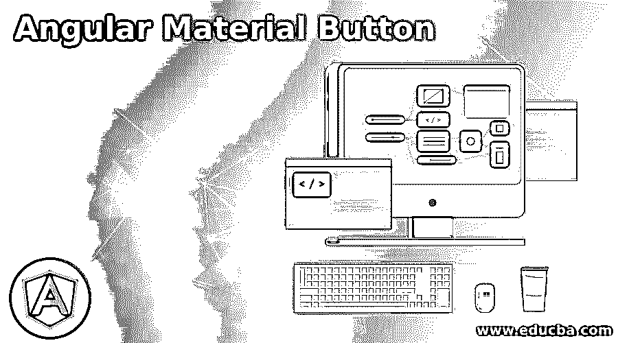
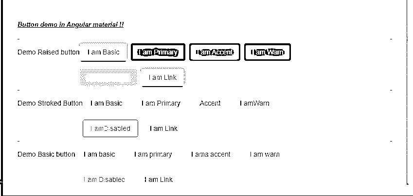

# 角形材料按钮

> 原文：<https://www.educba.com/angular-material-button/>

## 角度材质按钮介绍

棱角分明的材料也为我们提供了非常互动和有吸引力的按钮，可以用来执行任何基于点击的动作，或者我们可以说是任何事件。Angular Material 是一个强大的库，它提供了非常好的样式来设计我们的应用程序，也提供了非常好的文档来开始使用它；任何初学者都可以开始使用它，如果他们对 angular 如何工作知之甚少的话。对于有角度的材质按钮，是原生按钮标签或者是带有油墨波纹和材质设计属性的

**语法**

<small>网页开发、编程语言、软件测试&其他</small>

在本节中，让我们先来看看材料中可用的基本按钮类型，见下文；

`<button mat-button color="mentioned_ color">button text</button>`

正如你在上面的语法行中看到的，我们刚刚在 HTML 中使用了 mat-button 来使用 material 按钮；让我们来练习一下语法，让初学者看得更清楚些。

例如:

`<button mat-button color="warn">Warning!!</button>`

在下一节中，我们将看到其他可用的按钮类型，以及它们的实际用法，每种按钮都有一个示例。

### 如何在棱角分明的材质中打造纽扣？

正如我们已经知道的，在 angular material 中，我们为它的不同功能提供了不同的模块，这增加了它们在应用程序中的可重用性，因此对于按钮，我们有两个模块可以根据我们的要求使用；我们这里有两种类型的按钮，一种是简单的按钮，另一种是可以在特定区域使用的切换按钮。在这一节中，我们将看到如何用有棱角的材料制作一个按钮，以及正确运行这个按钮所需的配置；让我们开始吧；

1)如果我们想利用 angular material 中的按钮，我们需要将 MatButtonModule 添加到我们的根模块中。这是存在于中的模块；@角度/材质/纽扣'；我们只需要定义路径；为了您的参考，我附上一段代码，以便更好地理解见下文；

例如:

`import {MatButtonModule} from '@angular/material/button';`

2)如果你想在你的应用程序中使用切换按钮，那么我们必须从素材库中导入 MatButtonToggleModule 此模块存在于“@ angular/material/button-toggle”中；我们只需定义路径，并根据您的需要将其导入根模块或任何其他模块。作为参考，我附上一段代码，以便理解；

例如:

`import {MatButtonToggleModule} from '@angular/material/button-toggle';`

现在我们还有一个步骤来利用应用程序中的 material 按钮；见下文；

1)我们有“mat-button”或不同类型的属性，用于来自角形材料的不同类型的按钮；在示例部分，我们将通过实际例子来了解如何使用它；下面是在项目中设置角度材料的步骤；

1)首先，安装 Angular CLI，它使我们能够下载项目所需的包和库。您可以通过在命令上键入以下命令来下载它，请确保您已经安装了 node，见下文；

例如:

`npm install -g @angular/cli)`

以上命令将在我们的系统中全局安装 CLI 因此，我们可以在需要时全局使用它。

3)现在，在这一步中，我们将尝试从头开始创建新的 angular 项目；这个项目将不是一个材料项目，我们必须通过在我们的项目中安装材料依赖关系来添加它。所以只需在你的命令提示符下执行下面的命令，并按回车键见下文；

例如:

ng 新的项目名称

`ng new my-first-project`

此命令将创建名为 my-first-project 的项目；您可以用提到的任何名称创建您的项目。

4)为了确保万无一失，请尝试下面提到的一个命令，将所有需要的库安装到我们的项目中，

例如:

`npm install`

5)现在，您可以通过键入下面提到的简单命令来测试和运行您的项目。这只是为了确保我们在正确的轨道上，我们的项目没有任何错误或缺陷。

例如:

`ng serve`

6)进入浏览器，尝试使用以下 URL 运行应用程序:

例如:

http://localhps:4200

默认情况下，angular 项目运行在端口 4200 上；如果需要，您可以根据自己的需要进行更改。

7)现在一切都设置好了，我们有了我们的 angular 项目，现在我们只要在命令提示符下运行下面的命令，就可以将素材库添加到我们的项目中；

例如:

`ng add @angular/material`

### 角形材料按钮示例

下面给出了角形材料按钮的例子-

**1)根模块:**

`import {NgModule} from '@angular/core';
import {MatButtonModule} from '@angular/material/button';
import {MatButtonToggleModule} from '@angular/material/button-toggle';
@NgModule({
exports:
MatButtonModule,
MatButtonToggleModule
] })
export class MaterialDemoModule {}[`

**2) TS 代码:**

`import {Component} from '@angular/core';
/**
* @title button demo
*/
@Component({
selector: 'button-demo',
templateUrl: 'button-demo.html',
styleUrls: ['button-demo.css'],
})
export class ButtonDemo {}` 

3)index.html:

`<!DOCTYPE html>
<html lang="en">
<head>
<meta charset="utf-8">
<meta name="viewport" content="width=device-width, initial-scale=1.0">
<link href="https://fonts.googleapis.com/icon?family=Material+Icons&display=block" rel="stylesheet">
<title>Button demo !!</title>
</head>
<body class="mat-app-background">
<button-demo>Loading ..</button-overview>
Current build: 12.0.4
</body>
</html>`

**4) HTML 代码:**

`<h5><u><i>Button demo in Angular material !!</i></u></h5>
<mat-divider></mat-divider>

Demo Raised button 

<button mat-raised-button>I am Basic</button>
<button mat-raised-button color="primary">I am Primary</button>
<button mat-raised-button color="accent">I am Accent</button>
<button mat-raised-button color="warn">I am Warn</button>
<button mat-raised-button disabled>I am Disabled</button>
<a mat-raised-button href="https://www.google.com/" target="_blank">I am Link</a>

<mat-divider></mat-divider>

Demo Stroked Button 

<button mat-stroked-button>I am Basic</button>
<button mat-stroked-button color="primary">I am Primary</button>
<button mat-stroked-button color="accent"I am>Accent</button>
<button mat-stroked-button color="warn">I amWarn</button>
<button mat-stroked-button disabled>I amDisabled</button>
<a mat-stroked-button href="https://www.google.com/" target="_blank">I am Link</a>

<mat-divider></mat-divider>

Demo Basic button

<button mat-button>I am basic</button>
<button mat-button color="primary">I am primary</button>
<button mat-button color="accent">I ama accent</button>
<button mat-button color="warn">I am warn</button>
<button mat-button disabled>I am Disabled</button>
<a mat-button href="https://www.google.com/" target="_blank">I am Link</a>

`

**输出:**

### 结论

这款纽扣从材质上来说非常好用；我们已经看到了每个按钮的练习示例。我们不需要担心按钮的样式；它会处理材料本身。

### 推荐文章

这是一个有角度的材料按钮指南。在这里，我们讨论的定义，语法，如何创建按钮的角度材料与例子和代码实现。您也可以看看以下文章，了解更多信息–

1.  [角度 CLI](https://www.educba.com/angular-cli/)
2.  [角度 7 形式验证](https://www.educba.com/angular-7-form-validations/)
3.  [角度 7 特征](https://www.educba.com/angular-7-features/)
4.  [角的 ng-if](https://www.educba.com/angularjs-ng-if/)

