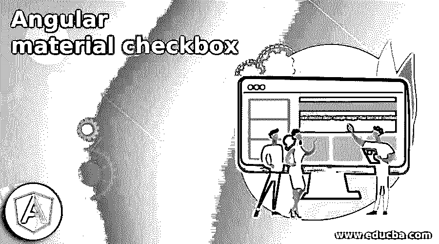
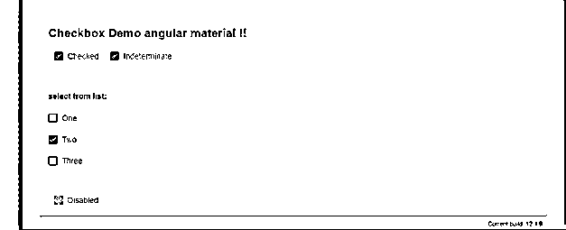

# 角度材料复选框

> 原文：<https://www.educba.com/angular-material-checkbox/>




## “角状材料简介”复选框

棱角分明的材质也为我们提供了一个具有吸引人的设计造型和设计的复选框；它在我们的应用程序中非常容易使用。当我们希望用户从列表或选项集中选择多个选项时，我们可以使用复选框；这完全取决于我们的需求。“角度材质”复选框为我们提供了与“输入类型”复选框相同的功能，并增加了样式和设计。在我们的应用程序中，我们必须进行一些更改和配置，以便使用这个标签来创建一个使用素材库的复选框；在本教程的下一节中，我们将详细了解它的配置。

**语法**

<small>网页开发、编程语言、软件测试&其他</small>

现在我们将看到它的语法，我们如何创建它，以及我们需要使用什么标签或指令；让我们仔细看看下面；

```
<mat-checkbox class="example-margin">Your text</mat-checkbox>
```

正如你所看到的，我们已经使用' mat-checkbox '指令创建了使用有角材料的复选框；让我们看一下练习语法，以便更好地理解代码；

例如:

```
<mat-checkbox class="example-margin">I am checkbox!</mat-checkbox>
```

为了使用上面的指令，我们必须对你的 angular 应用程序做一些额外的配置，通过导入一些模块到根模块；在下一节中，我们将详细了解复选框的内部实现，以便在我们的 angular 应用程序中使用它。

### 如何在角材中创建复选框？

正如我们已经知道的，复选框可以用在我们希望用户选择多个选项的场景中。它为我们提供了选择，并允许我们一次从列表中选择两个值。这种有角度的材料提供了与输入复选框相同的功能，但不同之处在于它提供了更多的样式和设计，使其对用户更具吸引力和交互性。让我们看看在我们的应用程序中为 material 复选框进行配置所需的步骤；让我们开始吧；

1) MatCheckboxModule:这是一个只有在我们安装它时才会出现在素材库下的模块，所以我们必须将这个模块导入到我们的根模块或任何我们想要使用它的模块中。之后，如果我们想在应用程序的其他子模块中使用 t，我们也可以导出 t。作为参考，找到下面的代码；

例如:

```
import {MatCheckboxModule} from '@angular/material/checkbox';
```

2) mat-checkbox:这是‘MatCheckboxModule’模块的选择器，这个选择器可以直接用于在我们的应用程序中创建复选框；为了在我们的模板或 HTML 中直接使用它，我们必须在模块中已经导入了“MatCheckboxModule ”,否则它会给我们一个错误。作为参考，请参见下面的代码；

例如:

```
<mat-checkbox class="example-margin">ME!!</mat-checkbox>
```

现在，让我们从需要采取的步骤开始，以便为初学者初步加强我们的角度材料项目，见下文；

首先，安装 angular CLI，它使我们能够下载项目所需的包和库。您可以通过在命令上键入以下命令来下载它，请确保您已经安装了 node，见下文；

例如:

```
npm install -g @angular/cli)
```

以上命令将在我们的系统中全局安装 CLI 因此，我们可以在需要时全局使用它。

3)现在，在这一步中，我们将尝试从头开始创建新的 angular 项目；这个项目将不是一个材料项目，我们必须通过在我们的项目中安装材料依赖关系来添加它。所以只需在你的命令提示符下执行下面的命令，并按回车键见下文；

例如:

ng 新的项目名称

```
ng new my-first-project
```

此命令将创建名为 my-first-project 的项目；您可以用提到的任何名称创建您的项目。

4)为了确保万无一失，请尝试下面提到的一个命令，将所有需要的库安装到我们的项目中，

例如:

```
npm install
```

5)现在，您可以通过键入下面提到的简单命令来测试和运行您的项目。这只是为了确保我们在正确的轨道上，我们的项目已经创建，没有任何错误或缺陷。

例如:

```
ng serve
```

6)进入浏览器，尝试使用以下 URL 运行应用程序:

例如:

```
http://localhps:4200
```

默认情况下，angular 项目运行在端口 4200 上；如果需要，您可以根据自己的需要进行更改。

7)现在一切都设置好了，我们有了我们的 angular 项目，现在我们只要在命令提示符下运行下面的命令，就可以将素材库添加到我们的项目中；

例如:

```
ng add @angular/material
```

### 例子

1)模块代码:

```
import {NgModule} from '@angular/core';
import {MatCheckboxModule} from '@angular/material/checkbox';
@NgModule({
exports: [
MatCheckboxModule,
]
})
export class CheckBoxDemo {}
```

2)用选择器将 index.html 码加到组件上以便加载它:

```
<!DOCTYPE html>
<html lang="en">
<head>
<meta charset="utf-8">
<meta name="viewport" content="width=device-width, initial-scale=1.0">
<link href="https://fonts.googleapis.com/icon?family=Material+Icons&display=block" rel="stylesheet">
<title>Demo for Checkbox</title>
</head>
<body class="mat-app-background">
<checkbox-demo>Loading..</checkbox-demo>
Current build: 12.1.0
</body>
</html>
```

3) demo.component.ts 文件代码，它将根据变量的值启用或禁用复选框；

```
import {Component} from '@angular/core';
/**
* @title checkbox demo !!
*/
@Component({
selector: 'checkbox-demo',
templateUrl: 'checkbox-demo.html',
styleUrls: ['checkbox-demo.css'],
})
export class CheckBoxDemo {
checked = false;
indeterminate = false;
disabled = false;
}
```

4)模板代码 HTML 部分，这里我们已经用素材创建了复选框:

```
<mat-card>
<mat-card-content>
<h2>Checkbox Demo angular material !!</h2>

<mat-checkbox class="example-margin" [(ngModel)]="checked">Checked</mat-checkbox>
<mat-checkbox class="example-margin" [(ngModel)]="indeterminate">Indeterminate</mat-checkbox>

<br/><br/>

<h4>select from list:</h4>
<p><mat-checkbox >One</mat-checkbox></p>
<p><mat-checkbox >Two</mat-checkbox></p>
<p><mat-checkbox >Three</mat-checkbox></p>

<br/><br/>

<mat-checkbox class="example-margin" [(ngModel)]="disabled" [disabled]="disabled">Disabled</mat-checkbox>

</mat-card-content>
</mat-card>
```

**输出:**




### 结论

正如我们已经知道，需要采取什么步骤，也很快创建和设计使用角素材库和模块。这减少了开发人员的工作量，加快了应用程序的开发。

### 推荐文章

这是“角度材质”复选框的指南。这里我们讨论语法，我们如何创建它，以及我们需要使用什么标签或指令。您也可以看看以下文章，了解更多信息–

1.  [角度 7 特征](https://www.educba.com/angular-7-features/)
2.  [角度 CLI](https://www.educba.com/angular-cli/)
3.  [角度日期过滤器](https://www.educba.com/angularjs-date-filter/)
4.  [安装角度](https://www.educba.com/installing-angular/)


