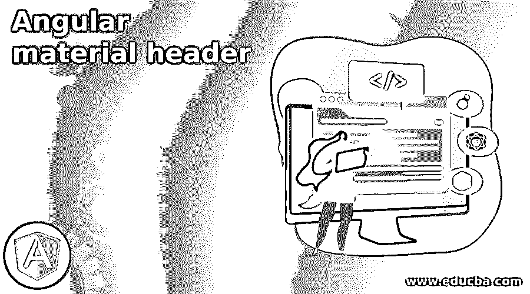
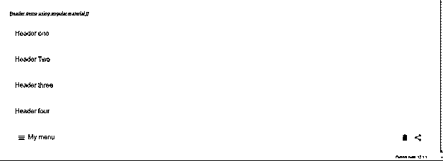

# 角形材料集管

> 原文：<https://www.educba.com/angular-material-header/>

## 角形材料集管简介

角材料提供了我们的工具栏，可用于创建标题。它基本上是一个容器，允许我们在 angular 应用程序中创建标题、头部和动作。我们在素材库中有一个构建模块，可以让我们轻松快速地创建这些标题。因此，我们应该在角度应用程序中安装材料，以便使用它。我们还需要在应用程序内部或模块文件中进行一些配置和导入，以便正确无误地使用它。在本教程的 comings 部分，我们将看到如何使用素材库中的工具栏实现 header，并为初学者提供练习示例以更好地理解它。

**语法:**

<small>网页开发、编程语言、软件测试&其他</small>

正如我们所知，我们可以利用“工具栏”在材料中创建标题。因此，让我们仔细看看在我们的应用程序中使用工具栏为我们的应用程序创建标题块广告动作的语法，见下文；

`<mat-toolbar-row>
header ..
// notehr actions goes here ..//
</mat-toolbar-row>`

正如你在上面的语法中看到的，我们正在尝试创建工具栏的标题，使用“mat-toolbar-row”来显示我们的标题。这个工具栏允许我们在应用程序中创建这样的标题。在本教程的下一节，我们将更仔细地研究它的实现细节，我们还将看到更多的例子，以更好的方式来说明这一点。

### 割台如何在有角度的材料中工作？

通过使用我们已经讨论过的材质工具栏，我们可以在我们的应用程序中创建标题。此外，我们还可以利用工具栏来创建标题和动作。没有直接在素材库中创建标题的方法，可以使用素材库。在这一节中，我们将进一步了解在工具栏中创建标题所需的语法和配置。下面我们开始看；

1) MatToolbarModule:这是必须存在于根模型或我们拥有的子模块中的模块。通过使用，如果这样我们可以在里面创建标题。它只不过是一个容器，为我们提供了一种在其中创建牧民、动作和头衔的方法，正如威尔已经提到的，没有直接的方法来创建它。请参考下面的代码，并将其导入到根模块中。见下文；

**例如:**

`import {MatToolbarModule} from '@angular/material/toolbar';`

2) mat-toolbar-row:这个标签用于在工具栏上创建标题、头部和动作。请参考下面的代码，它将帮助我们创建标题行，见下文；

**例如:**

`<mat-toolbar-row>
your header title or something else can goes here .//
</mat-toolbar-row>`

正如你所看到的，我们正在尝试使用“mat-toolbar-row”来帮助我们创建标题。我们还有一个标签可以用来创建标题，更多信息见下文

3) mat-toolbar:这可以用来维护工具栏容器中的标题。标题可以包含应用程序的常见内容，这些内容将出现在我们的每个页面上。请参考以下代码:

**例如:**

`<mat-toolbar>
your header title or something else can goes here .//
</mat-toolbar>`

现在让我们创建安装了材质的 angular 项目；

*   首先，我们将在全球范围内安装 Angular CLI，这有助于我们以后轻松快速地安装任何 Angular 插件。请参见下面的命令以供参考；

**例如:**

`npm install -g @angular/cli)`

*   现在在 angular 中创建一个初始的草稿项目。使用下面的命令非常简单；

**语法:**

`ng new your project name`

**例如:**

`ng new my-first-project`

在您创建的文件夹或目录中找到它。

4)通过运行以下命令，在项目中安装所需的依赖项；

**例如:**

`npm install`

5)我们已经为 angular 的项目设置做好了准备，我们只需在下面的命令中键入内容来运行项目

**例如:**

`ng serve`

6)如果您在创建项目时更改了默认端口 4200，我们可以检查以下 URL 上的应用程序

**例如:**

`http://localhps:4200`

7)现在是时候在我们到目前为止创建的项目内部安装素材库了，见下图；

**例如:**

`ng add @angular/material`

这就是我们准备使用素材库的应用程序。现在我们可以使用它的任何模块来增强应用程序的交互性，它会提供默认的样式、动画和设计。

### 例子

使用角度材料库中的工具栏创建标题的示例。

**header.component.html 代码:**

`<h5><u><i>Header demo using angular material !!</i></u></h5>

<mat-toolbar>
Header one 
</mat-toolbar>

<mat-toolbar>
Header Two 
</mat-toolbar>

<mat-toolbar>
Header three
</mat-toolbar>

<mat-toolbar>
Header four
</mat-toolbar>

<mat-toolbar>
<button mat-icon-button class="example-icon" aria-label="Example icon-button with menu icon">
<mat-icon>menu</mat-icon>
</button>
My menu

<button mat-icon-button >
<mat-icon>delete</mat-icon>
</button>
<button mat-icon-button class="example-icon">
<mat-icon>share</mat-icon>
</button>
</mat-toolbar>

`

**2) demo.header.component.ts 代码:**

`import {Component} from '@angular/core';
/**
* @title hedare using toolbar in material
*/
@Component({
selector: 'toolbar-demo',
templateUrl: 'demo.header.component.html',
styleUrls: ['demo.header.component.css'],
})
export class HeaderDemo {}`

**3)index.html 代码:**

`<!DOCTYPE html>
<html lang="en">
<head>
<meta charset="utf-8">
<meta name="viewport" content="width=device-width, initial-scale=1.0">
<link href="https://fonts.googleapis.com/icon?family=Material+Icons&display=block" rel="stylesheet">
<title>hedare using toolbar in material</title>
</head>
<body class="mat-app-background">
<toolbar-demo>Loading..</toolbar-demo>
Current build: 12.1.1
</body>
</html>`

**4) module.ts 代码:**

`import {NgModule} from '@angular/core';
import {MatToolbarModule} from '@angular/material/toolbar';
@NgModule({
exports: [
MatToolbarModule,
] })
export class DemoHedaerModule {}`

**输出:**

### 结论

我们没有任何直接的方法来使用素材库创建标题，但是它们为我们提供了一种从素材库使用工具栏创建标题的方法。按照这里提到的步骤，您可以用最少的努力在我们的应用程序中创建标题，并使用素材库中的默认样式，使它更具吸引力和用户友好性。

### 推荐文章

这是一个有角度的材料标题的指南。在这里，我们讨论了标题如何工作在角材料以及例子和输出。您也可以看看以下文章，了解更多信息–

1.  [角度 7 形式验证](https://www.educba.com/angular-7-form-validations/)
2.  [角度日期过滤器](https://www.educba.com/angularjs-date-filter/)
3.  [有棱角的材料图标](https://www.educba.com/angular-material-icons/)
4.  [安装角度](https://www.educba.com/installing-angular/)

