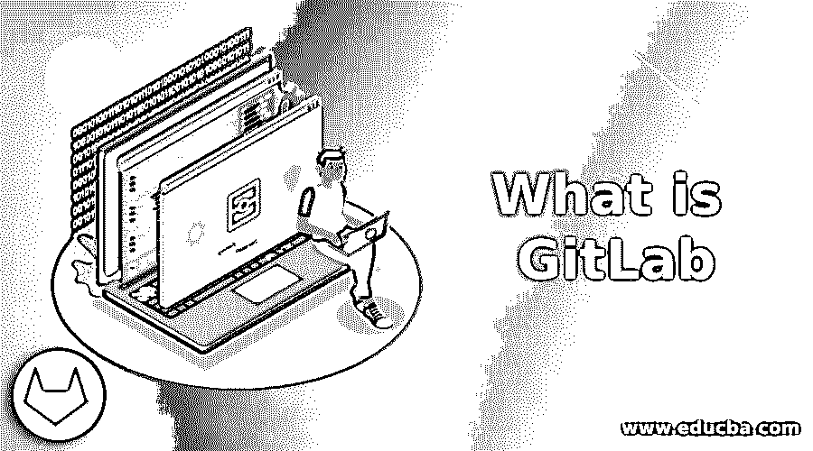

# 什么是 GitLab

> 原文：<https://www.educba.com/what-is-gitlab/>

## GitLab 简介

Gitlab 是一个生命周期工具，它提供了一个庞大的基于 web 的 DevOps 知识库。它通过使用开源许可证，提供对 CI/CD 管道特性的问题跟踪。该许可证由 GitLab Inc .发行，由 Valery Sizov 创建，由 IBM Sony、Cisco、Juniper、Oracle 等科技企业联合发行。Gitlab 中的代码可以从许多编程语言中获得，大部分是用 Ruby 编写的，很少部分是用 Go 编写的。开发代码源管理是为了支持软件开发生命周期。但是现在 Gitlab 出现了 Ruby 和 Rails，Go 和 Vue.js，本文阐述了 Gitlab 的一些重要特性、优点和局限性。

### 我们为什么使用 GitLab

GitLab 的应用程序提供了使整个开发操作自动化的功能，该开发操作制定了设计、创建、构建、验证、测试、部署和监控可伸缩性、声誉、可用性和复制的计划。GitLab 的使用量与日俱增。因为它具有广泛的特性和代码块。代码平台的协作是可以重用和实现的核心。它包含许多 CI/CD 管道、容器注册表、Kubernetes 的集成，并提供了最佳的数据可移植性。数据集成和监控使 GitLab 更具可持续性。

<small>网页开发、编程语言、软件测试&其他</small>

GitLab 的项目可以是私有的，也可以是公共的，它是开源的，向所有人免费开放。GitLab 上的公共存储库可用于 wikis、文档和问题跟踪。GitLab 使团队能够协作并处理用 Go 和 Ruby 编写的代码。它的目的是存储提交对象的信息和数组以及对它的一系列引用。它充当了一个中心枢纽，初学者和开发人员可以在这里创建、存储、测试、共享和协作所有的 web 项目。

### GitLab 的特性

GitLab 的特性允许强大的持续集成和良好集成的持续开发管道。通过使用 GitLab，it 可以选择付费并使用该方案来手动集成外部 CI 服务。例如，CircleCI 就是 GitLab 定义良好的 CI/CD 管道的一个例子。码头工人用免费提供的容器制作一切。它有一个内置的注册表，无需配置即可立即部署。通过使用 GitLab 部署第三方服务器来管理 docker 映像。基础设施管理显示了在 GitLab 中 Kubernetes 是如何正确组织的。它创造了一种自然的契合，非常适合 Kubernetes 融入其中。部署每一个分支机构和进行每一个基本的质量保证，在真正的功能，以合并开发团队和 QA 团队，这种合作变得更加有效。GitLab 中提供的项目管理广泛适用于所有使用 GitLab 板的工作流程。GitLab 项目管理提供的示例包括小组里程碑、燃耗和燃尽图、目标日期问题、项目间的移动问题以及 CSV 导出的准备工作。与 GitHub 相比，它可以导入大量的项目，还可以导出项目中的其他代码。GitLab 支持集成监控，以收集应用程序和服务器的所有性能指标。它让用户定义合并分支和生产系统的效果。只有通过它，快速的动作才是可能的，以使编码紧凑简单并立即隐含。

### GitLab 的重要性

GitLab 的其他功能包括里程碑的设置和分组、确定团队和个人的截止日期、问题的调整和跟踪、许多问题板的配置、问题板的焦点和分组、管理多个问题板、问题分配的标签和资源、合并、分配和关闭问题、配置问题关闭顺序、固定和设置功能图和路线图、机密问题的时间跟踪、相关问题的标记、燃尽图、机密问题的整合， 丰富标记的问题、聊天管理问题、基于网络的 IDE、提供所有时间可用的服务台、标记和描述的标签和受保护的标签、模糊文件的查找器、快进合并和压缩合并、合并的请求和批准、合并的冲突解决、统计图表表示和报告标记、关于合并请求提交的讨论、电子邮件合并请求、cherry 挑选更改、活动流、客户通知、文件锁定、分支和受保护的流、用户访问的许可和限制， 整合 Git 授权的 WiKi、图像、模板和内嵌注释的讨论和解析、GitLab.com 的导入、容器的调试、动态和静态应用程序和安全性、全面的管道图形、代码的质量报告、内置 CI/CD 和容器注册表、聊天部署、自定义域的安全和验证、静态 web 推送、HTML 工件的在线可视化、调度管道的触发、Jekyll 插件、自动 DevOps、多个 Kubernetes 集群的支持、服务器和应用程序的监控、 服务器和 web 浏览器的性能测试和负载平衡，广泛用于子组、灾难恢复、合规工具、内部资源、API 集成和分析以及日常活动管理。

### 优点和缺点

*   GitLab 的显著优势是它是免费的，并且易于管理和配置。它只启用有限数量的私有存储库，集成几个 API 和第三方服务器，并且只消耗可靠的正常运行时间。代码审查和拉起请求使它更加紧凑和用户友好。GitLab 的一些限制是它不像预期的那样值得称赞，并且用户界面使它的审查更加复杂。但是 GitLab 有很多 bug，所以有点草率。
*   GitLab 是一个云原生应用程序，隐含了大量的安全措施，包括使用 Kerberos 进行用户身份验证的粒度限制和权限。通过使用 GitLab，团队和成员提供了最小的集成来完成软件开发生命周期。GitLab 依赖于 Git，用户可以不受限制地快速访问开发历史，还创建了一个更具构建性的应用程序。

### 推荐文章

这是一个什么是 GitLab 的指南。这里我们讨论 GitLab 的介绍，我们为什么使用它，特性，重要性，优点和缺点。您也可以浏览我们的其他相关文章，了解更多信息——

1.  [去重复位](https://www.educba.com/git-reset-hard/)
2.  [Gitlab CI vs Jenkins](https://www.educba.com/gitlab-ci-vs-jenkins/)
3.  [GIT 指数](https://www.educba.com/git-index/)
4.  [Git 存储库设置](https://www.educba.com/git-repository-setup/)

