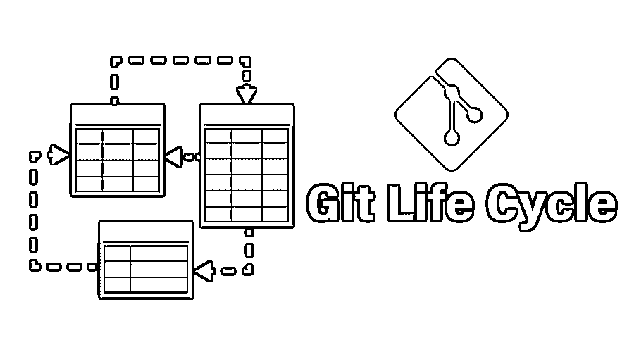
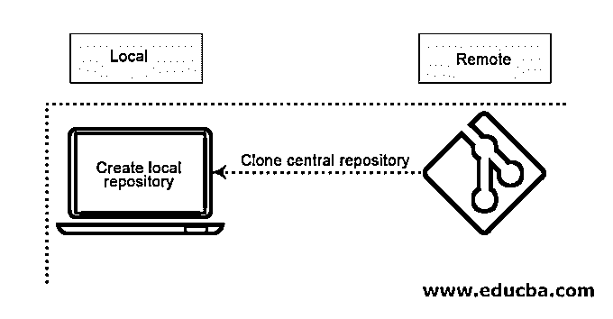
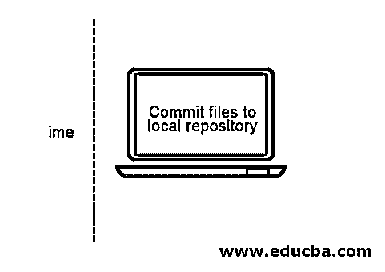
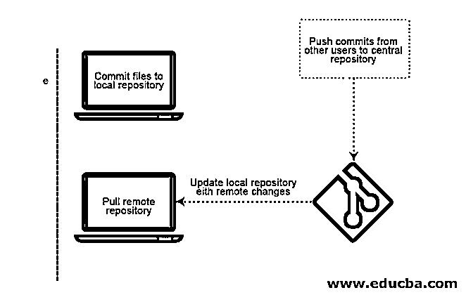
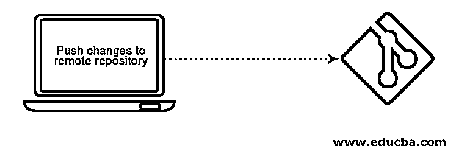

# Git 生命周期

> 原文：<https://www.educba.com/git-life-cycle/>

## Git 生命周期简介

Git 是程序员和企业可用的主要分布式版本控制系统之一。在这篇文章中，我们将看到 git 跟踪的项目如何进行工作流的细节，即 Git 生命周期。顾名思义，是关于从存储库中克隆文件后所涉及的不同阶段。它涵盖了这个特定版本控制系统所需的 git 中心命令或主命令

### Git 生命周期的工作流程

Git 的工作流程如下:

<small>网页开发、编程语言、软件测试&其他</small>

*   我们将创建一个我们可以工作的分支，稍后我们将它与主合并
*   克隆:首先，当我们在远程存储库中有代码时，我们克隆到本地以形成一个称为本地存储库的东西。

*   修改/添加文件:我们对现有文件进行了一些开发，或者也可以添加新文件。Git 将监控所有这些活动并记录下来。

*   我们需要使用 git 命令将需要转换到主服务器的内容移动到暂存区，暂存文件的快照将保存在 git 暂存区中。
*   我们需要对暂存的文件执行提交，上述步骤中记录的快照将永久保存在本地存储库中，并且此特定信息将通过提交消息进行记录，以供将来参考。

*   一旦我们提交，代码在本地回购上可用，但要将其发送到主回购，我们需要执行推送操作
*   如果其他人正在同一个分支上工作，那么有可能他已经通过推送将他的变更添加到了主分支中。因此，如果多人在同一个分支上工作，我们需要在推送操作之前执行拉操作，这个工作流如下所示。

*   一旦目标分支被更新，我们需要获得所有必需的批准，以便允许与主分支的合并操作。

这是 git 的基本工作流程，许多中间命令，如 git add、git status、git commit、git push origin、git rebase、git merge、git diff 等将根据用户的要求使用。

### Git 生命周期的各个阶段

所以我们已经看到了上面 git 生命周期的工作流程。但是我们需要知道我们有一个与 git 链接的项目，然后该项目可以驻留在以下区域。下面提到的领域是 Git 配方的组成部分，对它们有个概念会对你跟踪你正在处理的文件有很大帮助。

这些阶段如下所述:

*   工作目录
*   部队从一个战场转往另一个战场的集结地
*   Git 目录

这三个阶段解释如下:

#### 1.工作目录

*   如果您的项目驻留在本地机器上，那么基本上它会被调用，即使它是否链接到 git。在这两种情况下，它都被称为工作目录。但是当可用项目与 git 链接时，基本上会有。git 文件夹隐藏在所谓的工作目录中。所以出现了。git 文件夹足以说明该文件夹是机器上的工作副本，并且被 git 跟踪。
*   在这个阶段，git 知道它正在跟踪哪些文件和文件夹，就是这样。关于这一点没有其他信息。为了确保新添加的文件在工作副本中得到跟踪，我们需要确保这些文件是暂存的，这是我们的第二个文件存放处。

#### 2.部队从一个战场转往另一个战场的集结地

*   当我们对工作存储库中的现有文件进行更改时，或者如果我们添加任何文件夹的文件，并且如果我们希望这些更改需要被跟踪，并且还需要被移动到本地存储库中进行跟踪，那么我们需要将这些更改的文件或新添加的文件夹的文件移动到暂存区域。Git add 是将修改后的文件移动到暂存区的基本命令。
*   它勾选了已被修改的文件或新添加的文件夹的文件，以旅行到本地回购进一步牵引。那些没有票的文件将被 git 跟踪，但是它们将不能轻易地移动到目标。在这里，索引起着至关重要的作用。 [GIT Index](https://www.educba.com/git-index/) 是介于本地回购和工作目录之间的东西，它决定什么需要发送到本地回购，事实上，它决定什么需要发送到中央回购。

#### 3.GIT 目录

*   当我们完成文件或文件夹的修改或添加，并希望它们成为存储库的一部分时，我们首先要做的是将它们移动到暂存区域，它们将准备好提交。当我们提交时，提供适当的提交消息，文件将被提交并在工作目录中更新。
*   现在 git 跟踪提交和提交消息，并保存提交文件的快照，这是在 Git 特定的目录 Git 目录中完成的。与所有已提交文件及其提交消息相关的信息将存储在此目录中。我们可以说这个 git 目录存储了提交的文件的元数据。

### 优势

下面是下面提到的一些优点:

*   Git 生命周期描述了被 git 跟踪的项目在其开发和部署阶段是如何进行的。所以 git 提供的生命周期步骤和阶段更简洁，也更有帮助，原因是多方面的。就像我们需要一个集结地，我们可能想知道为什么需要它？。
*   我们需要一个 staging area，以便 git 在跟踪需要提交的文件时能够更快、更有效地运行，这样在以后出现任何问题时，我们都可以轻松地进行追溯。它帮助我们在提交前后验证文件，这样我们就可以确定我们提交的是什么。
*   当我们计划合并时，以及在我们需要合并的特定快照或提交时，由 git 维护的文件或元数据的快照非常有用。这些是 git 生命周期的一些优势

### 结论

因此，通常跟踪的是项目的生命周期，了解 git 和 git 阶段的工作流程中涉及的每个特性可以让您在使用 git 处理项目时掌握这些特性。需要使用一些不同的工具和命令，这些命令实际上是需要使用的，这样 git 中的项目流程才能继续。

### 推荐文章

这是 Git 生命周期指南。在这里，我们讨论 Git 生命周期的含义、基本工作流程、阶段以及优势。您也可以阅读以下文章，了解更多信息——

1.  [Git 检验命令](https://www.educba.com/git-checkout-command/)
2.  [去工具](https://www.educba.com/git-tools/)
3.  [Git Checkout Tag](https://www.educba.com/git-checkout-tag/)
4.  [Git 术语](https://www.educba.com/git-terminology/)

