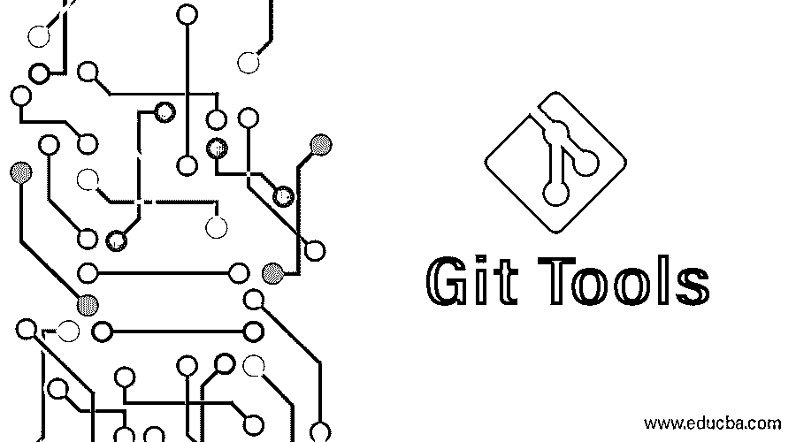
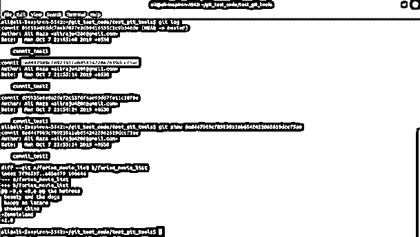
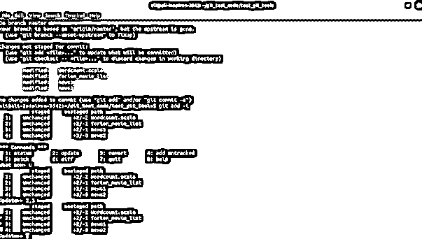
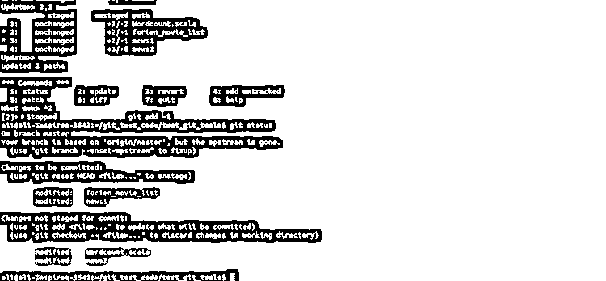
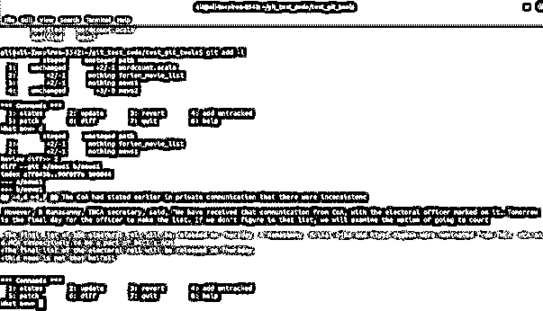
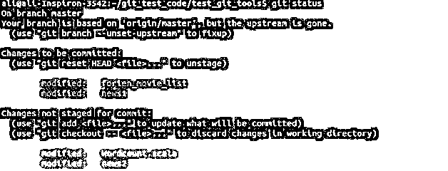
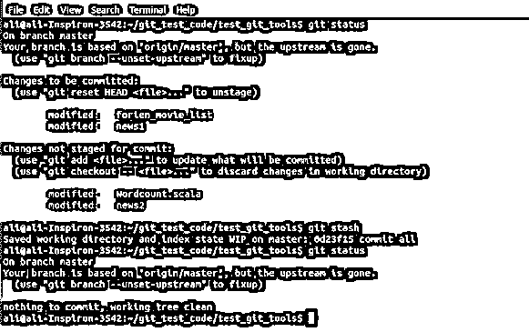
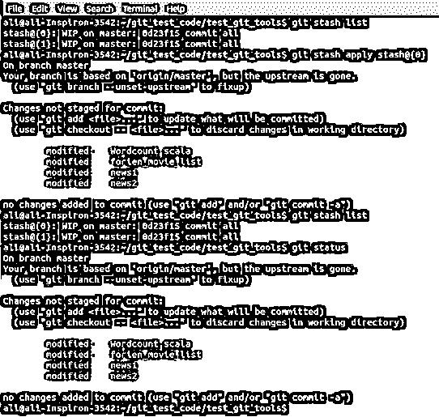
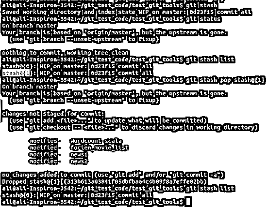

# 转到工具

> 原文：<https://www.educba.com/git-tools/>

## Git 工具简介

git 提供了非常有效的工具，可以使我们的版本跟踪更加有效，为版本控制系统提供更深层次的意义。这些自动化工具将把我们从大部分困难的任务和追踪中拯救出来。

git 工具帮助很大的一些例子可以在下面找到:

<small>网页开发、编程语言、软件测试&其他</small>

### 各种 Git 工具

git 工具可以有效应用的一些领域:

*   版本选择
*   互动舞台
*   储藏和清洁
*   签署您的作品
*   搜索工具–Grep
*   重写历史
*   高级合并工具
*   调试工具
*   Git 子模块等

#### 1.版本选择

处理提交最有效的工具之一。我们可以跟踪我们执行的提交，也可以根据我们的需求引用它们。我们可以通过两种方式达成承诺。

*   单次或单独提交
*   提交范围

**单个提交:**每当我们在 git 中提交某个东西时，都会生成一个对应的 SHA–1 哈希键，基于这个键，我们可以引用它们简单的 git show 命令。SHA–1 密钥由哈希算法生成，该算法接受输入并生成 160 位或 20 字节的哈希值

*   下面可以看到一个示例截图，其中 git 日志显示了在分支上执行的所有事件，我们可以使用特定的哈希值来引用特定的提交。这里我指的是 commit_test2。我们也可以在 show 命令中使用简写符号，git 将识别它的键并提供它的细节。像下面这样:

*   类似地，我们可以使用 flogs 和 HEAD with git 来获取每个事件的细节，如下图所示。分支上的第一个事件称为 HEAD 或 Master。

**Specify Range Commits:** We can specify range commits as well using the show command. This is most useful when we have multiple branches, and we want to know where they are getting merged etc.

*   上面的第一个语句表示引用分支 A 和 B 之间的提交范围，而第二个语句表示不在 A 和 B 分支范围内的提交范围。上面截图中的第三条语句与第二条类似。

#### 2.互动舞台

*   使用交互式登台工具，您可以为您的提交添加更多含义。您可以选择哪些更改需要暂存，哪些不需要。当我们对一些文件进行了修改，但是我们对一些变化不确定时，这个特殊的工具是有用的。因此，所有这些交互式登台工具通过决定需要登台和不登台的内容，来帮助只提交所需的文件或文件中的部分，而不是提交。
*   在下面的屏幕截图中，我们有四个未转移的文件，使用 git add -I 或 git add-interactive 选项进行交互式转移时，我只将两个文件添加到转移中，其余两个文件仍未转移。因此，我们可以轻松地提交暂存的文件，并且仍然处理未暂存的文件更改，稍后再提交。
*   我们需要使用现在>>提示中的 update(u 或 2)选项将文件添加到暂存中。

*   如果您观察更新> > 2，3 后的第一个屏幕截图，我们可以看到在第二行和第三行标有*标记，表示要暂存的选定文件或部分，如果再次按 enters 键，将暂存这两个 2 和 3。在下一次提交时，将提交转移的文件。

*   类似地，我们可以使用其他交互式工具，如 revert (3 或 r)来恢复对文件所做的更改，diff (6 或 d)来获得文件中的差异或修改，如上面的截图所示。我对 news1 文件应用了 diff，其中红色显示删除的修改，绿色显示新添加的修改。同样，修补程序选项只能用于暂存特定文件的某些部分，而不是整个文件。

#### 3.储藏和清洁

*   有时我们可能不得不切换分支来处理其他事情，并且我们不想提交在完成一半的工作上所做的变更，但是变更需要被跟踪和保存。解决方案是使用 git stashing 工具。Git stash 将收集你所有的暂存的、跟踪的文件，并把它们放在一个堆栈中，这样我们可以在任何时候重新应用这些修改。
*   如果我将 git 状态应用到我现在的工作目录，那么它看起来像下面的截图:

*   这里我们有两个暂存的文件，其余的文件是未暂存的。现在，当我应用 git stash 时，我所有被跟踪的更改，即暂存的和未暂存的，都将被移动到 stash ID 为的内存堆栈中，如下面的屏幕截图所示。

*   一旦我们应用 stash 和 git 状态，我们可以看到在分支上没有什么要提交的，并且我的所有更改都已经被移动了。我们可以通过 git stash list 命令查看内存中的 stash 版本，如下所示。

*   我们可以在堆栈中保存两个版本的 stash 数据，我们可以通过应用 git stash apply 命令恢复它们，该命令将应用顶部的堆栈 stash。如果我们想应用一个特定的存储，我们可以提交它，正如下面的截图所示。

*   我已应用 stash@{0}，我的文件已被应用回。但是当我应用 stash back 时，有一个主要的区别。您可以观察到，在应用 stash 之前，我的两个文件是暂存的，并保持未暂存。但是在应用和重新应用存储之后，我所有的文件都没有存储。Stash 不会处理已暂存或未暂存的文件。它将所有内容添加到未分级状态。即使在应用之后，存储也将保留在堆栈内存中。

*   我们需要明确提到 git stack drop 命令。或者，我们也可以使用 git status pop 来应用 stash 并一次性删除它。

*   您可以从上面的屏幕截图中看到，我删除了 stash@{0},在列表中，我们可以看到我之前拥有的 stash@{1}将移回堆栈顶部 stash@{0}

*   您可以在上面的屏幕截图中看到 pop 命令的用法，在这里，我应用 stash@{1}并通过 pop 命令一次将其删除。在 git stash 列表中，你可以看到之前我有两个 stash 版本，但是现在只有一个，因为其他版本都被删除了。
*   类似于 stash，它通过在堆栈中存储修改过的文件来呈现一个干净的工作目录，我们也可以使用 git clean 命令。但是在这里，我们将不能保存或重新应用任何东西，我们必须小心和肯定，而使用这个。比起干净，最好还是藏起来。在使用 git clean 时，我们还可以探索多个子选项。

### 结论

这些是一些工具，它们使我们在分支上的混乱工作变得简单多了，还有其他工具，特别是像子模块、调试、高级合并等等。，这也可以在我们处理分支的时候，在各种情况下为我们提供更多的帮助。

### 推荐文章

这是 Git 工具指南。在这里，我们将详细讨论各种 Git 工具的基本概念。您也可以浏览我们的其他相关文章，了解更多信息-

1.  [Git 术语](https://www.educba.com/git-terminology/)
2.  [GIT 命令](https://www.educba.com/git-commands/)
3.  [GIT 版本控制系统](https://www.educba.com/git-version-control-system/)
4.  [去推](https://www.educba.com/git-push/)

