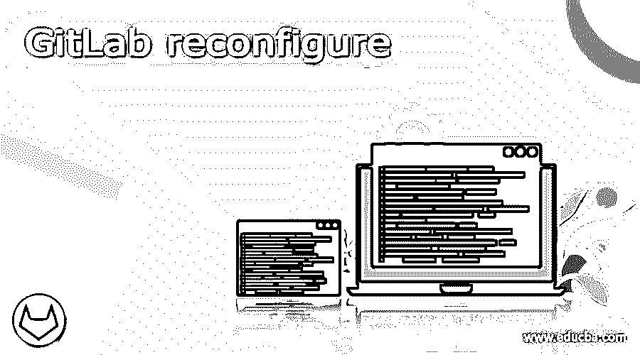
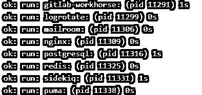
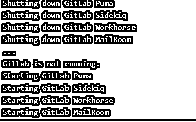

# GitLab 重新配置

> 原文：<https://www.educba.com/gitlab-reconfigure/>

## GitLab 重新配置简介

成功配置 GitLab 后，有时我们需要在需要时重启一些组件，这意味着有时配置文件可能会被更改，或者在另一种情况下，有时我们需要在需要重新配置 GitLab 时手动进行一些更改。基本上，GitLab 允许我们根据用户需求重新配置所有文件。有不同的方式来重新配置 GitLab，如综合重新配置和舵图也有重新配置。但是，关于 GitLab 的重新配置，还有一件更重要的事情取决于具体的需求，我们还需要管理权限来重新配置 GitLab。

### 什么是 GitLab 重新配置？

从根本上设计 Gitlab 的 GitLab.rb 文档和 GitLab-sprinter 的 config.toml 记录，GitLab 有很多值得研究的元素。如果它的设计中有什么问题(等等/GitLab/GitLab ),就应该进行重新配置。rb)发生了变化。如果您实际修改了/var/select/GitLab 中由 Chef 监管的任何记录，运行 reconfigure 将返回进度并重新启动依赖于这些文档的管理。

<small>网页开发、编程语言、软件测试&其他</small>

有一种不同的方式来重新配置是综合的，或者我们可以考虑一个舵图来重新配置 GitLab。根据我们的要求，我们可以使用任何人。

### GitLab 重新配置流程

现在我们来看看 GitLab 中的重新配置过程如下。我们需要考虑不同的参数进行重新配置，如下所示。

首先，让我们讨论 HTTPS 重新配置:在重新配置期间，我们首先需要使用一些命令来重新配置 HTTPS 协议，之后我们需要执行 CTL 重新配置命令来检查它是否正常工作。我们还需要配置两件东西:电子邮件服务器和 GitLab 中的自动备份。邮件服务器的重新配置依赖于云网络。假设我们有阿里云，那么我们需要遵循如下步骤。

1.首先，我们需要进入一个直接邮件控制台。
2。之后，我们需要从菜单中选择电子邮件的域。
3。单击现有的域，或者我们可以创建一个新的域。
4。这里我们需要指定依赖于用户的新域的名称。
5。现在刷新网页并点击配置按钮。
6。在“configure”选项卡中，我们有不同的选项来解析线路、添加记录以及填写类型、主机、ISP 和 TTL 等。
7。在重新配置所有东西之后，我们需要运行 GitLab-ctl reconfigure 命令，这样我们就能够测试配置了。
8。这里我们需要遵循许多步骤，在这一点上，我们只提到了重要的步骤。

### 自动备份配置

加强是重要的，因为如果发生不幸，它们可以阻止信息的不幸，并允许您在需要时转移到另一个 ECS 示例。

### 重新配置 omnibus

现在让我们看看如何重新配置 Omnibus GitLab，如下所示。

首先，我们需要在 GitLab 上安装 Omnibus 包。现在使用 gitlab-ctl 命令与我们安装在 gitlab 上的 Omnibus 包进行通信，以便我们可以重启所有包。

`sudo gitlab-ctl restart`

**解释**

执行上述命令后，它显示所有工作组件的状态，如下图所示。这张截图摘自 GitLab 官网。

现在，让我们看看如何按如下方式进行综合 GitLab 重新配置。

在一些文件中，我们需要重新配置 GitLab。所以我们需要重新开始这个过程。我们需要遵循如下命令。

`sudo gitlab-ctl reconfigure`

如果 GitLab 的排列(/等等/gitlab/gitlab.rb)发生了变化，那么应该重新配置 gitlab。
当您运行该订单时，Chef(支持 Omnibus GitLab 的高管应用程序的基本配置)确保目录、授权和管理等一切都已设置好，并且处于最初运输时的状态。

如果 GitLab 部件的任何安装文档发生了更改，它同样会在需要时重新启动 git lab 部件。如果您在/var/select/gitlab 中修改了由 Chef 监督的任何文档，运行 reconfigure 会返回进度并重新启动依赖于这些记录的管理。

### GitLab 重新配置代码示例

现在让我们举一个 GitLab 重新配置的例子，以便更好地理解如下。

如果我们需要检查服务的状态，那么我们可以使用如下命令。

`sudo GitLab-ctl status`

对于 GitLab 的重新配置，我们使用如下命令。

`sudo GitLab-ctl reconfigure`

之后，我们需要执行如下命令。

`sudo service GitLab restart`

上述命令的输出如下面的屏幕截图所示

### 设置和配置转轮

我们可以在不同的操作系统上安装 GitLab Runner，比如 Linux、macOS 和 windows。基本上，有两种方法可以安装 GitLab runner，即手动下载和使用存储库包。

现在让我们看看如何配置 GitLab runner，如下所示。

*   高级选项:在这个选项中，我们可以配置。这意味着我们编辑跑步者设置。
*   证书:在这个配置中，当我们连接到 GitLab 服务器时，我们检查对等的 TLS 证书。
*   Docker Machine Autoscale:用于执行 Docker Machine 创建的所有作业。
*   AWS Fargate 上的 GitLab CI:它是一个定制的执行器，用于在 AWS 上运行作业。
*   图形处理单元:在这个选项中，我们可以执行所有的图形作业。
*   Init system:在这个选项中，GitLab runner 安装所有依赖于操作系统的服务。
*   Shell 支持:通过使用 shell 脚本，我们可以在不同的操作系统上执行构建。
*   安全性:它在使用 GitLab Runner 执行作业的过程中提供安全性。
*   GitLab Runner 的监控:在这个选项中，我们可以监控跑步者的行为。
*   Docker 缓存清理:GitLab runner 为用户提供了自动清理功能，有时我们在低磁盘空间上执行作业。

### 结论

我们希望从这篇文章中你能学到更多关于 Gitlab 重新配置的知识。从上面的文章中，我们已经了解了 Gitlab 重新配置的基本思想，我们也看到了 Gitlab 重新配置的表示。从本文中，我们了解了如何以及何时使用 Gitlab reconfigure。

### 推荐文章

这是 GitLab 重新配置的指南。在这里，我们讨论定义，过程，什么是 GitLab 重新配置？以及代码和输出的例子。您也可以看看以下文章，了解更多信息–

1.  [GitLab 替代方案](https://www.educba.com/gitlab-alternative/)
2.  [什么是 GitLab](https://www.educba.com/what-is-gitlab/)
3.  [GitLab vs 吉拉](https://www.educba.com/gitlab-vs-jira/)
4.  [GitLab vs GitHub](https://www.educba.com/gitlab-vs-github/)

