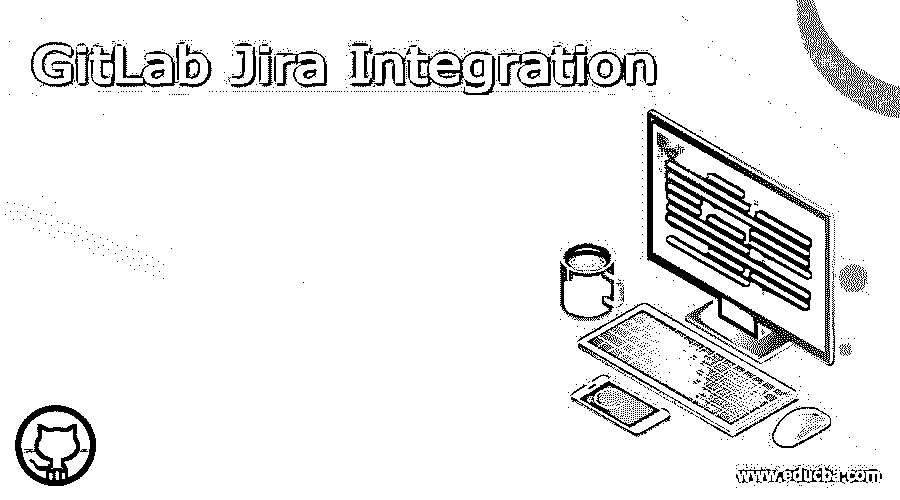
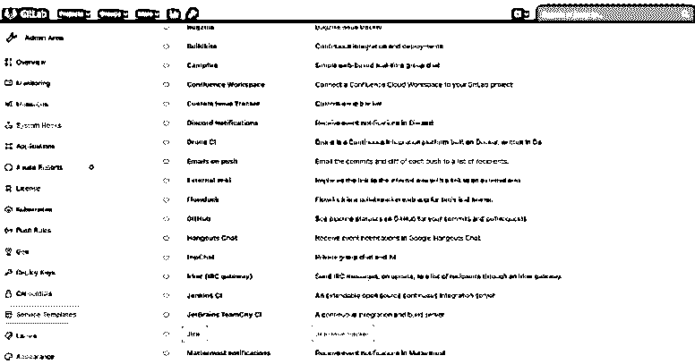
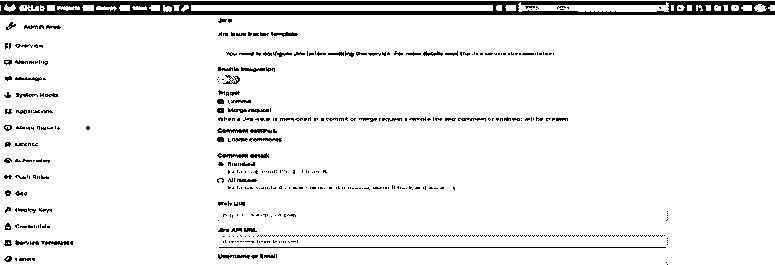
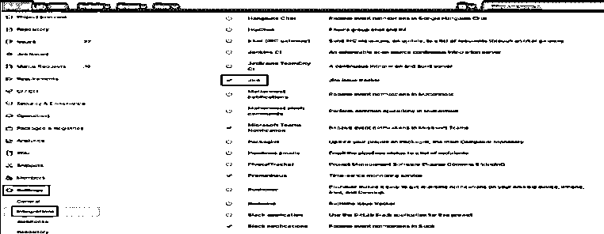
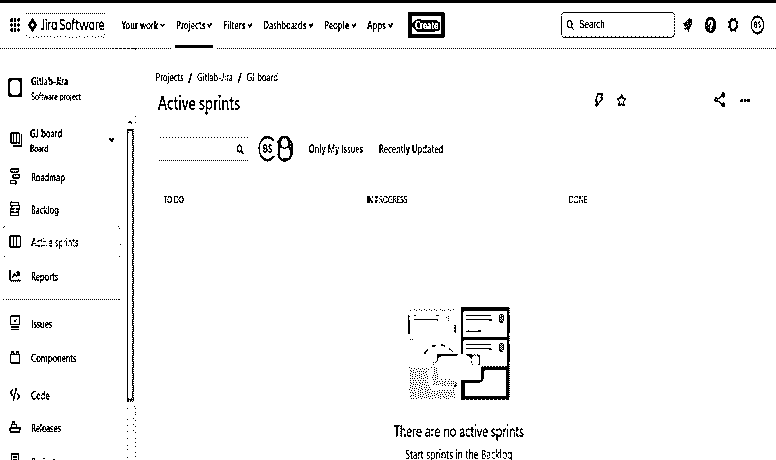
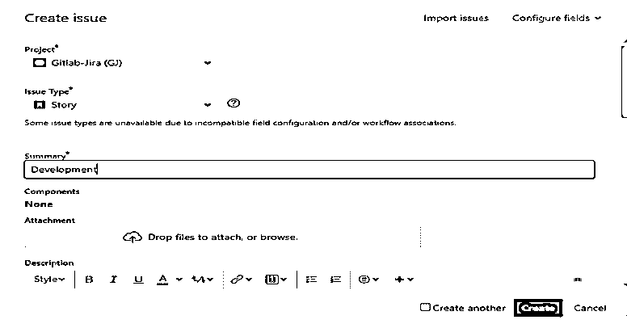
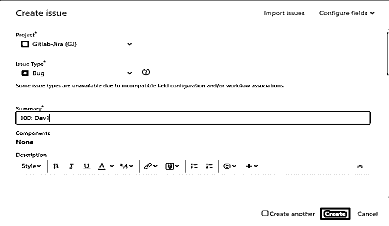

# GitLab 吉拉集成

> 原文：<https://www.educba.com/gitlab-jira-integration/>

## GitLab 吉拉集成的定义

Gitlab jira 集成就是 jira 和 Gitlab 的集成，jira 是一个非常有用的问题跟踪工具。我们也可以使用吉拉工具进行错误跟踪，这是一个非常重要的过程，我们在分配给开发人员的任务的透明代码和可追溯性中使用了这个过程。众所周知，gitlab 是一个基于网络的回购管理器，它提供了源代码库。我们还可以在提交代码时将吉拉任务源代码的变更链接到 git。

### 什么是 GitLab 吉拉集成？

*   使用 jira 和 gitlab，我们可以在开发团队的工作中实现非常好的功能。
*   在将 jira 和 gitlab 与生态系统集成时，跟踪提交趋势非常容易。
*   很容易跟踪跟踪要求的数量，以满足法规遵从性的要求。
*   它还将减少对人工通信的依赖。使用 jira gitlab 集成，我们可以自动化通信过程。
*   我们可以使用单个实例将单个 gitlab 项目集成到所有吉拉项目中。我们还可以快速检查 jira 问题。
*   我们可以很容易地从合并请求中发现问题，我们也可以通过使用 jira gitlab 集成来合并问题。
*   我们还可以自动关闭已经提交的问题，我们不需要手动关闭问题。
*   我们可以实现流程自动化，并缩短交付周期。
*   我们也可以加快团队的速度。
*   我们可以跟踪提交量，还可以跟踪提交操作的趋势，我们还可以提交实时文件。
*   我们可以强制执行提交操作，以确保每个提交操作都按照计划的时间发生。
*   它对交付生命周期管理中的所有工作项目具有完全的可追溯性。
*   我们可以在批量更新解决方案中自动访问库的脚本。我们也可以编辑 jira 的界面和开发工作流程，以满足用户的需求。
*   我们还可以建立动态吉拉表单，需要用户的输入，我们还必须定义默认值和字段依赖关系。

### 如何实现 Gitlab 吉拉集成？

*   我们可以使用两个选项来实现 jira 与 gitlab 的集成。我们可以通过 gitlab admin 使用服务模板，它提供了配置集成的默认值。
*   我们可以在项目级别预先填充 jira 集成的值，如果我们禁用了 jira 集成，默认值对我们是不可见的。
*   要在指定的项目级别配置吉拉集成，它将包含特定值。
*   我们还可以将每个 gitlab 项目配置为一个吉拉实例。我们也可以说一个单独的 gitlab 项目正在与指定实例中的所有吉拉项目进行交互。
*   Gitlab 提供了不同的选项，使我们能够集成最适合我们组织的吉拉。
*   下面的例子说明我们必须在 gitlab 中配置吉拉。为了配置 gitlab，我们使用所有默认项目的服务模板来填充默认的吉拉值。

1)第一步是进入该项目的管理区部分，然后单击吉拉的服务模板。

<small>网页开发、编程语言、软件测试&其他</small>

2)打开服务模板后，下一步是配置问题跟踪的 url。我们可以通过替换问题跟踪者的 id 来配置问题跟踪者的 url。

在上面的 web URL 快照中，我们输入了吉拉实例的基本 URL，该实例已链接到 gitlab 项目。我们还需要输入吉拉 API URL，该 URL 只是 Jira 实例的 web URL 或基本 URL。
我们还需要输入吉拉的用户名和密码。
我们还需要使用事务 ID，这用于通过使用合并和提交请求来关闭吉拉问题。这是吉拉的 ID，用于将问题转移到所需的州。

3)我们还可以设置单个项目的项目模板。要设置与单个项目的集成，我们需要单击集成页面，单击集成页面后，单击吉拉服务。

### Git 插件安装到 JIRA 和配置

*   要用吉拉安装和配置 git 插件，我们需要遵循以下步骤。如果假设我们没有登录到吉拉，那么首先我们需要登录到吉拉门户网站。

1)在第一步中，我们使用凭据登录吉拉门户网站。

2)打开吉拉软件后，我们需要点击应用->管理您的应用。

3)打开受管用户应用程序后，选择用户安装的应用程序来安装用于吉拉集成的 git 插件。

### 使用案例 GitLab 吉拉集成

*   将吉拉与 gitlab 整合后，我们正在创建当前项目的故事如下。
*   我们可以为当前项目创建 bug、故事和任务。我们用吉拉创作的故事如下。

*   我们还可以为指定的项目或 spring 创建 bug 和 issue story。
*   我们要创建的 bug 如下。

### 结论

Gitlab jira 集成无非就是 jira 和 Gitlab 的集成。吉拉是一个非常有用的问题跟踪工具。我们可以使用两个选项实现 jira 与 gitlab 的集成，第一个是使用 gitlab admin 的服务模板，第二个是使用 jira cloud。

### 推荐文章

这是 GitLab 吉拉集成指南。这里我们讨论一下定义，什么是 GitLab 吉拉集成？如何实现 Gitlab 吉拉集成？为了更好的理解。您也可以看看以下文章，了解更多信息–

1.  [GIT 仓库](https://www.educba.com/git-repository/)
2.  [什么是 GitLab](https://www.educba.com/what-is-gitlab/)
3.  [Mercurial vs Git](https://www.educba.com/mercurial-vs-git/)
4.  [bit bucket vs Github vs Gitlab](https://www.educba.com/bitbucket-vs-github-vs-gitlab/)

