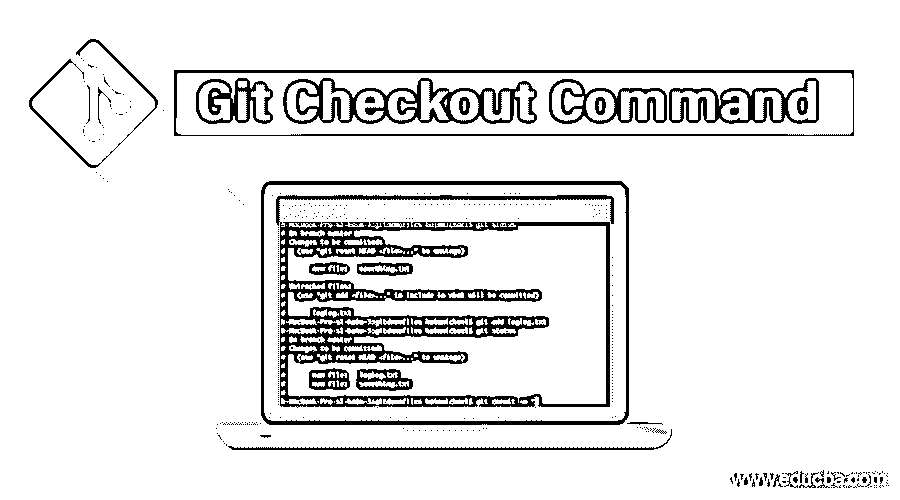

# Git 检验命令

> 原文：<https://www.educba.com/git-checkout-command/>

## Git Checkout 命令简介

我们都听说过 Git，对吧？如果没有，我简单介绍一下 [Git](https://www.educba.com/introduction-to-git/) Checkout 命令和比较流行的 Github。但是，等等，你不知道它们是不同的吗？嗯，他们很不一样。首先，Git 是产品经理、数据科学家和开发人员用来管理程序源代码开发历史的分布式控制工具，而 Github 是围绕 Git 构建的基于云的平台，用于存储从本地计算机推入的代码。

在本文中，我们将了解更多关于 Git 的知识，更具体地说，是它的一个命令——Git check out。

<small>网页开发、编程语言、软件测试&其他</small>

### 什么是 Git Checkout 命令？

如果您从事过任何类型的项目，那么您会对如何使用和扩展 Github 已经构建的开源软件和程序有一个基本的概念，即使用“资源库”中随时可用的代码，也称为 repo。

命令 git clone 用于将所需的存储库从远程 git 服务器提取到本地计算机，这个过程称为克隆。

`<https://github.com/desired_repo_name/desired_repo>`

默认情况下，克隆存储库时，从本地存储库的主分支开始。为了避免任何混淆和适当的文档目的，建议创建一个新的分支并在该临时分支中工作。使用 git checkout 命令创建一个新的分支。git checkout 命令用于检查您的存储库的期望状态，无论是任何分支还是特定文件。它还可以用于在现有的本地分支机构之间进行切换。

总结一下， [git checkout](https://www.educba.com/git-checkout/) 有 3 个用途:

1.  从当前分支创建新分支。
2.  在现有的本地分支之间切换。
3.  检出并转到特定文件的特定状态。

您可以使用标志-b 创建一个新的分支。假设您在主分支，那么

`git checkout -b <new_branch_name>`

用于切换的命令将使用主服务器的内容创建新的分支，并切换到新创建的分支，使得改变将反映在新的分支中。

`git checkout <existing_local_branch_name>`

如果您想要检出并移动到特定的文件状态，可以使用以下命令。

`git checkout commit_point_A -- <filename>`

#### 1.新分支

在 Git 中，分支是日常开发过程中极其重要的一部分。它们是反映最近变化的非常有效的指针。无论何时你想修复一些错误或者添加新的特性——不管它是大是小——你都可以创建一个新的分支来反映和封装你的改变。这样，不稳定或不相似的代码就很难融合到主代码库中，并且在将它集成到主分支之前，也可以使您未来的历史更加清晰。除了创建和删除分支之外，git branch 命令还允许您重命名和列出分支。但是，它不允许您将已经分叉的历史放回一起或在分支之间切换。这就是 git checkout 的用武之地。Git branch 与 git checkout 命令集成在一起，克服了这些缺点。

Git checkout 与 Git 分支密切配合。git branch 命令用于创建一个新的分支。创建之后，您可以使用下面给出的命令切换到该分支。

`git checkout -b <new_branch>`

上面的例子不仅创建了一个<new-branch>,还同时检查了一个<new-branch>。Option -b 是一个标志，用于告诉 git 仅在运行 Git 分支<new_branch>后运行 git checkout <new_branch>，即仅在创建新分支后进行分支。下面给出的另一个命令可以在 git checkout 中使用一个额外的分支参数来传递，以便在现有分支的基础上创建一个新的分支。默认情况下，git checkout -b 将基于当前 HEAD 创建新的分支，其中 HEAD 是 git 引用当前快照的方式。</new_branch></new_branch></new-branch></new-branch>

`git checkout -b <new-branch> <existing-branch>`

#### 2.切换分支

顾名思义，切换分支是一个非常简单的操作。执行以下命令将 HEAD 指向给定分支名称的尖端。

`git checkout <branch_name>`

需要记住的一点是，您希望切换到的分支应该已经存在于您正在处理的目录中。

#### 3.签出远程分支

在与团队协作时，利用远程存储库是一种常见的做法。这些存储库包含它们自己的分支集合，可以在云上托管和共享，也可以是另一个同事的本地副本。要签出一个远程分支，您必须首先获取该分支所需的内容，然后继续签出。

`git fetch --all`

在 Git 的当前更新版本中，您可以使用下面的命令像签出本地分支一样签出远程分支。

`git checkout <remote_branch>`

如果您使用的是旧版本的 Git，您必须使用下面给出的命令基于远程分支的位置创建一个新分支。

`git checkout <remote_branch> origin/<remote_branch>`

除了以上所有的事情之外，您还可以签出一个新的本地分支，并将其重置为远程分支的最后一次提交。

`git checkout -b <branch_name>`

上述步骤的先决条件是，您希望签出的分支应该已经存在于您正在处理的目录中。但是如果没有呢？Git 提供了–track 简写，用于在分支名称不存在的情况下创建跟踪分支。

`$ git checkout --track origin/<branch_name>
Branch <branch_name> set up to track remote branch server fix from origin.
Switched to a new branch '<branch_name>'`

### Git Checkout 命令的优点

*   它通过使不稳定的代码更难合并到主代码库中来帮助管理错误。
*   它也有助于检查远程分支机构。
*   它有助于在特性开发和处理发布期间以标准化的方式管理分支机制。
*   它使得用一个命令切换分支变得非常容易。
*   保持存储库和流程的整洁和可读性。

### 结论

Git 有许多用途，被开发人员、[产品经理](https://www.educba.com/product-manager-interview-question/)和[数据科学家](https://www.educba.com/how-to-become-a-data-scientist/)广泛使用。它的命令非常有效，非常有用。本文探索并演示了它的一个特性命令 git checkout，它用于创建一个新分支，在分支之间切换并检验远程分支。

### 推荐文章

这是 Git Checkout 命令的指南。在这里，我们分别讨论 Git Checkout 命令的介绍及其优点。您也可以浏览我们推荐的其他文章，了解更多信息——

1.  [Git 术语| 15 大特性](https://www.educba.com/git-terminology/)
2.  [什么是 Git |优缺点](https://www.educba.com/what-is-git/)
3.  [GIT 命令|十大命令](https://www.educba.com/git-commands/)
4.  [GIT 版本控制系统](https://www.educba.com/git-version-control-system/)
5.  [去推](https://www.educba.com/git-push/)

