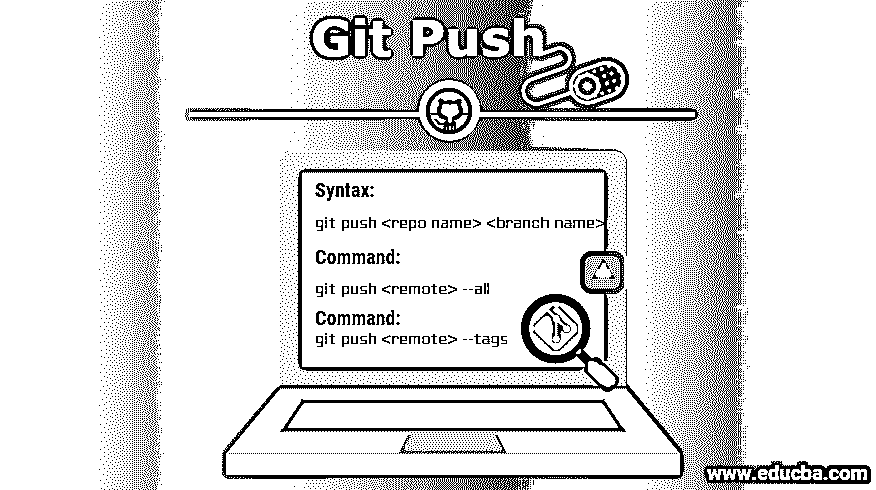
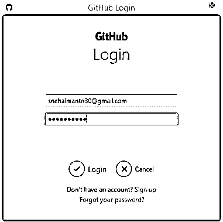
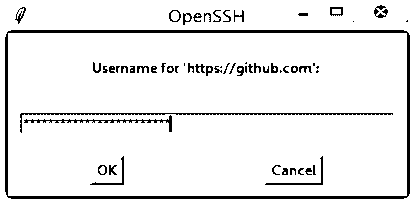
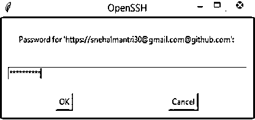

# Git Push

> 原文：<https://www.educba.com/git-push/>

## Git 推送简介

Git push 是 Git 最重要的特性之一，它用于将所有更新的提交从本地分支发送到远程分支，这些提交存储在本地系统中。push 命令允许我们将最新更新的提交发送到相应的远程服务器。存储在远程服务器上的远程分支都是在 git remote 命令的帮助下联合起来的。

有时，git push [看起来像是 git fetch](https://www.educba.com/what-is-git-fetch/)，但这是不同的，因为 git fetch 是将所有提交提取到本地分支的过程，而 git push 将所有提交更新到其远程分支。

<small>网页开发、编程语言、软件测试&其他</small>

### 如何创建 Git 推送？

1.  一旦所有的更改都提交到本地存储库，现在就该把所有的提交都推送到远程存储库了。
2.  Push 命令的语法如下。

**语法:**

`git push <repo name> <branch name>`

3.  使用上面的命令将把一个已定义的分支推送到远程服务器，包括所有最近的提交和相关对象。该过程不会直接对远程分支进行更改；首先，它将在远程存储库上创建一个本地分支，保存所有更新的代码，并跳过覆盖提交。一旦保存了所有的更改，只有它会作为最终内容被合并到目标的远程分支。
4.  一旦修复了一个目标分支，就可以使用下面的命令将所有的本地分支推送到这个选定的远程分支。

**命令:**

`git push <remote> --all`

5.  假设您还想将标签上传到远程服务器上；然后，需要使用单独的命令来指定它。直接使用简单的 push 命令是不可能的。单独命令中的–tag 标志可以使用以下命令将所有本地标记发送到其指定的远程分支。

**命令:**

`git push <remote> --tags`

6.  还可以使用一个简单的命令 git is 将所有本地分支一起发送到指定的远程分支。

**命令:**

`git push <remote> --all`

7.  如果我们想要删除某个特定的远程分支，那么可以使用如下命令来删除。

**命令:**

`git push <remote> --delete`

8.  也可以将我们的代码及其分支推送到已定义的远程存储库；遵循几个步骤，这是可能的。

`git clone https://www.educba.com/<git-user>/<repo-name>&& cd <repo-name>`

9.  做您希望他们做的任何更改，保存它们，并调用 git 添加一个命令来存储您的更改。

**命令:**

`git add <filename>`

10.  现在是时候提交您所有的更改了。

**命令:**

`git commit –m`

这将给我的存储库添加一些更改。

11.  将所有代码推入主分支的最后一步如下。

**命令:**

`Git push origin master`

12.  通过忽略对 git 的所有本地更改，可以将所有更改推送到指定的分支。

**命令:**

`git push --force <remote-name><Branch-name>`

13.  这里，remote-name 只不过是远程存储库的相同名称，所有当前更新的变更都将存储在该存储库中。分支名称就是目标远程分支，您将在其中保存所有更新的更改。

### 它是如何工作的？

*   Git push 是一个命令，用于将所有新的本地提交更新到远程存储库。
*   它在称为源和目的地的两个实体之间工作，而源是您从最近检查的 HEAD 分支上传所有数据的地方。
*   目的地是我们希望用其最近的分支更新相关远程服务器上的最新更改的地方。它在目标存储库位置创建自己的本地分支。
*   Push 命令也是同步过程中所有 git 操作中最常见的过程之一。这个过程作用于使用 git remote 命令运行的远程分支。
*   Git Push 被认为是一个上传命令。另一方面，git fetch 和 git pull 都用于下载目的。稍后，所有的更改都用 git merge 命令进行配置，以便将所有东西都放在目标位置。
*   该命令负责将当前更新的提交从本地存储库源移动到特定的远程存储库目的地。这个过程准备了它的信息的副本，并确保我们的本地分支被更新，以将所有的更改上传到远程存储库。
*   上述过程中的对象由树、提交和标记组成。
*   这里 git 使用本地引用对它们的相关文件进行修改，指向远程存储库，显示最近更新的提交的指针。
*   之后，任何新添加的内容都将被复制到 git 的系统对象中，称为元数据和 SHA。
*   推送的工作方式不同于合并。

### Git 推送示例

因此，让我们考虑一个示例，按照以下步骤执行 git push 命令:

首先，我们必须打开我们实际项目所在的文件夹路径，并使用 PWD 命令检查这个文件夹的路径。

所以按照上面的命令，它显示了我们当前工作的目录的实际路径。

第二步:现在，我们正在检查存储我们所有最新更改的本地分支。

它表明我们在主分支上；那很好。

**步骤 3:** 现在，我们运行 git push 命令，通过运行 git push origin master 命令，将我们所有的更改从本地分支发送到远程存储库。

****

**** 

因此它将重定向到 Github 帐户的登录窗口，在这里您必须输入您的电子邮件 Id 和密码，如下所示。

**步骤 4:** 一旦登录过程在 SSH 密钥的帮助下成功完成，它将连接到远程存储库。

因此，一旦输入了所有必需的细节，git push 负责将所有最新的提交从本地分支推送到远程存储库，并存储更新的数据。

### 结论

*   以上所有信息表明，git push 是一个将本地分支所做的所有更改上传到目标远程存储库的命令。
*   git 推送的过程不同于 git 获取。
*   在将所有更改发送到远程存储库之前，确保首先在本地分支上更新所有更改。

### 推荐文章

这是一个 Git 推送的指南。在这里，我们已经讨论了如何创建 git push 以及一步一步的步骤和例子。你也可以看看下面的文章来了解更多-

1.  [Git 替代品介绍](https://www.educba.com/git-alternatives/)
2.  [Git 结账标签(优点)](https://www.educba.com/git-checkout-tag/)
3.  [GIT 面试问题(前 11 名)](https://www.educba.com/git-interview-questions/)
4.  [GIT 命令|提示和技巧](https://www.educba.com/git-commands/)

