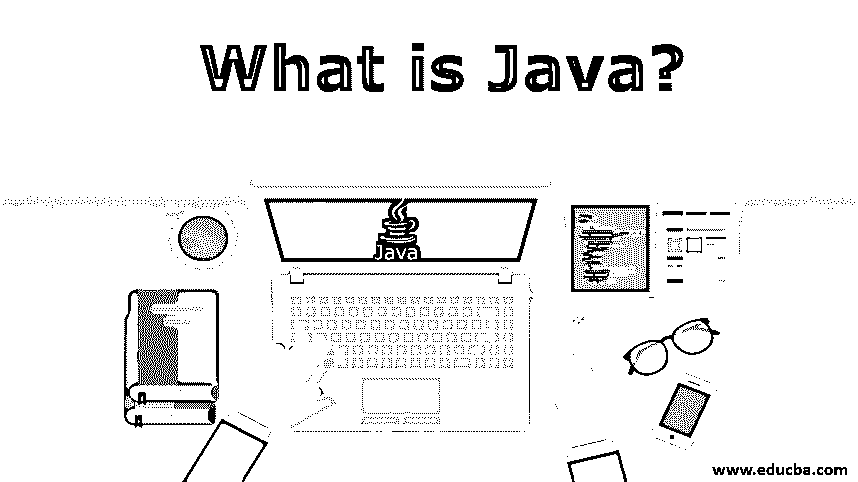
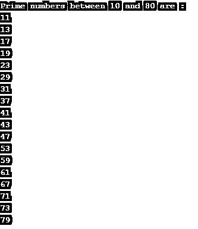

# Java 是什么？

> 原文：<https://www.educba.com/what-is-java/>




## Java 是什么？

Java 是用于应用程序开发的计算平台，是面向对象的、基于类的并发编程语言，这意味着许多语句可以同时执行，而不是顺序执行。它可以在所有平台上运行，并且可以免费访问。

以下是重要的几点:

<small>网页开发、编程语言、软件测试&其他</small>

*   Java 是基于类和面向对象的。
*   它是独立于平台的，这意味着 java 代码可以在任何操作系统上编译，并可以在相同或任何其他操作系统上运行。
*   它支持并发性，这意味着多个进程可以同时执行代码。许多 java 编程语句可以一起执行，而不是按顺序逐个执行。

### 我们为什么要用 Java？

自其发展以来，它在市场上不断受到欢迎，并且是当今开发应用程序最常用的语言之一。

以下是最重要的功能:

*   简单:开发 Java 时，考虑到了 C 或 C++等其他编程语言的复杂性。这使得开发人员的生活相对容易，因为 java 不使用指针的[，并且有一个内置的内存管理系统。](https://www.educba.com/pointers-in-data-structure/)
*   **可移植性:**如前所述，java 源代码可以在一台机器上开发和编译，并且可以在同一台或任何其他操作系统上运行。因此，java 程序可以很容易地移植到任何其他机器上，从而提供了可移植性。
*   **面向对象:**一切都被当作一个对象，应用开发中涉及的所有操作都是用这些对象来完成的。
*   **动态能力:**使用 java 开发的应用程序可以使它们适应不断变化的执行环境。这是因为这种编程语言具有像动态内存分配这样的特性，其中分配的内存量根据环境而变化，这反过来提供了高性能。
*   **高安全性:**在安全性方面，它是对本质上不可读的字节码进行操作。它在安全的沙箱中运行源代码，不允许任何外部干预。因此，它允许开发人员构建防篡改和无病毒的应用程序，从而提供高安全性。
*   **稳健:**开发时考虑了所有可能性，因此不存在误差。它允许开发处理所有可能错误的代码。此外，它有一个强大的类型检查，使我们的源代码健壮。
*   **多线程:**支持创建多个线程执行，从而提供高性能。此外，它支持同步机制来维护不同线程之间的同步。
*   **解释:**代码转换成字节码，由 java 运行时环境解释。
*   **分布式:**支持开发分布式应用。它提供了像远程方法调用这样的特性，通过远程方法调用，程序可以通过网络与远程机器上的另一个程序进行通信，并生成所需的输出。
*   **性能:**它提供了高性能，因为它使用字节码，可以轻松、高速地翻译成机器码。它有及时的编译器，通过它可以实现高性能。

由于上面解释的所有特性，java 在应用程序开发中被广泛使用和流行。

### 我们能用 Java 做什么？

现在我们将看到不同的应用:

以下是使用它的一些常见领域:

**1。银行和金融领域:**银行领域利用 java 处理交易。它在高效处理数百万笔交易的同时表现异常出色。

**2。信息技术:** 使用 java 可以开发以下类型的应用程序。

*   **Web 应用开发:**这是指网站开发。在 web 应用开发中，java 提供了服务器端技术，从前端用户界面接收数据，并将数据提供给后端逻辑处理层，经过处理后，数据通过这些服务器端技术返回到前端。

下面是一些提供的服务器端技术:

*   [弹簧框架](https://www.educba.com/what-is-spring-framework/)
*   Spring Boot

除了服务器端技术，最常用的应用服务器之一 apache tomcat 是使用 java 开发的。

*   **Android 应用开发:** Java 也用于 Android 应用的开发。Android 应用程序是使用 java API 开发的。
*   **桌面应用:**也用于开发独立的桌面应用。它有抽象窗口工具包(AWT)来支持 GUI 开发。
*   **企业应用:**提供 Java 企业版，流行于开发企业应用。使用 Java EE 开发的应用程序主要是商业应用程序，它们是可伸缩的、可靠的、大规模的、多层的和安全的应用程序。
*   **科学应用:**涉及科学和数学计算的应用可以开发为核心编程语言。此外，它还是对大量数据进行科学分析的首选。
*   **大数据**:处理大数据处理的 Map-reduce 框架是用 java 写的。
*   **云应用:**它提供了可用于构建 Saas、Paas 和 Iaas 云开发中使用的应用的特性。它帮助公司远程开发他们的应用程序，或者通过网络与他人分享他们的数据或信息。
*   **游戏应用:**它支持最流行的 3D 引擎之一 jMonkeyEngine，可以用来设计三维游戏。

**3。股市:**用于开发涉及股市分析的算法。

**4。Retail:** 它还用于开发购物中心、商店和其他地方使用的计费应用程序。

### 例子

让我们看一个基本的例子。main 方法是 java 应用程序的入口点。

#### 示例#1

在这个例子中，我们将看到 main 方法是如何定义的。

**代码:**

```
package com.edubca.javademo;
public class JavaDemo{
public static void main(String args[]){
String str="This is Edubca Java Training";
System.out.println(str);  //printing on console
}
}
```

**输出:**


**说明:**

*   我们已经看到了类是如何声明的，以及 main 方法的声明。
*   在 main 方法内部，使用 System.out.println()，它接受一个字符串作为参数，并用于在控制台上打印指定的字符串。

#### 实施例 2

这个例子展示了像加、减、乘、除这样的数学计算是如何实现的。

**代码:**

```
package com.edubca.javademo;
public class JavaDemo{
public int add(int a, int b){
int c= a+b;
return c;
}
public int substract(int a, int b){
int c= a-b;
return c;
}
public int multiply(int a, int b){
int c= a*b;
return c;
}
public int divide(int a, int b){
int c= a/b;
return c;
}
public static void main(String[] args) throws Exception {
// Declare variables
int a= 10;
int b= 5;
//create instance of JavaDemo class
JavaDemo jdemo= new JavaDemo ();
int addresult=jdemo.add(a,b);   // invoke add method of JavaDemo
int substractresult=jdemo. substract (a,b);   // invoke substract method of JavaDemo
int multiplyresult=jdemo.multiply(a,b);   // invoke multiply method of JavaDemo
int divideresult=jdemo.divide(a,b);   // invoke divide method of JavaDemo
System.out.println("Addition of 10 and 5 is " + addresult );
System.out.println("Subtraction of 10 and 5 is " + substractresult );
System.out.println("Multiplication of 10 and 5 is " + multiplyresult );
System.out.println("Division of 10 and 5 is "+ divideresult );
}
}
```

**输出:**


**说明:**

*   在上面的例子中，我们已经看到了如何创建类、声明方法、创建类对象以及通过对象调用声明的方法。

#### 实施例 3

在这个例子中，我们将看到一个寻找两个数之间的所有质数的程序。

**代码:**

```
package com.edubca.javademo;
public class JavaDemo{
public static void main(String args[]){
//declare variables
int low=10; int high=80;
System.out.println("Prime numbers between 10 and 80 are : ");
// while loop
while(low < high){
boolean isprime=true;
// for loop in java
for(int i=2; i< low/2; i++){
if(low % i==0){
isprime=false;
break;
}
}
if(isprime){
System.out.println(low + " ");
}
low++;
}
}
}
```

**输出:**




**说明:**

*   上面的程序显示了 while 循环和 for 循环的用法。
*   上述程序将产生以下输出。

#### 实施例 4

在这个例子中，我们将看到如何打印斐波纳契数列到一个数字。

**代码:**

```
package com.edubca.javademo;
public class JavaDemo{
// declaring static method printfabonacci
static int printfabonacci ( int i){
if(i==0){
return 0;
}
if(i==1 || i==2){
return 1;
}
// calling method recursively
else{
return printfabonacci (i-1)+ printfabonacci (i-2);
}
}
public static void main(String args[]){
int maxnumbers=10;   // max numbers in Fibonacci
String str="";
for(int i=0; i<maxnumbers;i++){
str= str + printfabonacci(i) + " ";
}
System.out.println("Fibonacci series of 10 numbers is " + str);
}
}
```

**输出:**


### 结论

从上面的讨论中，我们对功能和不同的应用有了清楚的了解。此外，我们还看到了一些代码示例，展示了 java 类的创建、main 方法的声明、方法的创建、对象的创建以及通过对象调用 java 方法。

### 推荐文章

这是一本关于什么是 Java 的指南？在这里，我们讨论为什么我们使用 java，以及这种编程语言如何有用？以及示例。您也可以浏览我们的其他相关文章，了解更多信息——

1.  [Java 收集流](https://www.educba.com/java-collection-stream/)
2.  [Java InetAddress](https://www.educba.com/java-inetaddress/)
3.  [Java 中断异常](https://www.educba.com/java-interruptedexception/)
4.  [Java file not found exception](https://www.educba.com/java-filenotfoundexception/)


