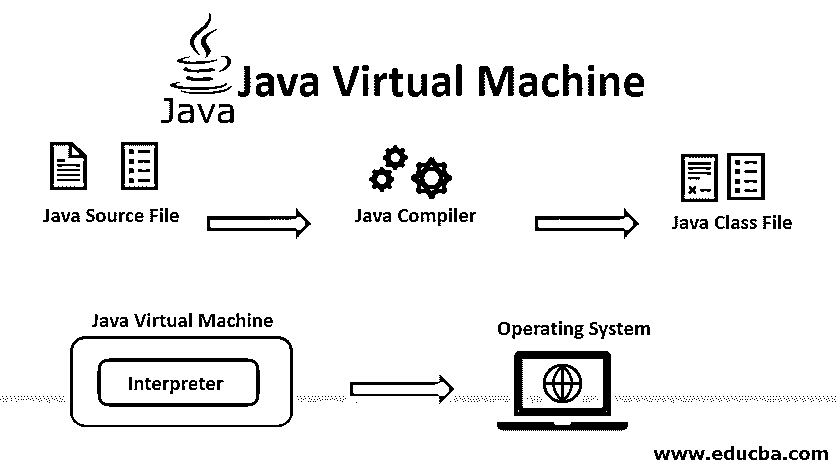
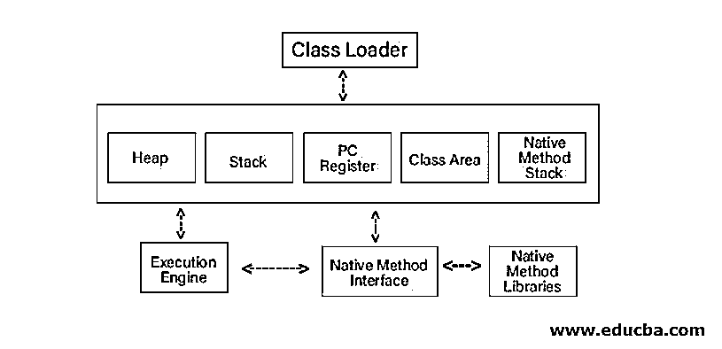

# Java 虚拟机

> 原文：<https://www.educba.com/java-virtual-machine/>

## Java 虚拟机简介

在本文中，我们将了解 Java 虚拟机，又名“JVM”。Java 虚拟机是允许计算机系统运行/执行 Java 程序的虚拟机。基本上， [JVM 是一个引擎，](https://www.educba.com/what-is-jvm/)它是 Java 代码的运行时环境。JVM 将 java 代码转换成机器语言。当你运行一个编译的。类文件，它进入 JVM，然后 JVM 返回输出。Java 虚拟机是 JRE 的一部分，JRE 代表“Java 运行时环境”。Java 虚拟机的基本任务包括加载代码、验证代码和执行代码。此外，为代码执行提供运行时环境。JVM 由各种组件组成，如类加载器、JVM 分配的空间列表(如堆栈)、执行引擎和一些本地库。

### Java 虚拟机的体系结构

以下是 Java 虚拟机的架构:

<small>网页开发、编程语言、软件测试&其他</small>

如上图所示，Java 虚拟机架构由各种组件组成。让我们分别了解每一个具体的组件。

#### 装货设备

顾名思义，它是一个负责加载类文件的组件。加载、链接和初始化一个类文件是加载器的主要功能。加载器在运行时工作。

*   **加载:**基本上，加载程序读取。类文件，然后生成二进制代码并将其保存在方法区域中。引导类加载器、扩展类加载器和应用程序类加载器是负责加载各种类的各种类加载器。
*   **链接:**验证、准备、解决三大功能。它始于。类文件验证。如果验证失败，它会给出一个运行时验证异常。稍后，内存被分配给具有默认值的变量。然后，最后，符号内存引用被替换为来自内存区域的直接引用。
*   **初始化:** 这是 ClassLoader 的最后一部分。原始值被赋给所有的静态变量，然后执行静态块。这部分从类的顶部到底部执行。

#### 许多

对象和实例变量的细节都存储在这里。它是一个共享内存区域，这意味着存储在这里的数据不是线程安全的。

线程“main”java . lang . out of memory 中出现异常错误:Java 堆空间

最相关的错误之一是“out of memory error*”*异常，这意味着 JVM 不能在堆区域中分配对象，或者不能为同一个对象分配内存。

#### 堆

这是为每个新线程创建单独的运行时堆栈的地方。也称为运行时堆栈，每次调用方法时，所有细节都存储在相应的运行时站中，在方法完成后，这些细节将从堆栈中移除。

#### PC 寄存器

对于每个线程，都会创建一个单独的 PC(程序计数器)寄存器，用于存储当前执行指令的地址，该地址稍后会被下一条指令更新。这个内存区域非常小，大小是固定的。

#### 本机方法堆栈

它是一种自己的内存区域，由线程调用，然后线程处于一个全新的级别，不再受 Java 虚拟机所隐含的结构和安全限制的约束。与其他运行时内存区域相比，本机方法堆栈占用的内存没有固定的大小，没有增量或减量的限制。

#### Java 本地接口

JNI 简单地与下面提到的本地方法库交互，这些方法库是 [C，C++实现](https://www.educba.com/c-vs-c-plus-plus/)，并向执行引擎提供相同的内容。JNI 允许直接访问汇编代码。对于 JVM，Java 和 Native 是两种类型的代码。JNI 顺利地在这两者之间建立了明确的联系。

#### 本机方法库

执行引擎所需的本机库集合。

### 执行引擎

好了，现在我们有了一个 java 程序的字节码，它通过一个类加载器被分配给上面解释的数据区域，现在字节码将被执行引擎执行。执行引擎只是以单元为单位读取字节码，就像机器一行一行地读取代码行一样。字节码是一种人类可读的格式，这就是为什么机器不能照原样读取它，需要将其转换成机器可读的格式，下面的组件用于解释目的。

执行引擎有三个主要组件，即解释器、JIT 编译器和垃圾收集器。

#### 1.解释者

简单地用顺序方法执行字节码。命令行查询以编译后的文件作为参数进行调用。解释器非常快速地逐个解释和执行命令，这比 JIT 编译器编译代码要快。

java 类名

main()类在编译的。类文件。

#### 2.JIT 编译器

Java 运行时环境最重要的组件之一，它在运行时增强了 Java 应用程序的性能。没有其他组件比 JIT 编译器对性能的影响更大。这是一个默认的编译器，当任何 Java 方法被调用时都会被激活。

#### 3.垃圾收集工

顾名思义，确实和垃圾有关系；垃圾收集器只是搜索 JVM 堆空间中每个可能的可用对象，检查它是否在使用中，然后删除未使用的对象。所以，它只是简单地标记了内存中正在使用或没有使用的部分。然后，它继续扫描，在那里它只是删除标记的对象。最佳用例是不需要手动内存分配系统，因为垃圾收集器会自动移除未使用的内存空间。由于这是一项自动任务，没有程序员能够控制为特定的清理任务安排任何时间段，并且在搜索对象引用时需要更多的 CPU 能力。

### 结论

尽管对于编写 Java 代码来说，清楚地理解 JVM 是如何工作的并不是强制性的，但是这非常有帮助。对于理解 JVM 工作原理的开发人员来说，无论需求有多长或多复杂，他都会写出更好和优化的代码。除了这里提供的描述，JVM 还提供了广泛的特性和技术。这些特性可用于提高特定供应商所需的性能。

### 推荐文章

这是一个 Java 虚拟机指南。这里我们讨论 java 虚拟机的架构及其各种组件。您也可以阅读以下文章，了解更多信息——

1.  [什么是 Java SE？](https://www.educba.com/what-is-java-se/)
2.  [最佳 Java 编译器](https://www.educba.com/best-java-compilers/)
3.  [JRE vs JVM](https://www.educba.com/jre-vs-jvm/)
4.  [什么是虚拟机？](https://www.educba.com/what-is-virtual-machine/)

